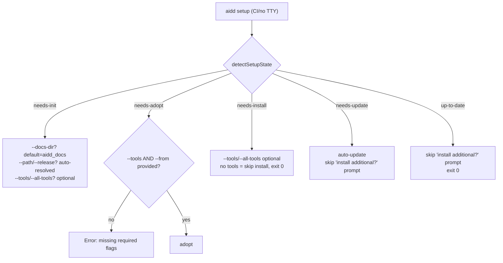

# Instruction: Setup command non-interactive mode

## Feature

- **Summary**: Make `aidd setup` fully callable without a TTY by adding missing flags and removing the hard-block, so CI/CD pipelines and build scripts can initialize, adopt, install, or update projects programmatically.
- **Stack**: `TypeScript, Commander.js, Vitest`
- **Branch name**: `feat/setup-non-interactive`
- **Parent Plan**: `none`
- **Sequence**: `standalone`
- Confidence: 9/10
- Time to implement: small

## Existing files

- @src/application/commands/setup.ts
- @src/application/use-cases/setup-use-case.ts
- @tests/e2e/setup.e2e.test.ts

### New file to create

- none

## User Journey

## Implementation phases

### Phase 1 — Command: flags + remove TTY hard-block

> Expose the four missing flags and align interactive detection with other commands.

1. Remove TTY hard-block (lines 34-38 of setup.ts)
2. Add `--docs-dir <dir>` option → maps to `docsDir`
3. Add `--tools <ids>` option (comma-separated, e.g. `claude,cursor`) → parsed to `ToolId[]`
4. Add `--all-tools` flag → pre-populate `toolIds` with `VALID_TOOL_IDS`
5. Add `--from <version>` option → maps to `from`
6. Validate parsed toolIds with `assertValidToolIds` (inside try/catch, same as install.ts)
7. Change `interactive: true` → `interactive: process.stdout.isTTY`
8. Pass `docsDir`, `toolIds`, `from` to the use-case execute call

### Phase 2 — Use-case: non-interactive guards per branch

> Add inline guards where prompter would block in non-interactive mode. No structural change.

1. `handleInit`: if `!interactive && options.docsDir === undefined` → use `Manifest.DEFAULT_DOCS_DIR` silently (no prompt)
2. `handleInit`: source prompt already guarded by `options.path`; release prompt already falls back to `latest` — no change needed
3. `handleAdopt`: if `!interactive && (!options.toolIds || options.toolIds.length === 0)` → throw `new Error("--tools <ids> is required for adopt in non-interactive mode.")`
4. `handleAdopt`: if `!interactive && options.from === undefined` → throw `new AdoptRequiresVersionError(repo)` (before the prompter call)
5. `handleUpdate`: change hardcoded `interactive: true` → `interactive: options.interactive ?? false`
6. `offerAdditionalInstall`: if `!interactive` (guard via `interactive` arg) → return `undefined` immediately (skip `prompter.confirm`)
7. `handleUpToDate`: if no interactive → skip `prompter.confirm`, return `{ kind: "up-to-date", hasAdditionalTools: missingTools.length > 0 }` directly

### Phase 3 — Tests

> Update the one existing e2e test that will break; add non-interactive coverage.

1. Update `setup.e2e.test.ts`: remove/replace test "exits 1 with error when stdout is not a TTY" (that behaviour no longer applies)
2. Add e2e test: `needs-init` state, non-interactive, no flags → succeeds with defaults
3. Add e2e test: `needs-adopt` state, non-interactive, missing `--from` → exits 1 with error
4. Add unit test (setup-use-case): `handleAdopt` non-interactive without toolIds → throws
5. Add unit test (setup-use-case): `handleUpToDate` non-interactive → skips additional install prompt

## Validation flow

1. Run `aidd setup` with no TTY in a fresh project dir → succeeds, creates `aidd_docs/` with default docs dir
2. Run `aidd setup --tools claude --from v3.0.0` with no TTY in a project with tool signals → adopts
3. Run `aidd setup` with no TTY in a project missing `--from` in adopt state → exits 1 with clear error
4. Run `aidd setup` with no TTY in an up-to-date project → exits 0 with "up to date" message, no prompts
5. Run `npm run test` → all tests pass including new non-interactive ones
