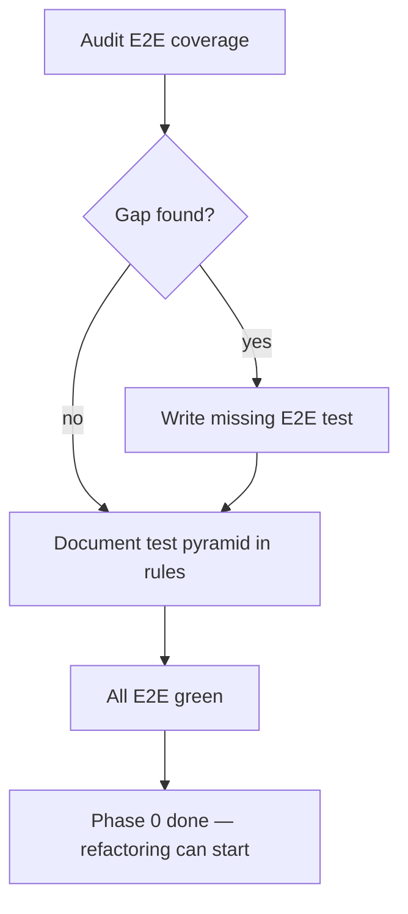

# Instruction: Use Case Refactoring — Phase 0: Safety Net

## Feature

- **Summary**: Fill E2E test gaps (adopt, auth, lifecycle) and codify the target test pyramid in rules before any refactoring starts. No production code changes.
- **Stack**: `TypeScript ESM, Vitest, Node.js >= 24`
- **Branch name**: `refactor/phase-0-safety-net`
- **Parent Plan**: `@aidd_docs/tasks/2026_03/2026_03_24-use-case-refactoring-master.md`
- **Sequence**: `1 of 6`
- **Confidence**: 10/10
- **Time to implement**: 1 session

## Existing files

- @tests/e2e/helpers.ts
- @tests/e2e/lifecycle.e2e.test.ts
- @tests/e2e/install.e2e.test.ts
- @tests/e2e/setup.e2e.test.ts
- @tests/application/use-cases/helpers.ts
- @tests/application/use-cases/adopt-use-case.test.ts
- @tests/application/use-cases/auth-login-use-case.test.ts
- @.claude/rules/05-testing/5-testing.md

### New files to create

- `tests/e2e/adopt.e2e.test.ts`
- `tests/e2e/auth.e2e.test.ts`
- `.claude/rules/05-testing/5-test-pyramid.md`

## User Journey

## Implementation phases

### Step 1 — Audit and write adopt E2E test

> Verify the adopt workflow is covered end-to-end.

1. Check `tests/e2e/setup.e2e.test.ts` for any existing adopt coverage
2. Write `tests/e2e/adopt.e2e.test.ts` with `describe.concurrent()`:
   - "detects pre-existing AIDD files and registers them without overwriting"
   - "fails in non-interactive mode without --tools and --from flags"
   - "adopts multiple tools from a local framework path"
3. Use fixtures from `FIXTURE_DIR`, real temp dirs, `try/finally` cleanup

### Step 2 — Write auth E2E test

> Verify auth login/logout/status flows are covered end-to-end.

1. Write `tests/e2e/auth.e2e.test.ts` with `describe.concurrent()`:
   - "stores token and reports authenticated status"
   - "logout clears stored credentials"
   - "status reports unauthenticated when no token stored"
2. Use `AIDD_TOKEN` env var to avoid real GitHub token dependency

### Step 3 — Extend lifecycle E2E

> Add auth-gated install scenario to existing lifecycle test.

1. Add one scenario to `lifecycle.e2e.test.ts`:
   - "full workflow: init → install → update → restore works with local framework"
   (already partially covered — confirm no gaps, extend if needed)

### Step 4 — Codify test pyramid in rules

> Lock the three-tier model before tests are restructured in Phase 4.

1. Write `.claude/rules/05-testing/5-test-pyramid.md`:
   - **Unit** (`tests/domain/`): domain models, value objects — no mocks, no I/O, pure functions only
   - **Integration** (`tests/application/`): use-cases with real temp filesystem + fixture framework; mock only `Prompter` and `FrameworkResolver`; test names describe functional intent, not method names
   - **E2E** (`tests/e2e/`): full CLI invocation; `describe.concurrent()` required; `try/finally` required; one file per command
2. Add naming rule: test names must describe a user-visible or system-level behavior (ban "calls X", "returns Y")

### Step 5 — Run full test suite

1. Run `pnpm test` — all tests must pass before closing this phase
2. Commit: `test(e2e): add adopt, auth coverage and test pyramid rules`

## Validation flow

1. `pnpm test` — all green, no skipped
2. Grep for new test files: `tests/e2e/adopt.e2e.test.ts`, `tests/e2e/auth.e2e.test.ts`
3. Rule file exists: `.claude/rules/05-testing/5-test-pyramid.md`
4. No production source file (`src/`) was modified
