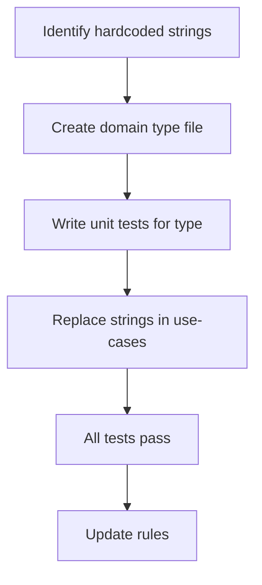

# Instruction: Use Case Refactoring — Phase 1: Domain Enrichment

## Feature

- **Summary**: Extract all hardcoded discriminant strings into named domain types and value objects. No use-case logic changes — only type definitions and their adoption in existing code.
- **Stack**: `TypeScript ESM, Node.js >= 24, Vitest`
- **Branch name**: `refactor/phase-1-domain-types`
- **Parent Plan**: `@aidd_docs/tasks/2026_03/2026_03_24-use-case-refactoring-master.md`
- **Sequence**: `2 of 6`
- **Confidence**: 10/10
- **Time to implement**: 1 session

## Existing files

- @src/domain/models/tool-config.ts
- @src/domain/models/manifest.ts
- @src/application/use-cases/update-use-case.ts
- @src/application/use-cases/restore-use-case.ts
- @src/application/use-cases/status-use-case.ts
- @src/application/use-cases/sync-use-case.ts
- @src/application/use-cases/conflict-resolution-use-case.ts
- @.claude/rules/08-domain/
- @.claude/rules/00-architecture/

### New files to create

- `src/domain/models/file-diff.ts`
- `src/domain/models/conflict-decision.ts`
- `src/domain/models/update-scope.ts`
- `src/domain/models/sync-exclusions.ts`
- `tests/domain/models/file-diff.test.ts`
- `tests/domain/models/update-scope.test.ts`
- `.claude/rules/08-domain/8-value-objects.md`
- `.claude/rules/00-architecture/0-discriminant-types.md`

## User Journey

## Implementation phases

### Step 1 — FileDiff types

> Replace `"added" | "removed" | "changed" | "unchanged"` hardcoded in update-use-case.

1. Create `src/domain/models/file-diff.ts`:
   - `export type FileDiffKind = "added" | "removed" | "changed" | "unchanged"`
   - `export interface FileDiff { relativePath: string; kind: FileDiffKind; conflict?: boolean }`
2. Write `tests/domain/models/file-diff.test.ts` — test all valid kinds, conflict flag
3. Replace inline `type FileDiffKind` and `interface FileDiff` in `update-use-case.ts` with imports

### Step 2 — ConflictDecision type

> Replace `"overwrite" | "skip" | "backup"` hardcoded in update and restore use-cases.

1. Create `src/domain/models/conflict-decision.ts`:
   - `export type ConflictDecision = "overwrite" | "skip" | "backup"`
2. Replace inline type in `update-use-case.ts` and `restore-use-case.ts`
3. Update `conflict-resolution-use-case.ts` return type to use `ConflictDecision`

### Step 3 — UpdateScope value object

> Replace `"all"`, `"docs"`, `"tool:"` string manipulation in update-use-case execute().

1. Create `src/domain/models/update-scope.ts`:
   - `export type UpdateScope = { kind: "all" } | { kind: "docs" } | { kind: "tool"; toolId: ToolId }`
   - `export function parseUpdateScope(raw: string): UpdateScope` — parses prompter selection value
   - `export function formatScopeChoice(toolId: ToolId): string` — builds select choice value
2. Write `tests/domain/models/update-scope.test.ts` — parse all variants, round-trip
3. Replace the `scopeSelection.startsWith("tool:")` logic in `update-use-case.ts` with `parseUpdateScope()`

### Step 4 — SyncExclusions

> Move hardcoded `EXCLUDED_FILES` set out of sync-use-case into domain.

1. Create `src/domain/models/sync-exclusions.ts`:
   - `export const SYNC_EXCLUDED_FILES: ReadonlySet<string>` — the current hardcoded set
   - `export function isSyncExcluded(relativePath: string, docsDir: string): boolean`
2. Replace `isExcluded()` function in `sync-use-case.ts` with import from domain
3. No behavior change — pure extraction

### Step 5 — Rules

> Document the new domain patterns.

1. Write `.claude/rules/08-domain/8-value-objects.md`:
   - Rule: every discriminant string used in 2+ use-cases must be a named type in `domain/models/`
   - Rule: value objects are immutable, constructed via factory functions if validation needed
2. Write `.claude/rules/00-architecture/0-discriminant-types.md`:
   - List of banned inline type definitions: FileDiffKind, ConflictDecision, UpdateScope
   - Must import from `domain/models/`

### Step 6 — Run full test suite

1. `pnpm test` — all green
2. Commit: `refactor(domain): extract discriminant types and value objects`

## Validation flow

1. `pnpm test` — all green
2. Grep `"added" | "removed"` as inline types in use-cases — must be zero occurrences
3. Grep `startsWith("tool:")` in update-use-case — must be zero occurrences
4. `EXCLUDED_FILES` must not exist in sync-use-case.ts
5. New domain files exist and have corresponding unit tests
