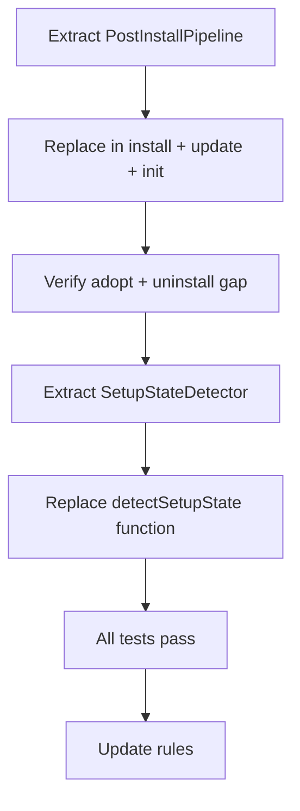

# Instruction: Use Case Refactoring — Phase 2: Shared Sub-Use-Cases

## Feature

- **Summary**: Extract the duplicated post-install pipeline into a shared use-case, and consolidate setup state detection into a dedicated class. No functional changes — pure structural extraction with identical behavior.
- **Stack**: `TypeScript ESM, Node.js >= 24, Vitest`
- **Branch name**: `refactor/phase-2-shared-use-cases`
- **Parent Plan**: `@aidd_docs/tasks/2026_03/2026_03_24-use-case-refactoring-master.md`
- **Sequence**: `3 of 6`
- **Confidence**: 9/10
- **Time to implement**: 1 session

## Existing files

- @src/application/use-cases/install-use-case.ts
- @src/application/use-cases/update-use-case.ts
- @src/application/use-cases/init-use-case.ts
- @src/application/use-cases/adopt-use-case.ts
- @src/application/use-cases/uninstall-use-case.ts
- @src/application/use-cases/setup-use-case.ts
- @src/application/use-cases/memory-script-use-case.ts
- @src/application/use-cases/catalog-use-case.ts
- @src/application/use-cases/gitignore-use-case.ts
- @src/domain/ports/file-system.ts
- @src/domain/ports/manifest-repository.ts
- @src/domain/ports/git.ts
- @src/domain/ports/hasher.ts
- @src/domain/ports/framework-resolver.ts
- @tests/application/use-cases/helpers.ts
- @.claude/rules/06-design-patterns/6-use-case.md

### New files to create

- `src/application/use-cases/shared/post-install-pipeline-use-case.ts`
- `src/application/use-cases/shared/setup-state-detector.ts`
- `tests/application/use-cases/shared/post-install-pipeline-use-case.test.ts`
- `tests/application/use-cases/shared/setup-state-detector.test.ts`
- `.claude/rules/06-design-patterns/6-shared-use-cases.md`

## User Journey



## Implementation phases

### Step 1 — PostInstallPipelineUseCase

> Encapsulate the 4-step sequence called after every install/update.

1. Create `src/application/use-cases/shared/post-install-pipeline-use-case.ts`:
   ```
   class PostInstallPipelineUseCase
     constructor(fs, hasher, git, manifestRepo)
     execute({ projectRoot, version, descriptor, contentFiles, manifest, docsDir }): Promise<void>
       → MemoryScriptUseCase.execute(...)
       → manifestRepo.save(manifest)
       → CatalogUseCase.execute(...)
       → GitignoreUseCase.execute(projectRoot, [".aidd/cache/"])
   ```
2. Constructor injection order: `FileSystem → ManifestRepository → Hasher → Git`
   (Logger not needed — delegates to sub-use-cases)
3. Write `tests/application/use-cases/shared/post-install-pipeline-use-case.test.ts`:
   - "saves manifest, generates catalog, updates gitignore after install"
   - "executes memory script when framework has memory bank content"

### Step 2 — Replace in install-use-case

> Replace the 4 inline calls with PostInstallPipelineUseCase.

1. In `install-use-case.ts` lines 159-169: replace with single `new PostInstallPipelineUseCase(...).execute(...)`
2. Remove direct imports of MemoryScriptUseCase, CatalogUseCase, GitignoreUseCase from install
3. `pnpm test` — must stay green

### Step 3 — Replace in update-use-case

> Same replacement in update executeInternal() lines 295-304.

1. In `update-use-case.ts`: replace the 4 inline post-processing calls with PostInstallPipelineUseCase
2. `pnpm test` — must stay green

### Step 4 — Replace in init-use-case

> init calls only 3 of 4 (no MemoryScript) — document why, use pipeline for the 3.

1. Review why MemoryScript is absent from init (no tools installed yet — correct behavior)
2. Replace the 3 calls (save + catalog + gitignore) with PostInstallPipelineUseCase where `skipMemoryScript: true` option, OR keep them explicit with a comment explaining the exception
3. Decision: if init is the only exception, keep explicit with comment — do not pollute the pipeline interface

### Step 5 — SetupStateDetector

> Move `detectSetupState` free function into a class for testability.

1. Create `src/application/use-cases/shared/setup-state-detector.ts`:
   ```
   class SetupStateDetector
     constructor(manifestRepo, fs, resolver)
     detect(projectRoot): Promise<SetupState>
   ```
2. Move logic verbatim from `detectSetupState()` free function in `setup-use-case.ts`
3. Export `SetupState` type from `setup-state-detector.ts` (remove from setup-use-case.ts or re-export)
4. Write `tests/application/use-cases/shared/setup-state-detector.test.ts`:
   - "returns needs-init when no manifest and no tool signals"
   - "returns needs-adopt when tool signals detected without manifest"
   - "returns needs-install when manifest exists with no installed tools"
   - "returns needs-update when installed version is behind latest"
   - "returns up-to-date on network failure"
5. Replace `detectSetupState()` call in `SetupUseCase.execute()` with `new SetupStateDetector(...).detect()`

### Step 6 — Rules update

1. Write `.claude/rules/06-design-patterns/6-shared-use-cases.md`:
   - Shared use-cases live in `application/use-cases/shared/`
   - They are never called from commands directly — only from other use-cases
   - They must have a single `execute()` method with a typed options/result interface
   - PostInstallPipelineUseCase is the canonical post-write sequence — no direct calls to Memory/Catalog/Gitignore outside of it
2. Update `.claude/rules/06-design-patterns/6-use-case.md`: add mention of shared/ subdirectory

### Step 7 — Full test suite

1. `pnpm test` — all green
2. Commit: `refactor(application): extract PostInstallPipeline and SetupStateDetector`

## Validation flow

1. `pnpm test` — all green
2. Grep `new MemoryScriptUseCase` in use-cases outside shared/ — must be zero
3. Grep `new CatalogUseCase` in install/update — must be zero
4. `detectSetupState` free function must no longer exist in setup-use-case.ts
5. `tests/application/use-cases/shared/` directory exists with 2 test files
