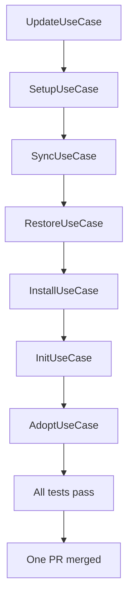

# Instruction: Use Case Refactoring — Phase 3: Use Case Cleanup

## Feature

- **Summary**: Reduce all use-case methods to ≤ 20 lines by extracting well-named private methods and sub-use-cases. One PR, one commit per use-case. No functional changes.
- **Stack**: `TypeScript ESM, Node.js >= 24, Vitest`
- **Branch name**: `refactor/phase-3-use-case-cleanup`
- **Parent Plan**: `@aidd_docs/tasks/2026_03/2026_03_24-use-case-refactoring-master.md`
- **Sequence**: `4 of 6`
- **Confidence**: 8/10
- **Time to implement**: 2–3 sessions

## Existing files

- @src/application/use-cases/update-use-case.ts
- @src/application/use-cases/setup-use-case.ts
- @src/application/use-cases/sync-use-case.ts
- @src/application/use-cases/restore-use-case.ts
- @src/application/use-cases/install-use-case.ts
- @src/application/use-cases/init-use-case.ts
- @src/application/use-cases/adopt-use-case.ts
- @src/application/use-cases/shared/post-install-pipeline-use-case.ts
- @src/application/use-cases/shared/setup-state-detector.ts
- @src/domain/models/file-diff.ts
- @src/domain/models/conflict-decision.ts
- @src/domain/models/update-scope.ts
- @tests/application/use-cases/update-use-case.test.ts
- @tests/application/use-cases/setup-use-case.test.ts
- @tests/application/use-cases/install-use-case.test.ts
- @tests/application/use-cases/init-use-case.test.ts
- @tests/application/use-cases/adopt-use-case.test.ts
- @tests/application/use-cases/restore-use-case.test.ts
- @tests/application/use-cases/sync-use-case.test.ts

## User Journey

## Implementation phases

### Commit 1 — UpdateUseCase

> Decompose executeInternal() (166 lines) into focused private methods.

1. Extract `private updateToolSection(toolId, manifest, distribution, options, internal): Promise<UpdateToolResult>`
   - computeDiff + resolveConflicts + applyDiff + manifest.addTool — stays ≤ 20 lines per method
2. Extract `private updateDocsSection(manifest, docsFiles, options, internal): Promise<DocsUpdateResult | null>`
   - deduplicates `updateDocs()` and the docs block in `executeInternal()`
3. Extract `private buildScopeOptions(scopeSelection: UpdateScope, options): UpdateOptions`
   - replaces the inline `toolIds/docsOnly` reassignment in the interactive block
4. `executeInternal()` becomes: load manifest → loop tools via `updateToolSection` → `updateDocsSection` → `PostInstallPipelineUseCase` → build result
5. `execute()` interactive block uses `UpdateScope` from domain (Phase 1) — no raw strings
6. `pnpm test` — green before next commit

### Commit 2 — SetupUseCase

> Decompose handleInit() (106 lines) into 3 resolver methods + simplify handleAdopt.

1. Extract `private resolveDocsDir(options): Promise<{ docsDir: string; explicitDocsDir: string }>`
   - the 3-branch docsDir logic (explicit / non-interactive / interactive) — ≤ 20 lines
2. Extract `private resolveFrameworkSource(options): Promise<{ frameworkPath?: string; frameworkRepo?: string }>`
   - the path/repo resolution with manifest fallback — ≤ 20 lines
3. Extract `private resolveRelease(frameworkRepo, options): Promise<string | undefined>`
   - the interactive/non-interactive latest version fetch — ≤ 15 lines
4. `handleInit()` becomes: `resolveDocsDir` → `resolveFrameworkSource` → `resolveRelease` → `frameworkResolver.execute` → `InitUseCase` → `runInstall` → return result
5. Extract `private resolveAdoptTools(options): Promise<ToolId[]>` from handleAdopt
6. Extract `private resolveAdoptFrom(options): Promise<string>` from handleAdopt
7. `pnpm test` — green before next commit

### Commit 3 — SyncUseCase

> Separate tool selection from propagation logic.

1. Extract `private selectSyncScope(options, manifest): Promise<{ sourceTool: ToolId; targetTools: ToolId[] }>`
   - the interactive + non-interactive tool selection — ≤ 20 lines per branch
2. `execute()` becomes: load manifest → `selectSyncScope` → loop targets via existing propagate methods → build totals
3. The 3 propagate methods (`propagateModified`, `propagateAdded`, `propagateDeleted`) are already well-named — verify each is ≤ 20 lines, extract inner loops if needed
4. `pnpm test` — green before next commit

### Commit 4 — RestoreUseCase

> Verify existing decomposition is ≤ 20 lines; clean up restoreDocs duplication.

1. Extract `private restoreSection(manifestFiles, distMap, options): Promise<{ restored: string[]; kept: string[] }>`
   - shared logic between tool restore and docs restore (both call collectDrift + applyRestorations)
2. Replace duplicated code in `execute()` tool loop and `restoreDocs()` with `restoreSection()`
3. `execute()` method itself should be ≤ 20 lines after extraction
4. `pnpm test` — green before next commit

### Commit 5 — InstallUseCase

> Separate tool selection from tool installation loop.

1. Extract `private resolveToolIds(options, manifest): Promise<ToolId[]>`
   - the 4-branch selection logic (all / explicit / interactive / error) — ≤ 20 lines
2. Extract `private installOneTool(toolId, manifest, distribution, projectRoot): Promise<InstallToolResult>`
   - the per-tool install body — ≤ 20 lines
3. `execute()` becomes: load manifest → `resolveToolIds` → load framework → loop via `installOneTool` → `PostInstallPipelineUseCase`
4. `pnpm test` — green before next commit

### Commit 6 — InitUseCase

> Separate interactive prompting from file writing.

1. Extract `private resolveInitConfig(options): Promise<{ docsDir: string; repo?: string }>`
   - interactive prompt block — ≤ 15 lines
2. Extract `private writeDocsFiles(frameworkPath, docsDir, projectRoot, force, existing): Promise<GeneratedFile[]>`
   - file iteration and write logic — ≤ 20 lines
3. Double manifest load: remove second `load()` in `execute()` — use the result from `checkPreconditions` by passing it as argument
4. `pnpm test` — green before next commit

### Commit 7 — AdoptUseCase

> Verify existing decomposition; add missing post-install steps.

1. Verify all methods are ≤ 20 lines — extract if any exceed
2. Review whether `GitignoreUseCase` and `MemoryScriptUseCase` should be called after adopt (they are currently absent — add if appropriate, document if not)
3. `pnpm test` — green before next commit

### Final — Open PR

1. All 7 commits in one PR on branch `refactor/phase-3-use-case-cleanup`
2. PR description lists each commit with its use-case name and what was extracted

## Validation flow

1. `pnpm test` — all green after every individual commit
2. No method in any use-case file exceeds 20 lines (grep or manual audit)
3. No functional behavior change — E2E output identical to pre-refactor
4. `SetupUseCase.handleInit()` is ≤ 20 lines
5. `UpdateUseCase.executeInternal()` no longer exists — replaced by focused private methods
