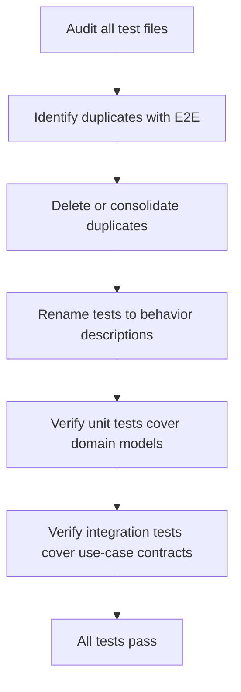

# Instruction: Use Case Refactoring — Phase 4: Test Pyramid Restructuring

## Feature

- **Summary**: Restructure all tests to match the three-tier pyramid (unit / integration / e2e). Remove tests that duplicate E2E coverage. Rename all tests to describe functional intent. No production code changes.
- **Stack**: `TypeScript ESM, Vitest`
- **Branch name**: `refactor/phase-4-test-pyramid`
- **Parent Plan**: `@aidd_docs/tasks/2026_03/2026_03_24-use-case-refactoring-master.md`
- **Sequence**: `5 of 6`
- **Confidence**: 9/10
- **Time to implement**: 1 session

## Existing files

- @tests/domain/
- @tests/application/use-cases/
- @tests/infrastructure/
- @tests/e2e/
- @.claude/rules/05-testing/5-testing.md
- @.claude/rules/05-testing/5-test-pyramid.md

## User Journey

## Implementation phases

### Step 1 — Audit test coverage

> Map each test file to its tier and identify overlaps.

1. List all tests in `tests/application/use-cases/` — for each `it()`, ask: "does an E2E test already cover this exact scenario?"
2. Flag as duplicate if: same command + same flags + same expected outcome exists in `tests/e2e/`
3. List all tests in `tests/domain/` — verify every new domain model from Phase 1 has unit tests
4. Produce a short audit list before making changes

### Step 2 — Remove duplicate integration tests

> Delete integration tests that are fully covered by E2E tests with no added precision.

1. For each flagged duplicate: verify E2E counterpart covers the same assertion
2. Delete the duplicate — do not consolidate if the E2E is clearer
3. Keep integration tests that test edge cases not exercised by E2E (conflict resolution decisions, partial tool updates, non-interactive mode branches)
4. `pnpm test` — green after each deletion batch

### Step 3 — Rename tests to behavior descriptions

> All test names must describe a user-visible or system-level behavior.

1. Apply naming rule: `it("does X when Y")` — present tense, behavioral
2. Banned patterns: `it("calls execute()")`, `it("returns undefined")`, `it("throws Error")`
3. Good patterns: `it("skips install when tool already installed")`, `it("preserves user-modified files on update")`
4. Apply to all tiers — domain, application, e2e

### Step 4 — Ensure domain unit tests cover all Phase 1 models

> Each new domain model must have a dedicated unit test file.

1. Verify `tests/domain/models/file-diff.test.ts` — all FileDiffKind variants
2. Verify `tests/domain/models/update-scope.test.ts` — all UpdateScope variants + parseUpdateScope
3. Verify `tests/domain/models/conflict-decision.test.ts` if created
4. Add missing unit tests for `sync-exclusions.ts` if not covered

### Step 5 — Ensure integration tests cover shared use-cases

> Phase 2 extracted PostInstallPipelineUseCase and SetupStateDetector — verify coverage.

1. Confirm `tests/application/use-cases/shared/post-install-pipeline-use-case.test.ts` exists and covers:
   - pipeline executes all 4 steps in order
   - manifest is saved before catalog generation
2. Confirm `tests/application/use-cases/shared/setup-state-detector.test.ts` covers all 5 SetupState variants

### Step 6 — Update rules

1. Update `.claude/rules/05-testing/5-testing.md` if any rule changed
2. Confirm `.claude/rules/05-testing/5-test-pyramid.md` (created in Phase 0) is still accurate
3. Add to rules: "before deleting an integration test, verify an E2E test covers the same scenario"

### Step 7 — Full test suite

1. `pnpm test` — all green, fewer total tests than before Phase 4 (duplicates removed)
2. Commit: `test: restructure test pyramid, remove E2E duplicates, rename for behavior`

## Validation flow

1. `pnpm test` — all green
2. `grep -r 'calls execute\|returns undefined\|throws Error' tests/` — zero matches in test names
3. Total test count is lower than before Phase 4 (duplicates removed)
4. Every domain model from Phase 1 has a corresponding unit test in `tests/domain/`
5. `tests/application/use-cases/shared/` has 2+ test files
