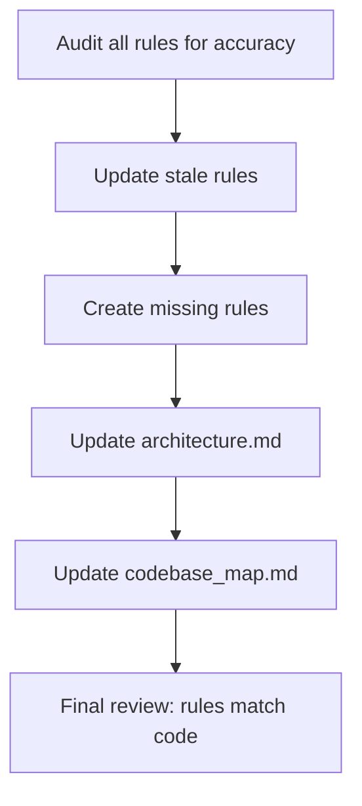

# Instruction: Use Case Refactoring — Phase 5: Rules and Docs Update

## Feature

- **Summary**: Update all .claude/rules/ and aidd_docs/memory/ to accurately reflect the refactored architecture. Ensure future contributors cannot reintroduce the debt patterns that were eliminated.
- **Stack**: `Markdown`
- **Branch name**: `refactor/phase-5-rules-docs`
- **Parent Plan**: `@aidd_docs/tasks/2026_03/2026_03_24-use-case-refactoring-master.md`
- **Sequence**: `6 of 6`
- **Confidence**: 10/10
- **Time to implement**: 1 session

## Existing files

- @.claude/rules/00-architecture/0-command-thin-wrapper.md
- @.claude/rules/00-architecture/0-hexagonal.md
- @.claude/rules/00-architecture/0-layer-responsibilities.md
- @.claude/rules/00-architecture/0-error-handling.md
- @.claude/rules/06-design-patterns/6-use-case.md
- @.claude/rules/05-testing/5-testing.md
- @.claude/rules/04-tooling/ide-mapping.md
- @aidd_docs/memory/architecture.md
- @aidd_docs/memory/codebase_map.md

### New files already created in previous phases

- `.claude/rules/08-domain/8-value-objects.md` (Phase 1)
- `.claude/rules/00-architecture/0-discriminant-types.md` (Phase 1)
- `.claude/rules/06-design-patterns/6-shared-use-cases.md` (Phase 2)
- `.claude/rules/05-testing/5-test-pyramid.md` (Phase 0)

### New files to create in this phase

- `.claude/rules/06-design-patterns/6-method-size.md`
- `.claude/rules/00-architecture/0-post-install-pipeline.md`

## User Journey

## Implementation phases

### Step 1 — Update 0-layer-responsibilities.md

> Reflect the new shared/ subdirectory and the PostInstallPipeline pattern.

1. Add entry for `application/use-cases/shared/`:
   - "Shared use-cases — orchestration helpers called by other use-cases; never by commands"
   - Examples: PostInstallPipelineUseCase, SetupStateDetector
2. Update Use Case section: add "methods must be ≤ 20 lines; extract private methods if exceeded"
3. Confirm "no tool-specific logic in use-cases" rule is still accurate after Phase 3 refactoring

### Step 2 — Update 6-use-case.md

> Add method size rule and constructor injection order for shared use-cases.

1. Add: "Every method (public or private) must be ≤ 20 lines. Extract named private methods before reaching the limit."
2. Add: "Shared sub-use-cases live in `shared/` — import from there, never inline equivalent logic"
3. Verify constructor injection order still matches all 7 use-cases after Phase 3

### Step 3 — Create 6-method-size.md

> Prevent regression on method length.

1. Write `.claude/rules/06-design-patterns/6-method-size.md`:
   - Hard limit: 20 lines per method (public or private)
   - Counting rule: blank lines and closing braces count; comments do not
   - Violation pattern: nested for-loops with conditional blocks — split into named private methods
   - Anti-pattern: `executeInternal()`, `handleXxxLong()` — sign that the method does too much
   - Extraction rule: extracted method name must describe its intent, not its mechanics

### Step 4 — Create 0-post-install-pipeline.md

> Document the canonical sequence and ban direct calls outside PostInstallPipelineUseCase.

1. Write `.claude/rules/00-architecture/0-post-install-pipeline.md`:
   - The post-install sequence is: MemoryScriptUseCase → manifestRepo.save() → CatalogUseCase → GitignoreUseCase
   - This sequence must ONLY be called via `PostInstallPipelineUseCase`
   - Exception: `InitUseCase` skips MemoryScript (no tools installed yet) — document inline with comment
   - Any new use-case that writes files to disk and updates the manifest must call this pipeline

### Step 5 — Update architecture.md

> Reflect the new domain models and shared use-cases in the component diagram.

1. Add to Domain models list: `FileDiff, ConflictDecision, UpdateScope, SyncExclusions`
2. Add to Application use-cases list: `post-install-pipeline (shared), setup-state-detector (shared)`
3. Update "Use Case Notes" section: add SetupStateDetector, PostInstallPipelineUseCase notes
4. Update "Directory Structure" section: add `application/use-cases/shared/`
5. Update any diagram that shows the install/update flow to include the pipeline

### Step 6 — Update codebase_map.md (if exists)

1. Reflect new files added across all phases
2. Remove references to patterns that were eliminated (inline post-install calls, free function detectSetupState)

### Step 7 — Final consistency check

> Verify every rule file describes what the code actually does.

1. Read each `.claude/rules/` file — does it match the current state of `src/`?
2. Flag any rule that references a pattern that no longer exists or uses old naming
3. Remove [DEPRECATED] markers from any rules that were transitional during Phase 1–3

### Step 8 — Commit

1. Commit: `docs: update rules and architecture docs to reflect refactored application layer`

## Validation flow

1. Every rule file in `.claude/rules/` accurately describes the current `src/` code
2. `aidd_docs/memory/architecture.md` lists all 4 new domain models
3. `application/use-cases/shared/` appears in the directory structure section
4. No rule references `executeInternal`, `handleInit` as long methods, or raw `"added"/"removed"` inline types
5. `pnpm test` — still all green (no production code changed in this phase)
