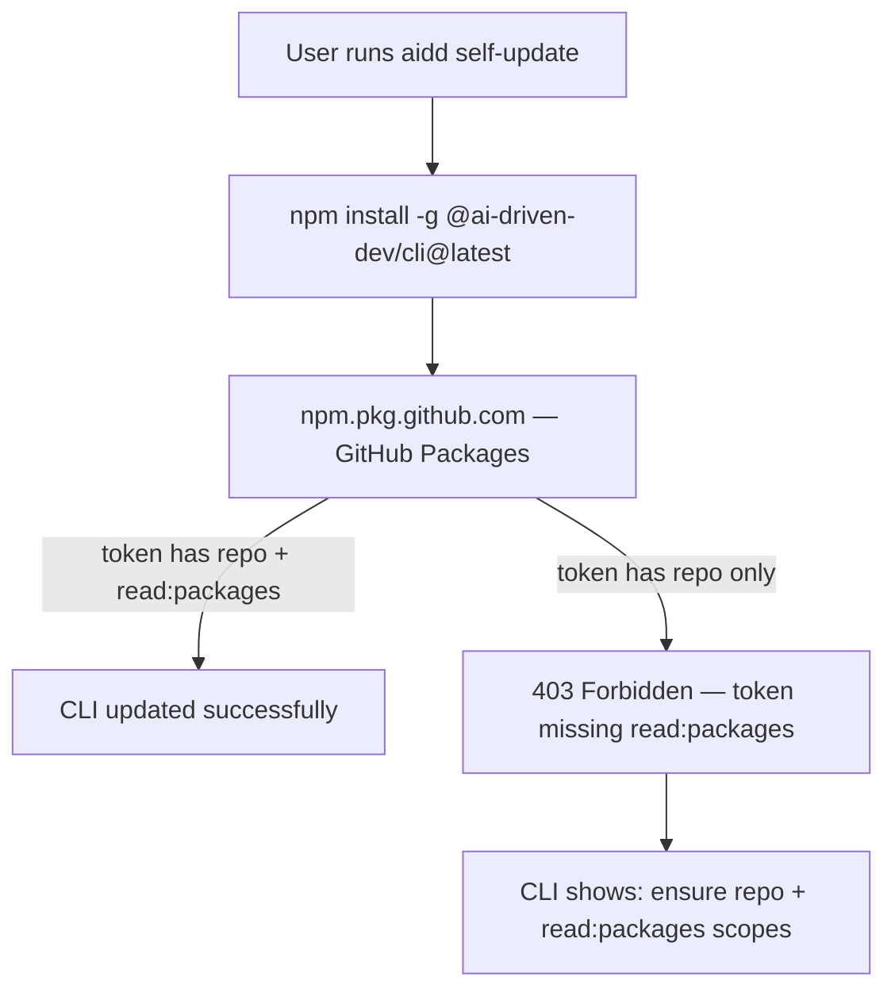

# Instruction: Fix missing read:packages scope for self-update

## Feature

- **Summary**: Add `read:packages` to documented required GitHub token scopes and surface an actionable error when `aidd self-update` fails with a 403 from GitHub Packages
- **Stack**: `TypeScript`, `Node.js`
- **Branch name**: `fix/109-read-packages-scope`
- **Parent Plan**: `none`
- **Sequence**: `standalone`
- Confidence: 10/10
- Time to implement: small

## Existing files

- @README.md
- @src/infrastructure/adapters/cli-updater-adapter.ts
- @tests/infrastructure/adapters/cli-updater-adapter.integration.test.ts

### New files to create

- none

## User Journey

## Implementation phases

### Phase 1: Update README documentation

> Add `read:packages` to all token scope instructions.

1. Line 47: change `repo` scope to `repo` and `read:packages`
2. Line 329: update `AIDD_TOKEN` env var description to include `read:packages`

### Phase 2: Improve install() error message

> Wrap execSync in try/catch and throw an actionable error when install fails.

1. In `CliUpdaterAdapter.install()`, wrap `execSync` in try/catch
2. Throw: `"Update failed. If you see a 403 error above, ensure your GitHub token includes both repo and read:packages scopes.\nUpdate your token at https://github.com/settings/tokens, then re-run \`aidd auth login\`."`

### Phase 3: Add integration test

> Cover the install failure path in the adapter test.

1. In `tests/infrastructure/adapters/cli-updater-adapter.integration.test.ts`, add a `describe` block for `install()`
2. Mock `execSync` to throw, assert the error message contains `read:packages`

## Validation flow

1. Run `pnpm test:integration` — new test passes
2. Read README lines 47 and 329 — both mention `read:packages`
3. Manually inspect the error thrown by `install()` when execSync fails — message includes `read:packages` hint
