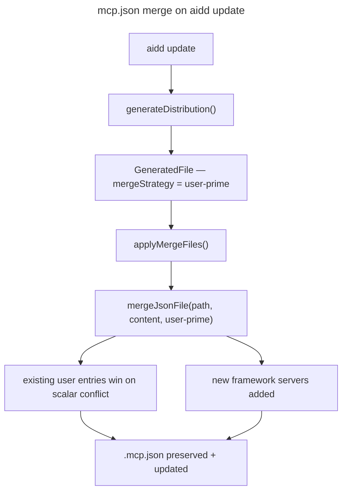

# Instruction: fix(update): .mcp.json merge strategy — user-prime

## Feature

- **Summary**: Replace the boolean `shouldMerge` on `ConfigHandler` with a typed `mergeStrategy` that encodes both whether to merge and who wins on conflicts. Set `.mcp.json` to `"user-prime"` so user customizations are never overwritten on `aidd update`.
- **Stack**: `TypeScript 5`, `Node.js 22`
- **Branch name**: `fix/mcp-json-merge-strategy`
- **Parent Plan**: `none`
- **Sequence**: `standalone`
- Confidence: 9/10
- Time to implement: medium

## Existing files

- @src/domain/models/tool-config.ts
- @src/domain/models/generated-file.ts
- @src/domain/models/distribution.ts
- @src/domain/ports/file-system.ts
- @src/infrastructure/adapters/file-system-adapter.ts
- @src/application/use-cases/update-use-case.ts
- @src/domain/tools/claude.ts
- @src/domain/tools/copilot.ts
- @src/domain/tools/cursor.ts
- @src/domain/tools/opencode.ts
- @tests/infrastructure/adapters/file-system-adapter.integration.test.ts
- @tests/domain/models/distribution.unit.test.ts
- @tests/domain/tools/opencode.unit.test.ts
- @tests/application/use-cases/install-use-case.integration.test.ts

### New file to create

- `src/domain/models/merge-strategy.ts` — `MergeStrategy` discriminant type

## User Journey

## Implementation phases

### Phase 1 — Domain type

> Define the `MergeStrategy` discriminant type and update the `ConfigHandler` interface.

1. Create `src/domain/models/merge-strategy.ts` with `export type MergeStrategy = "none" | "framework-prime" | "user-prime"`
2. In `src/domain/models/tool-config.ts`: replace `shouldMerge(configName: string): boolean` with `mergeStrategy(configName: string): MergeStrategy`
3. Import `MergeStrategy` in `tool-config.ts`

### Phase 2 — Tool configs

> Update all 4 tool configs to implement the new interface method.

1. `claude.ts`: replace `shouldMerge` with `mergeStrategy` — return `"framework-prime"` for `CONFIG_VSCODE_SETTINGS`, `"user-prime"` for `CONFIG_MCP`, `"none"` otherwise
2. `copilot.ts`: replace `shouldMerge` with `mergeStrategy` — return `"framework-prime"` for `CONFIG_VSCODE_SETTINGS`, `"none"` otherwise
3. `cursor.ts`: replace `shouldMerge` with `mergeStrategy` — return `"user-prime"` for `CONFIG_MCP` (`.cursor/mcp.json`), `"none"` otherwise
4. `copilot.ts`: also add `"user-prime"` for `CONFIG_MCP` (`.vscode/mcp.json`), keep `"framework-prime"` for `CONFIG_VSCODE_SETTINGS`
5. `opencode.ts`: replace `shouldMerge` with `mergeStrategy` — return `"framework-prime"` when current impl returns true, `"none"` otherwise

### Phase 3 — GeneratedFile model

> Carry the strategy through the file model.

1. In `src/domain/models/generated-file.ts`: rename `merge: boolean` → `mergeStrategy: MergeStrategy`
2. Update constructor params and default (`"none"` instead of `false`)
3. Import `MergeStrategy`

### Phase 4 — Distribution

> Pass the strategy when building GeneratedFile instances.

1. In `src/domain/models/distribution.ts`: replace `shouldMerge(ref.name)` call with `configHandler.mergeStrategy(ref.name)`
2. Update `collectRawFiles` signature: `shouldMerge` param → `mergeStrategy` param of type `(name: string) => MergeStrategy`
3. Pass to `GeneratedFile`: `mergeStrategy: mergeStrategy(ref.name)` instead of `merge: shouldMerge(ref.name)`

### Phase 5 — FileSystem port + adapter

> Extend `mergeJsonFile` to accept the strategy and invert direction for `"user-prime"`.

1. In `src/domain/ports/file-system.ts`: add `strategy: MergeStrategy` param to `mergeJsonFile` signature
2. In `src/infrastructure/adapters/file-system-adapter.ts`:
   - Update `mergeJsonFile` signature
   - For `"framework-prime"`: keep `deepMerge(existing, incoming)` (source wins — current behavior)
   - For `"user-prime"`: call `deepMerge(incoming, existing)` (existing wins)

### Phase 6 — Update use-case

> Update the 3 usages of `GeneratedFile.merge` in `update-use-case.ts`.

1. `applyMergeFiles`: `if (!newFile.merge)` → `if (newFile.mergeStrategy === "none")`, pass `newFile.mergeStrategy` to `mergeJsonFile`
2. `computeDiff`: `if (newFile.merge)` → `if (newFile.mergeStrategy !== "none")`
3. `registerToolFiles`: `newDistMap.get(f.relativePath)?.merge === true` → `newDistMap.get(f.relativePath)?.mergeStrategy !== "none"`

### Phase 7 — Tests

> Update all impacted tests to use `mergeStrategy` instead of `merge`.

1. Update `file-system-adapter.integration.test.ts`: test both `"framework-prime"` (source wins) and `"user-prime"` (existing wins) behaviors
2. Update `distribution.unit.test.ts`: assertions on `mergeStrategy` field instead of `merge`
3. Update `install-use-case.integration.test.ts`: update merge file fixture assertions
4. Update `opencode.unit.test.ts`: verify opencode returns `"framework-prime"` for its configs
5. Add test for claude tool: verify `.mcp.json` returns `"user-prime"`, `.vscode/settings.json` returns `"framework-prime"`

## Validation flow

1. Run `aidd install claude` on a clean project — `.mcp.json` is created
2. Modify `.mcp.json` manually (add a custom MCP server, change an arg)
3. Run `aidd update` — `.mcp.json` must not be overwritten, custom entries must be preserved
4. Verify new framework MCP servers (if any) appear in `.mcp.json`
5. Verify `.vscode/settings.json` still behaves as before (framework wins)
6. Run full test suite — no regressions
