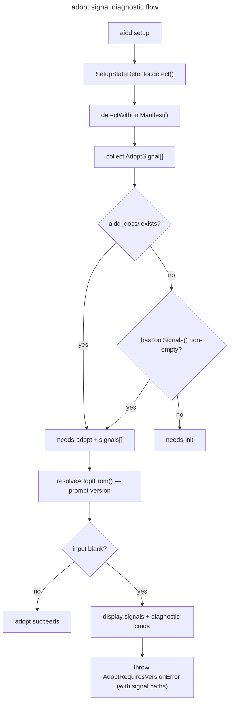

# Instruction: Surface adopt-trigger signals with diagnostic + fresh-init escape

## Feature

- **Summary**: When `aidd setup` routes to the adopt flow and the user cannot provide a prior version, display which files triggered the detection and log suggested diagnostic commands. Fresh-init escape hatch deferred pending feasibility check.
- **Stack**: `TypeScript 5`, `Node.js 20`, `Vitest`
- **Branch name**: `fix/adopt-signal-diagnostic`
- **Parent Plan**: `none`
- **Sequence**: `standalone`
- Confidence: 9/10
- Time to implement: ~1h

## Existing files

- @src/domain/models/tool-config.ts
- @src/application/use-cases/shared/setup-state-detector.ts
- @src/application/use-cases/setup-use-case.ts
- @src/application/use-cases/init-use-case.ts
- @src/application/use-cases/doctor-use-case.ts
- @tests/application/use-cases/shared/setup-state-detector.integration.test.ts

### New file to create

- none

## User Journey

## Implementation phases

### Phase 1: Make `hasToolSignals` return `string[]` everywhere

> Single consistent API — callers that need boolean use `.length > 0`

1. Change `hasToolSignals(fs, config, projectRoot): Promise<string[]>` in `tool-config.ts` — return matching file paths instead of `boolean` (same loop, collect instead of early-return true)
2. Update `init-use-case.ts` `hasAiddSignals`: `if ((await hasToolSignals(...)).length > 0)`
3. Update `doctor-use-case.ts` `checkOrphanedDirectories` (line 162): same `.length > 0` guard

### Phase 2: Collect signals in `SetupStateDetector`

> Enrich `SetupState["needs-adopt"]` with the triggering paths

1. Add `AdoptSignal` type in `setup-state-detector.ts`:
   `{ type: "docsDir"; path: string } | { type: "toolSignal"; tool: ToolId; file: string }`
2. Update `detectWithoutManifest`: collect all signals via updated `hasToolSignals`, return `{ kind: "needs-adopt", signals }`
3. Update `SetupState` union: `{ kind: "needs-adopt"; signals: AdoptSignal[] }`

### Phase 3: Surface diagnostic in adopt flow

> Show which files triggered adopt mode + suggested commands when user enters blank version

1. Thread `signals` from `execute()` switch → `handleAdopt(options, signals)` → `resolveAdoptFrom(options, repo, signals)`
2. In `resolveAdoptFrom`, when `fromInput` is blank:
   - For each signal, log: `"Detected: <path>"` + `"→ ls <path>"` (or `cat <file>` for toolSignal)
3. In non-interactive mode: append signal paths to `AdoptRequiresVersionError` message
4. Throw `AdoptRequiresVersionError` as before (fresh-init escape deferred)

### Phase 4: Update tests

> Keep existing tests green; add coverage for new paths

1. `setup-state-detector.integration.test.ts`: update `needs-adopt` assertions to include `signals` field check
2. Add test: blank-version + signals → error message contains signal paths
3. Verify `doctor-use-case` tests still pass after `hasToolSignals` return type change

## Deferred: fresh-init escape hatch

`InitUseCase.checkPreconditions` (line 50-54): `force: true` + no manifest → `NoManifestError`.
Cannot use `force` here. Options to evaluate in a separate ticket:
- Delete `aidd_docs/` before calling `handleInit` (requires explicit user confirmation + data loss risk)
- New `InitOptions.overwrite` flag that bypasses `AiddFilesDetectedError` without requiring an existing manifest

## Validation flow

1. Create a project with `aidd_docs/` but no `.aidd/manifest.json`
2. Run `aidd setup` (interactive), leave version blank
3. Confirm: diagnostic output lists `aidd_docs/` as trigger with `ls aidd_docs/` suggestion
4. Confirm: `AdoptRequiresVersionError` message includes signal path
5. Run `aidd setup --from ""` (non-interactive): confirm error message includes signal paths
6. Verify `aidd doctor` and `aidd init` still behave correctly (hasToolSignals callers)

---

## Confidence assessment

- 9/10
- ✅ `hasToolSignals` → `string[]` is backward-compatible for callers (boolean guard → `.length > 0`)
- ✅ `SetupState["needs-adopt"]` gains a field — switch on `kind` is unaffected
- ✅ `doctor-use-case` and `init-use-case` touched minimally (1 line each)
- ❌ Fresh-init escape hatch deferred — `checkPreconditions` incompatibility blocks safe implementation
