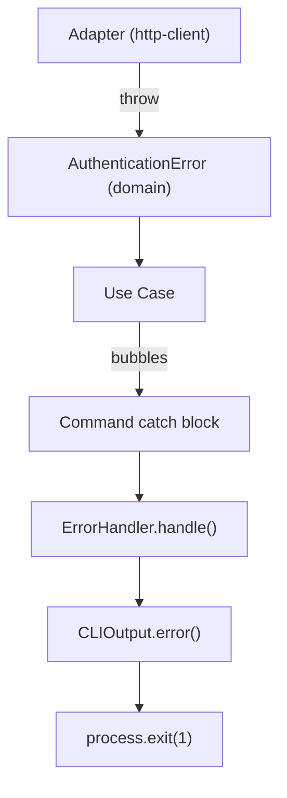

# Instruction: Typed Exceptions — Foundation

## Feature

- **Summary**: Add AuthenticationError to domain, create global ErrorHandler, strip exit() from CLIOutput, translate HTTP auth failure in http-client, wire ErrorHandler in deps
- **Stack**: `TypeScript 5`, `Node.js`
- **Branch name**: `refactor/113-typed-exceptions-error-handler`
- **Parent Plan**: `./2026_04_08-#113-typed-exceptions-error-handler-master.md`
- **Sequence**: `1 of 2`
- **Confidence**: 9/10
- **Time to implement**: 45min

## Existing files

- @src/domain/errors.ts
- @src/application/output.ts
- @src/infrastructure/http/http-client.ts
- @src/infrastructure/deps.ts

### New file to create

- `src/application/error-handler.ts`

## User Journey

## Implementation phases

### Phase 1 — Domain: add AuthenticationError

> Typed exception for HTTP 401/403, carrying source context

1. Add `AuthenticationError` to `src/domain/errors.ts` with `constructor(source: string)`, message: `Authentication failed (${source}). Run \`aidd auth login\` to authenticate.`

### Phase 2 — Application: create ErrorHandler

> Central handler — matches typed exceptions, formats message, exits

1. Create `src/application/error-handler.ts` — class `ErrorHandler`, constructor takes `CLIOutput`
2. Implement `handle(error: unknown): never` — `instanceof` match on all known typed exceptions (domain + application), fallback to `error instanceof Error ? error.message : String(error)`
3. Call `output.error(message)` then `process.exit(1)`

### Phase 3 — Application: clean CLIOutput

> Remove logic from pure output channel

1. Remove `exit()` method from `src/application/output.ts`

### Phase 4 — Infrastructure: translate in http-client

> Adapter translates technical HTTP error to domain exception

1. In `src/infrastructure/http/http-client.ts`, replace inline `throw new Error("Authentication failed...")` with `throw new AuthenticationError("GitHub API")`
2. Import `AuthenticationError` from `../../domain/errors.js`

### Phase 5 — Infrastructure: wire ErrorHandler in deps

> Make ErrorHandler available to all commands

1. Instantiate `ErrorHandler` in `createDeps()` with the `output` instance
2. Add `errorHandler: ErrorHandler` to the `Deps` interface
3. Export `ErrorHandler` type from `error-handler.ts`

## Validation flow

1. Run `npm run typecheck` — zero errors
2. Confirm `CLIOutput` no longer has `exit()` method
3. Confirm `deps.errorHandler` is typed and accessible
