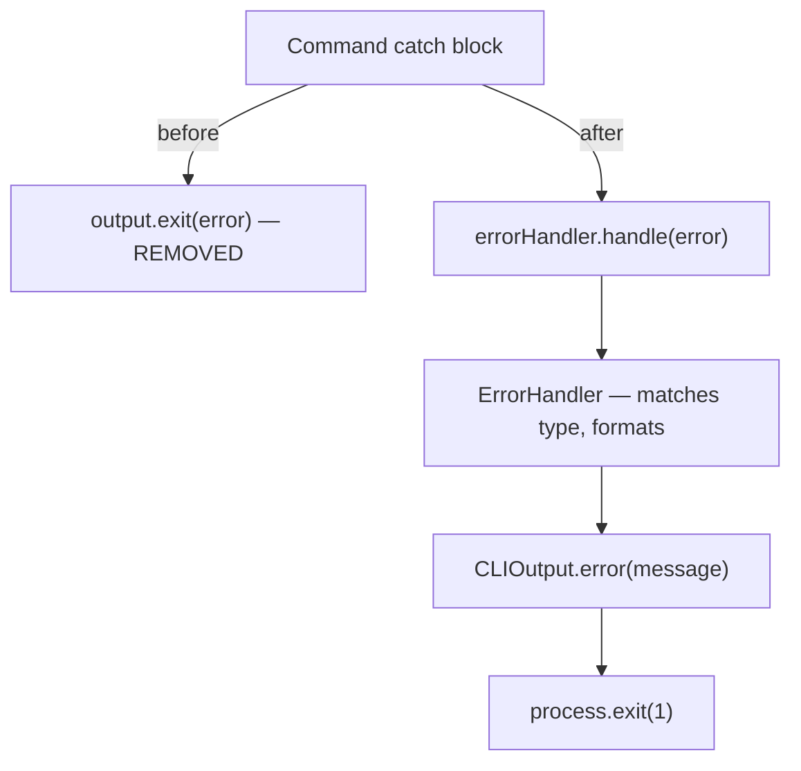

# Instruction: Typed Exceptions — Migration + Rules

## Feature

- **Summary**: Migrate all 13 command files from output.exit() to errorHandler.handle(), and update 3 architecture rule files to reflect the new error-handling contract
- **Stack**: `TypeScript 5`, `Node.js`
- **Branch name**: `refactor/113-typed-exceptions-error-handler`
- **Parent Plan**: `./2026_04_08-#113-typed-exceptions-error-handler-master.md`
- **Sequence**: `2 of 2`
- **Confidence**: 9/10
- **Time to implement**: 45min

## Existing files

- @src/application/commands/auth.ts
- @src/application/commands/cache.ts
- @src/application/commands/clean.ts
- @src/application/commands/config.ts
- @src/application/commands/doctor.ts
- @src/application/commands/install.ts
- @src/application/commands/restore.ts
- @src/application/commands/self-update.ts
- @src/application/commands/setup.ts
- @src/application/commands/status.ts
- @src/application/commands/sync.ts
- @src/application/commands/uninstall.ts
- @src/application/commands/update.ts
- @.claude/rules/00-architecture/0-error-handling.md
- @.claude/rules/03-frameworks-and-libraries/3-cli-output.md
- @.claude/rules/06-design-patterns/6-adapter.md

### New file to create

- none

## User Journey

## Implementation phases

### Phase 1 — Migrate all commands

> Replace every output.exit(error) with errorHandler.handle(error)

1. For each of the 13 command files, inject `deps.errorHandler` and replace `output.exit(error)` with `errorHandler.handle(error)` — 18 call sites total:
   - `auth.ts` (lines 76, 102, 135)
   - `cache.ts` (lines 30, 90)
   - `clean.ts` (line 51)
   - `config.ts` (lines 30, 64, 182)
   - `doctor.ts` (line 43)
   - `install.ts` (line 104)
   - `restore.ts` (line 172)
   - `self-update.ts` (line 52)
   - `setup.ts` (line 145)
   - `status.ts` (line 75)
   - `sync.ts` (line 93)
   - `uninstall.ts` (line 83)
   - `update.ts` (line 145)

### Phase 2 — Update architecture rules

> Encode the new contract so it is enforced going forward

1. `0-error-handling.md` — add: adapters translate raw errors to typed domain exceptions before throwing; never embed user-facing strings; try/catch in adapters only for translation
2. `3-cli-output.md` — remove `exit()` from the contract; add: commands use `errorHandler.handle(error)`, not `output.exit()`
3. `6-adapter.md` — add: throw typed domain exceptions; nothing infrastructure-specific crosses the port; never `new Error("user-facing string")` in adapters

## Validation flow

1. Run `npm run typecheck` — zero errors
2. Grep for `output.exit` in `src/` — zero results
3. Grep for `\.exit(` in `src/application/output.ts` — zero results
4. Run `npm test` if tests exist
