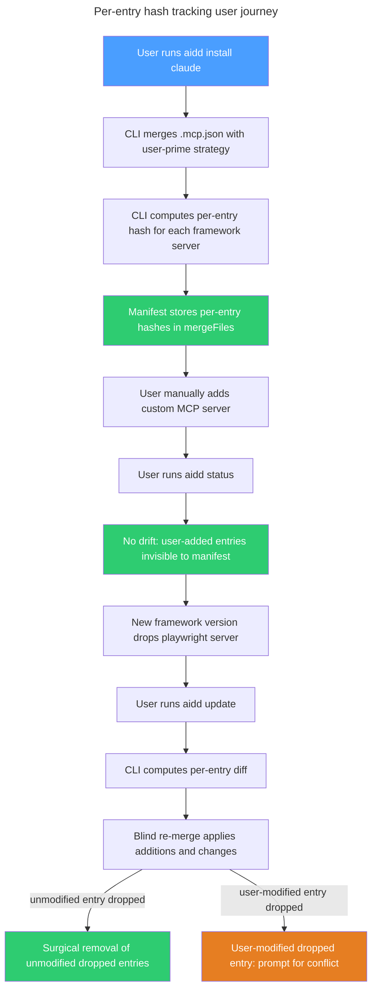

# Instruction: Per-entry hash tracking for merge config files

## Feature

- **Summary**: Add per-entry hash tracking to the manifest for merge config files (`.mcp.json`, `.vscode/settings.json`, etc.), enabling precise drift detection, conflict resolution, and safe auto-removal at the entry level instead of the whole-file level
- **Stack**: `TypeScript 5.x`, `Node.js >= 24`, `vitest`
- **Branch name**: `feat/123-per-entry-hash-tracking`
- **Parent Plan**: `none`
- **Sequence**: `master (3 parts)`
- Confidence: 9/10
- Time to implement: 3-4 sessions

## Parts

| Part | Scope | Branch | Depends on | Independently deployable |
|------|-------|--------|------------|--------------------------|
| [Part 1](2026_04_09-#123-per-entry-hash-tracking-part-1.md) | Domain model + migration + install | `feat/123-per-entry-hash-tracking-part-1` | none | YES |
| [Part 2](2026_04_09-#123-per-entry-hash-tracking-part-2.md) | Status per-entry drift detection | `feat/123-per-entry-hash-tracking-part-2` | Part 1 | YES after Part 1 |
| [Part 3](2026_04_09-#123-per-entry-hash-tracking-part-3.md) | Update per-entry diff + surgical removal | `feat/123-per-entry-hash-tracking-part-3` | Part 1 | YES after Part 1 |

Parts 2 and 3 are independent of each other.

## Audit findings

### Merge file landscape per tool

| File | Tools | Strategy | Entry section key |
|------|-------|----------|-------------------|
| `.mcp.json` | Claude | `user-prime` | `mcpServers` |
| `.cursor/mcp.json` | Cursor | `user-prime` | `mcpServers` |
| `.vscode/mcp.json` | Copilot | `user-prime` | `servers` |
| `.vscode/settings.json` | Claude + Copilot | `framework-prime` | `null` (top-level) |
| `opencode.json` | OpenCode | `framework-prime` | `mcp` |

### Key simplifications

1. **Merge files move to separate `mergeFiles` field** in ToolEntry. `getToolFiles()` naturally stops returning them. The 5 use-cases that consume `getToolFiles()` (sync, sync-status, restore, update computeDiff, status checkTrackedFiles) require zero changes.
2. **Uninstall/clean unchanged**: uninstall does not reverse merges. Orphaned merge entries become untracked. Clean deletes entire files as before.
3. **Update keeps blind re-merge**: `mergeJsonFile()` handles additions and changes. Only new operation is surgical removal of dropped entries after re-merge.

### Use-case impact matrix

| Use-case | Changes needed | Part |
|----------|---------------|------|
| install | Compute per-entry hashes, store in `mergeFiles` | Part 1 |
| status | Per-entry comparison via `checkMergeFiles()` | Part 2 |
| update | Per-entry diff + surgical removal of dropped entries | Part 3 |
| uninstall | None | - |
| clean | None | - |
| sync | None | - |
| sync-status | None | - |
| restore | None | - |
| adopt | None | - |

## User Journey

## Validation flow (end-to-end after all parts)

1. Run `aidd install claude` on a clean project and verify `.aidd/manifest.json` contains per-entry hashes under `mergeFiles` for `.mcp.json`
2. Manually add a custom MCP server to `.mcp.json` then run `aidd status` and verify NO drift reported
3. Manually modify a framework-installed MCP server then run `aidd status` and verify drift reported for that specific entry only
4. Simulate framework update that drops one server and adds another then run `aidd update` and verify unmodified server silently removed, new server added, no prompt
5. Simulate framework update on a user-modified entry then run `aidd update` and verify conflict prompt
6. Run `aidd uninstall claude` and verify `.mcp.json` stays on disk with entries intact (orphaned, untracked)
7. Load a v1 manifest then run `aidd install --force` and verify migration to v2 with per-entry hashes populated
8. Run full test suite: `pnpm test` with all tiers passing

## Risks and confidence

- 9/10 confidence
- **LOW**: v1 to v2 migration edge cases — merge files in old `files` array must be correctly identified via hardcoded path list at migration time
- **LOW**: Phase 3 surgical removal after re-merge must preserve JSON formatting — `JSON.stringify(merged, null, 2)` already used by `mergeJsonFile`
- **NONE**: 5 `getToolFiles()` consumers unaffected (structural separation). Uninstall, clean, sync, restore unchanged.
