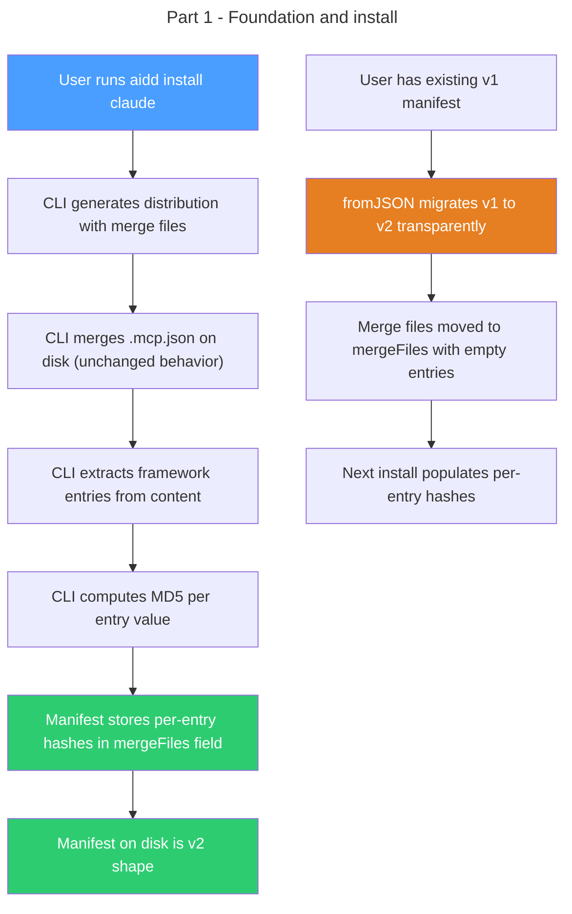

# Instruction: Per-entry hash tracking — Part 1: Foundation

## Feature

- **Summary**: Add domain model for per-entry hash tracking, extend manifest with `mergeFiles` field, implement v1 to v2 migration, and compute per-entry hashes during install
- **Stack**: `TypeScript 5.x`, `Node.js >= 24`, `vitest`
- **Branch name**: `feat/123-per-entry-hash-tracking-part-1`
- **Parent Plan**: `2026_04_09-#123-per-entry-hash-tracking-master.md`
- **Sequence**: `1 of 3`
- Confidence: 9/10
- Time to implement: 1-2 sessions

## Existing files

- @src/domain/models/manifest.ts
- @src/domain/models/generated-file.ts
- @src/domain/models/file-hash.ts
- @src/domain/models/merge-strategy.ts
- @src/domain/models/tool-config.ts
- @src/domain/models/distribution.ts
- @src/domain/ports/file-system.ts
- @src/domain/tools/claude.ts
- @src/domain/tools/cursor.ts
- @src/domain/tools/copilot.ts
- @src/domain/tools/opencode.ts
- @src/infrastructure/adapters/file-system-adapter.ts
- @src/application/use-cases/install-use-case.ts
- @tests/application/use-cases/install-use-case.integration.test.ts
- @tests/domain/models/manifest.unit.test.ts

### New files to create

- src/domain/models/merge-entry.ts
- tests/domain/models/merge-entry.unit.test.ts

## User Journey

## Implementation phases

### Phase 1: Domain model

> New value objects and pure functions for per-entry tracking

1. Create `MergeFileEntry` value object in `src/domain/models/merge-entry.ts` with `relativePath: string`, `sectionKey: string | null`, `entries: Record<string, FileHash>` (flat map of entry name to hash), all fields `readonly`
2. Add `extractMergeEntries(jsonContent: string, sectionKey: string | null, hasher: Hasher): Record<string, FileHash>` pure function in same file: parses JSON, reads entries at `sectionKey` depth (or top-level if null), computes `MD5(JSON.stringify(value))` per entry
3. Extend `ToolConfig.ConfigHandler` interface with `entrySection(configName: string): string | null` method
4. Implement `entrySection()` in all 4 tool configs: `"mcpServers"` for `.mcp.json` / `.cursor/mcp.json`, `"servers"` for `.vscode/mcp.json`, `"mcp"` for `opencode.json`, `null` for `.vscode/settings.json`
5. Unit tests for `MergeFileEntry` construction, `extractMergeEntries` with section key (`"mcpServers"` extracts server entries), without section key (extracts top-level keys), with empty JSON, with missing section key

### Phase 2: Manifest evolution

> Extend Manifest to store merge entries, bump version, add migration

1. Add `MergeFileEntry[]` to `ToolEntry` interface as `mergeFiles` field
2. Add `MergeFileEntryData` serialization type alongside `TrackedFileData`
3. Update `manifest.addTool()` signature to `addTool(toolId, version, files, mergeFiles)`
4. Add `getMergeFiles(toolId): readonly MergeFileEntry[]` accessor
5. Update `isFileTracked()` to also check `mergeFiles` paths
6. Remove `syncFileHashAcrossTools()` — each tool tracks its own entries independently
7. Bump `MANIFEST_VERSION` from 1 to 2
8. Add migration in `fromJSON()`: if `version === 1`, accept the manifest, identify merge file paths via hardcoded list (known merge file output paths from tool configs), move matching entries from `files` to `mergeFiles` with empty `entries` map
9. Update `toJSON()` to serialize `mergeFiles` per tool entry
10. Update `fromJSON()` to deserialize `mergeFiles` with `FileHash` reconstruction
11. Unit tests: serialization round-trip with mergeFiles, v1 manifest loads and migrates correctly, `isFileTracked` returns true for merge file paths, `getMergeFiles` returns correct entries, `addTool` with mergeFiles parameter

### Phase 3: Install with per-entry tracking

> Compute and store per-entry hashes during install

1. In `InstallUseCase.writeToolFiles()`: for merge files (after `mergeJsonFile()`), extract framework entries from `file.content` using `extractMergeEntries(content, sectionKey, hasher)`
2. Resolve `sectionKey` from tool config via `getToolConfig(toolId).config().entrySection(configName)` — config name derivable from `GeneratedFile.frameworkPath` (the original config ref name)
3. Build `MergeFileEntry` per merge file with the framework-only entry hashes
4. Collect merge file entries separately from regular files in `writeToolFiles` return value
5. Pass merge file entries to `manifest.addTool(toolId, version, files, mergeFiles)`
6. Remove `syncFileHashAcrossTools()` call — no longer needed
7. Still call `mergeJsonFile()` for disk write (merge behavior unchanged)
8. Integration tests: install claude verifies manifest contains `mergeFiles` with per-entry hashes for `.mcp.json` under `mcpServers`; install claude + copilot verifies `.vscode/settings.json` tracked per tool with own entries; user-added MCP servers not in manifest; manifest on disk has `version: 2`; v1 manifest upgrades on load then install populates mergeFiles entries

## Validation flow

1. Run `aidd install claude` on clean project and check `.aidd/manifest.json` has `version: 2` and `mergeFiles` with per-entry hashes
2. Verify `.mcp.json` on disk is correctly merged (unchanged behavior)
3. Create a v1 manifest manually, run `aidd install claude --force`, verify v2 migration and per-entry hashes populated
4. Install claude + copilot, verify `.vscode/settings.json` has separate entries per tool in manifest
5. Add a custom MCP server to `.mcp.json`, reinstall, verify custom server not tracked in manifest
6. Run `pnpm test` — all tiers pass

## Risks and confidence

- 9/10 confidence
- **LOW**: v1 to v2 migration must identify merge files by path. Hardcoded list of known merge output paths (`.mcp.json`, `.cursor/mcp.json`, `.vscode/mcp.json`, `.vscode/settings.json`, `opencode.json`) is sufficient since these are determined by tool configs which change rarely.
- **LOW**: `extractMergeEntries` must handle edge cases (empty JSON, missing section key, non-object values). Covered by unit tests.
