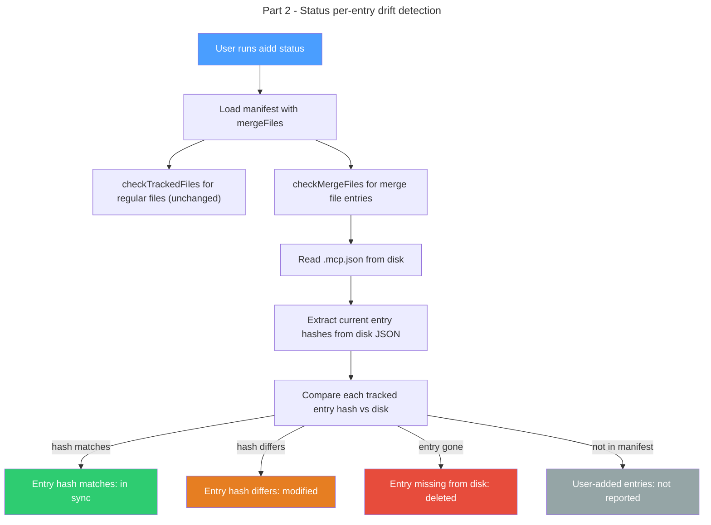

# Instruction: Per-entry hash tracking — Part 2: Status drift detection

## Feature

- **Summary**: Replace whole-file hash comparison with per-entry comparison for merge config files in the status command, enabling precise drift reporting that ignores user-added entries
- **Stack**: `TypeScript 5.x`, `Node.js >= 24`, `vitest`
- **Branch name**: `feat/123-per-entry-hash-tracking-part-2`
- **Parent Plan**: `2026_04_09-#123-per-entry-hash-tracking-master.md`
- **Sequence**: `2 of 3`
- Confidence: 9/10
- Time to implement: 1 session

## Existing files

- @src/application/use-cases/status-use-case.ts
- @src/domain/models/merge-entry.ts (created in Part 1)
- @src/domain/models/manifest.ts (updated in Part 1)
- @src/domain/ports/file-system.ts
- @src/domain/ports/hasher.ts
- @tests/application/use-cases/status-use-case.integration.test.ts

### New files to create

None.

## User Journey

## Implementation phases

### Phase 1: Per-entry drift detection in StatusUseCase

> Add merge file drift detection alongside existing file-level detection

1. Add `checkMergeFiles(mergeFiles: readonly MergeFileEntry[], projectRoot: string): Promise<FileDrift[]>` private method in `StatusUseCase`
2. For each `MergeFileEntry`: read disk file, call `extractMergeEntries(diskContent, entry.sectionKey, hasher)` to get current hashes
3. Compare each manifest entry hash against disk entry hash: mismatch is `modified`, missing from disk is `deleted`
4. Entries on disk but not in manifest are ignored (user-added)
5. If the merge file itself does not exist on disk, report all entries as `deleted`
6. Inject `Hasher` into `StatusUseCase` constructor (needed for `extractMergeEntries`)
7. In `execute()`: after `checkTrackedFiles()`, call `checkMergeFiles()` for each tool's merge files and append results to `drifted` array
8. `checkTrackedFiles()` unchanged — merge files are no longer in `files` array so naturally excluded
9. Integration tests: user modifies one MCP server entry shows only that entry as `modified`; user adds custom MCP server shows no drift; user deletes a framework MCP server entry shows as `deleted`; unmodified merge file shows no drift; entire merge file deleted shows all entries as `deleted`

## Validation flow

1. Install claude, run `aidd status`, verify no drift
2. Add a custom MCP server to `.mcp.json`, run `aidd status`, verify no drift reported (user entry invisible)
3. Modify a framework-installed MCP server value, run `aidd status`, verify that specific entry shows as modified
4. Delete a framework-installed MCP server from `.mcp.json`, run `aidd status`, verify that entry shows as deleted
5. Delete `.mcp.json` entirely, run `aidd status`, verify all framework entries show as deleted
6. Run `pnpm test` — all tiers pass

## Risks and confidence

- 9/10 confidence
- **LOW**: `StatusUseCase` constructor gains a `Hasher` dependency. Must update `createDeps` wiring in `deps.ts` and the status command. Straightforward.
- **NONE**: `checkTrackedFiles` unchanged. No impact on other use-cases.
