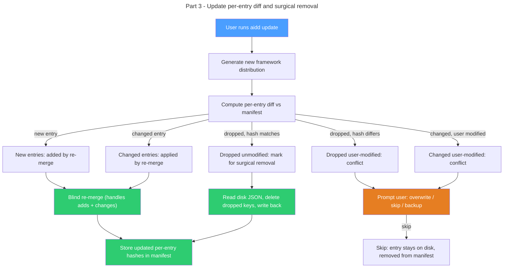

# Instruction: Per-entry hash tracking — Part 3: Update diff and surgical removal

## Feature

- **Summary**: Compute per-entry diffs for merge files during update, detect entry-level conflicts, and surgically remove dropped entries that the user never modified
- **Stack**: `TypeScript 5.x`, `Node.js >= 24`, `vitest`
- **Branch name**: `feat/123-per-entry-hash-tracking-part-3`
- **Parent Plan**: `2026_04_09-#123-per-entry-hash-tracking-master.md`
- **Sequence**: `3 of 3`
- Confidence: 9/10
- Time to implement: 1-2 sessions

## Existing files

- @src/application/use-cases/update-use-case.ts
- @src/application/use-cases/conflict-resolution-use-case.ts
- @src/domain/models/merge-entry.ts (created in Part 1)
- @src/domain/models/manifest.ts (updated in Part 1)
- @src/domain/models/file-diff.ts
- @src/domain/ports/file-system.ts
- @src/domain/ports/hasher.ts
- @tests/application/use-cases/update-use-case.integration.test.ts

### New files to create

None.

## User Journey

## Implementation phases

### Phase 1: Per-entry diff computation

> Compare new framework entries against manifest entries to detect adds, changes, removals, and conflicts

1. Add `computeMergeEntryDiff(toolId, newDistribution, manifest, projectRoot)` private method in `UpdateUseCase`
2. For each merge file in the new distribution: extract new framework entries via `extractMergeEntries(content, sectionKey, hasher)`
3. For each merge file in the manifest: get stored entries via `manifest.getMergeFiles(toolId)`
4. Compute per-entry diff: new entry not in manifest is `added`, manifest entry not in new framework is `removed`, both exist but hash differs is `changed`, both exist and hash matches is `unchanged`
5. For `removed` entries: read disk JSON, extract current entry hash, compare vs manifest hash. Match means user never touched it (safe removal). Mismatch means user modified (conflict).
6. For `changed` entries: read disk JSON, extract current entry hash, compare vs manifest hash. If disk matches manifest, user never touched it (apply silently via re-merge). If disk differs from manifest, user modified (conflict).
7. Return structured diff with conflict flags per entry

### Phase 2: Conflict resolution and application

> Resolve entry-level conflicts, apply re-merge, surgically remove dropped entries

1. Collect all conflicting entries (removed + user-modified, changed + user-modified) and pass to `ConflictResolutionUseCase` with entry-level paths (e.g., `.mcp.json > mcpServers.playwright`)
2. Keep `applyMergeFiles()` blind re-merge as-is — handles additions and changes correctly
3. After re-merge: for each dropped entry marked for silent removal, read the merged disk JSON, delete the specific key (at `sectionKey` depth or top-level), write back with `JSON.stringify(merged, null, 2)`
4. For conflicting removed entries where user chose "skip": leave entry on disk, do not track in new manifest (becomes untracked like user-added entries)
5. For conflicting removed entries where user chose "overwrite" or "backup": remove entry from disk JSON, backup if requested

### Phase 3: Manifest registration

> Store updated per-entry hashes after application

1. After re-merge and surgical removal: extract final entry hashes from disk JSON via `extractMergeEntries()`
2. Build new `MergeFileEntry` per merge file with only the entries that remain tracked (framework entries still present)
3. Update `registerToolFiles()` to pass `mergeFiles` to `manifest.addTool()`
4. Remove old `syncFileHashAcrossTools()` call in `applyMergeFiles()` — replaced by per-entry storage
5. Integration tests: framework adds new MCP server is silently merged and tracked; framework drops unmodified server is surgically removed from disk and manifest; framework drops user-modified server triggers conflict prompt, skip leaves entry on disk untracked; framework changes server value while user also modified triggers conflict prompt; dry-run mode reports per-entry diff without applying

## Validation flow

1. Install claude with v1 framework, modify nothing, update to v2 with same entries, verify no changes
2. Update to v2 that adds a new MCP server, verify silently added to disk and tracked in manifest
3. Update to v2 that drops a server the user never modified, verify silently removed from disk JSON and manifest
4. Update to v2 that drops a server the user modified, verify conflict prompt appears
5. Update to v2 that changes a server value the user also changed, verify conflict prompt appears
6. Run update with `--dry-run`, verify per-entry diff reported without disk changes
7. Run update with `--force`, verify conflicts auto-resolved with backup
8. Run `pnpm test` — all tiers pass

## Risks and confidence

- 9/10 confidence
- **LOW**: Surgical removal must read-modify-write the JSON file. Race condition is theoretical (CLI is single-process). JSON formatting preserved by `JSON.stringify(obj, null, 2)`.
- **LOW**: Entry-level conflict paths (e.g., `.mcp.json > mcpServers.playwright`) must integrate with existing `ConflictResolutionUseCase` which expects file paths. May need minor adaptation to support entry-qualified paths.
- **NONE**: Blind re-merge unchanged. Regular file diff unchanged. No impact on other use-cases.
