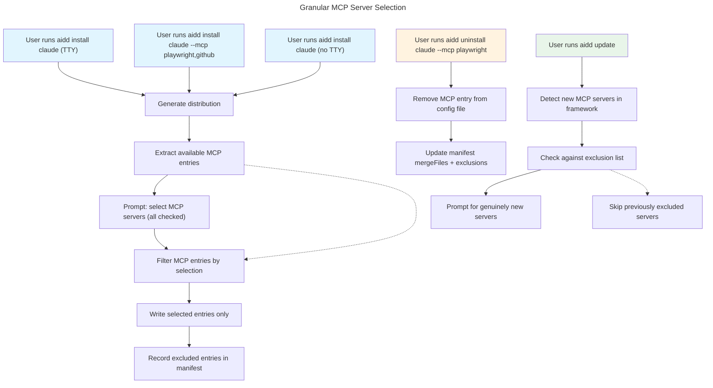

# Instruction: Granular MCP Server Selection

## Feature

- **Summary**: Allow users to select which MCP servers to install/uninstall per tool, with exclusion tracking in manifest so update respects prior choices
- **Stack**: `TypeScript ESM`, `Node.js >= 24`, `vitest`
- **Branch name**: `feat/259-granular-mcp-selection`
- **Parent Plan**: `none`
- **Sequence**: `master (3 parts)`
- Confidence: 9/10
- Time to implement: 3 parts

## Existing files

- @src/domain/models/manifest.ts
- @src/domain/models/merge-entry.ts
- @src/domain/models/tool-config.ts
- @src/application/use-cases/install-use-case.ts
- @src/application/use-cases/uninstall-use-case.ts
- @src/application/use-cases/update-use-case.ts
- @src/application/commands/install.ts
- @src/application/commands/uninstall.ts
- @src/domain/ports/file-system.ts
- @src/domain/ports/prompter.ts

### New file to create

- src/domain/models/mcp-exclusion.ts

## User Journey

## Implementation phases

### Part 1: Domain — Manifest Exclusion Tracking

> Add excludedMcp per tool to Manifest and serialization

1. Create `McpExclusion` type in `src/domain/models/mcp-exclusion.ts`
2. Extend `ToolEntry` and `ToolEntryData` with `excludedMcp` field
3. Add `addExcludedMcp()`, `getExcludedMcp()`, `removeExcludedMcp()` methods to `Manifest`
4. Update `addTool()` to accept optional `excludedMcp` parameter
5. Update `toJSON()` / `fromJSON()` for serialization (backward-compatible: optional field)
6. Unit tests for all new Manifest methods

### Part 2: Install + Uninstall — MCP Selection

> Interactive and flag-based MCP selection during install, selective removal during uninstall

1. Add `--mcp` flag to install command
2. Extract MCP entry names from distribution before writing
3. Prompt checkbox (interactive) or filter by flag (non-interactive) in `InstallUseCase`
4. Filter merge file writes to only selected entries
5. Record excluded entries in manifest via `addExcludedMcp()`
6. Add `--mcp` flag to uninstall command
7. Extend `UninstallUseCase` for selective MCP removal (surgical key removal + manifest update)
8. Integration tests for install and uninstall MCP flows

### Part 3: Update — Respect Exclusions

> Update skips excluded MCP servers, prompts for genuinely new ones

1. In update merge entry diff computation, check `excludedMcp` for each tool
2. New entries not in `excludedMcp` → prompt (or include with `--force`)
3. Entries in `excludedMcp` → skip silently (do not re-add)
4. `--force` overrides exclusions: clears `excludedMcp` and installs all
5. Integration tests for update with exclusions

## Validation flow

1. Run `aidd install claude` interactively, deselect one MCP server, verify it's not in `.mcp.json` and is recorded in manifest `excludedMcp`
2. Run `aidd install cursor --mcp playwright` non-interactively, verify only playwright entry in `.cursor/mcp.json`
3. Run `aidd uninstall claude --mcp playwright`, verify entry removed from `.mcp.json`, tool still installed
4. Run `aidd update` after framework adds new MCP server, verify prompt for new server, excluded servers stay excluded
5. Run `aidd update --force`, verify all MCP servers installed and `excludedMcp` cleared
