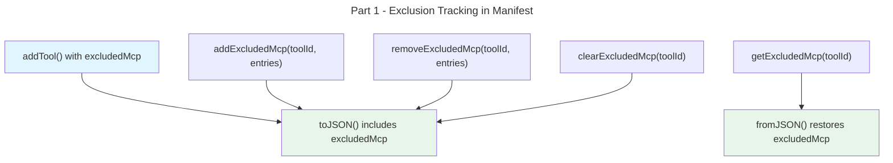

# Instruction: Granular MCP Selection — Part 1: Domain Exclusion Tracking

## Feature

- **Summary**: Extend Manifest to track which MCP servers were intentionally excluded per tool
- **Stack**: `TypeScript ESM`, `Node.js >= 24`, `vitest`
- **Branch name**: `feat/259-granular-mcp-selection`
- **Parent Plan**: `2026_04_10-#259-granular-mcp-selection-master.md`
- **Sequence**: `1 of 3`
- Confidence: 10/10
- Time to implement: short

## Existing files

- @src/domain/models/manifest.ts
- @src/domain/models/merge-entry.ts
- @src/domain/models/tool-config.ts
- @tests/domain/models/manifest.unit.test.ts

### New file to create

- src/domain/models/mcp-exclusion.ts

## User Journey

## Implementation phases

### Phase 1: MCP exclusion type

> Create the domain type for MCP exclusion tracking

1. Create `src/domain/models/mcp-exclusion.ts` with `McpExclusion` type: `{ readonly configPath: string; readonly entryKey: string }`
2. Export a set-like equality helper if needed for dedup

### Phase 2: Extend Manifest model

> Add excludedMcp to ToolEntry and Manifest methods

1. Add `excludedMcp: readonly McpExclusion[]` to `ToolEntry` interface (default `[]`)
2. Add `excludedMcp?: McpExclusionData[]` to `ToolEntryData` (optional for backward compat)
3. Update `addTool()` signature to accept optional `excludedMcp` parameter
4. Add `addExcludedMcp(toolId, exclusions)` method — appends to existing, deduplicates
5. Add `getExcludedMcp(toolId)` method — returns readonly array
6. Add `removeExcludedMcp(toolId, exclusions)` method — removes matching entries
7. Add `clearExcludedMcp(toolId)` method — empties the list (used by `--force`)

### Phase 3: Serialization

> Update toJSON/fromJSON for backward compatibility

1. Update `toJSON()` to include `excludedMcp` in `ToolEntryData` (omit if empty)
2. Update `fromJSON()` / `parseMergeFileEntries()` to handle missing `excludedMcp` (default `[]`)

### Phase 4: Tests

> Unit tests for all new Manifest capabilities

1. Test `addTool` with `excludedMcp` parameter
2. Test `addExcludedMcp` appends and deduplicates
3. Test `getExcludedMcp` returns empty for tool without exclusions
4. Test `removeExcludedMcp` removes matching entries
5. Test `clearExcludedMcp` empties the list
6. Test `toJSON/fromJSON` round-trip with exclusions
7. Test backward compat: `fromJSON` without `excludedMcp` field

## Validation flow

1. Run `pnpm test` — all existing tests pass
2. New manifest unit tests cover add/get/remove/clear/serialize/deserialize
3. Verify `fromJSON` handles old manifest format without `excludedMcp`
