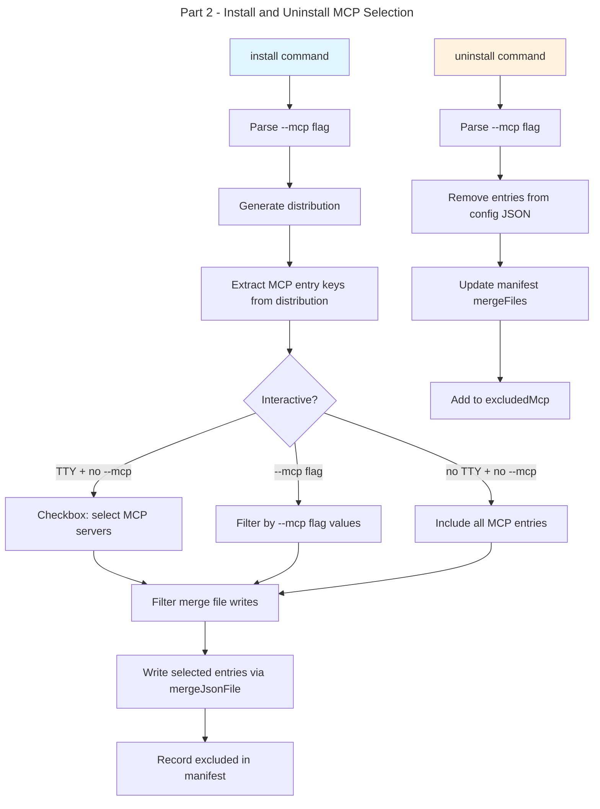

# Instruction: Granular MCP Selection — Part 2: Install + Uninstall

## Feature

- **Summary**: Add MCP server selection during install (interactive + `--mcp` flag) and selective MCP removal during uninstall
- **Stack**: `TypeScript ESM`, `Node.js >= 24`, `vitest`, `commander`, `@inquirer/prompts`
- **Branch name**: `feat/259-granular-mcp-selection`
- **Parent Plan**: `2026_04_10-#259-granular-mcp-selection-master.md`
- **Sequence**: `2 of 3`
- Confidence: 9/10
- Time to implement: medium

## Existing files

- @src/application/commands/install.ts
- @src/application/commands/uninstall.ts
- @src/application/use-cases/install-use-case.ts
- @src/application/use-cases/uninstall-use-case.ts
- @src/domain/models/manifest.ts
- @src/domain/models/merge-entry.ts
- @src/domain/models/distribution.ts
- @src/domain/ports/file-system.ts
- @src/domain/ports/prompter.ts
- @tests/application/use-cases/install-use-case.integration.test.ts
- @tests/application/use-cases/uninstall-use-case.integration.test.ts

### New file to create

- none

## User Journey

## Implementation phases

### Phase 1: Install command — `--mcp` flag

> Wire the new flag from command to use case

1. Add `--mcp <servers>` option to install command (comma-separated string)
2. Parse into `string[]` and pass as `mcpFilter` in `InstallOptions`
3. Add `mcpFilter?: string[]` to `InstallOptions` interface

### Phase 2: Install use case — MCP selection logic

> Extract, prompt, and filter MCP entries before writing

1. After `generateDistribution()`, extract available MCP entry keys from merge files with `entrySection !== null`
2. Add `promptMcpSelection()` private method: checkbox with all entries checked by default
3. Add `resolveMcpSelection()` private method implementing 3-branch logic:
   - `mcpFilter` provided → validate keys exist, use as selection
   - Interactive + no filter → prompt checkbox
   - Non-interactive + no filter → select all (backward compat)
4. Add `filterMergeFileContent()` private method: given a `GeneratedFile` with merge strategy, parse JSON, remove unselected entries from section, serialize back
5. Apply filter before `writeToolFiles()`: rewrite merge file content to only include selected entries
6. After write: compute excluded entries and call `manifest.addExcludedMcp()`
7. Build `mergeFiles` entries only for selected keys (not excluded ones)

### Phase 3: Uninstall command — `--mcp` flag

> Wire the flag for selective MCP removal

1. Add `--mcp <servers>` option to uninstall command (comma-separated string)
2. Parse into `string[]` and pass as `mcpFilter` in `UninstallOptions`
3. Add `mcpFilter?: string[]` to `UninstallOptions`
4. When `mcpFilter` is set, tool stays installed — only MCP entries are removed

### Phase 4: Uninstall use case — selective MCP removal

> Surgical removal of individual MCP entries

1. Add `uninstallMcpEntries()` private method in `UninstallUseCase`
2. For each tool: resolve merge files, find entries matching `mcpFilter`
3. Reuse `removeKeysFromJsonFile()` pattern from update use case (extract to shared helper or duplicate minimally)
4. Update manifest: remove entries from `mergeFiles`, add to `excludedMcp`
5. When `mcpFilter` is set, skip full tool removal — only remove MCP entries
6. Interactive mode when `--mcp` not set: prompt checkbox to select which MCP entries to remove

### Phase 5: Tests

> Integration tests for both install and uninstall flows

1. Install with `--mcp` flag: verify only selected entries in config file
2. Install interactive: verify checkbox prompt called, excluded entries in manifest
3. Install non-interactive without `--mcp`: verify all entries installed (backward compat)
4. Install with invalid `--mcp` key: verify error
5. Uninstall with `--mcp`: verify entry removed, tool still installed
6. Uninstall with `--mcp`: verify entry added to `excludedMcp`
7. Uninstall without `--mcp`: verify full tool removal (backward compat)

## Validation flow

1. Run `pnpm test` — all tests pass including new integration tests
2. `aidd install claude` interactively — deselect one MCP server, verify `.mcp.json` and manifest
3. `aidd install cursor --mcp playwright` — verify only playwright in `.cursor/mcp.json`
4. `aidd uninstall claude --mcp playwright` — verify entry removed, tool still present
