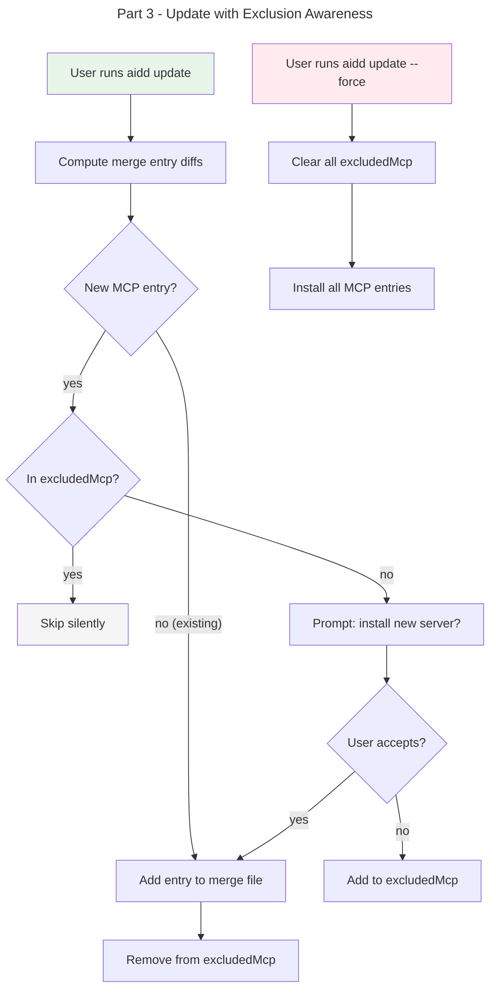

# Instruction: Granular MCP Selection — Part 3: Update Respects Exclusions

## Feature

- **Summary**: Update skips excluded MCP servers, prompts for genuinely new ones, `--force` overrides all exclusions
- **Stack**: `TypeScript ESM`, `Node.js >= 24`, `vitest`
- **Branch name**: `feat/259-granular-mcp-selection`
- **Parent Plan**: `2026_04_10-#259-granular-mcp-selection-master.md`
- **Sequence**: `3 of 3`
- Confidence: 9/10
- Time to implement: medium

## Existing files

- @src/application/use-cases/update-use-case.ts
- @src/domain/models/manifest.ts
- @src/domain/models/merge-entry.ts
- @tests/application/use-cases/update-use-case.integration.test.ts

### New file to create

- none

## User Journey

## Implementation phases

### Phase 1: Exclusion-aware merge entry diffing

> Modify merge entry diff to distinguish excluded vs. genuinely new entries

1. In `computeMergeEntryDiff()`, load `excludedMcp` for current tool from manifest
2. For each new entry key not in manifest `mergeFiles`: check if it's in `excludedMcp`
3. If excluded → filter it out of the distribution content before merge write (same filtering as install)
4. If not excluded → flag as genuinely new for prompting

### Phase 2: Prompt for new MCP servers

> Interactive prompt for genuinely new (non-excluded) MCP servers during update

1. Collect genuinely new MCP entry keys across all merge files for the tool
2. If interactive and new entries exist: prompt checkbox (all checked by default)
3. Entries the user deselects: add to `excludedMcp`
4. Non-interactive: include all new entries (backward compat) unless they're excluded

### Phase 3: Force mode clears exclusions

> `--force` overrides all prior exclusion choices

1. When `force` is true: call `manifest.clearExcludedMcp(toolId)` before processing
2. All MCP entries (including previously excluded) get installed
3. Merge file content written without filtering

### Phase 4: Tests

> Integration tests for update exclusion scenarios

1. Update with excluded MCP: verify excluded entry not re-added
2. Update with genuinely new MCP: verify prompt triggered
3. Update with `--force`: verify excluded entries cleared and all installed
4. Update non-interactive: verify new entries included, excluded entries skipped
5. Update when user declines new entry: verify added to `excludedMcp`

## Validation flow

1. Run `pnpm test` — all tests pass
2. Install claude with one MCP excluded, then update to new framework version with same MCP list — verify excluded stays excluded
3. Update to framework version with new MCP server — verify prompt appears
4. Update with `--force` — verify all MCP servers installed, `excludedMcp` cleared
