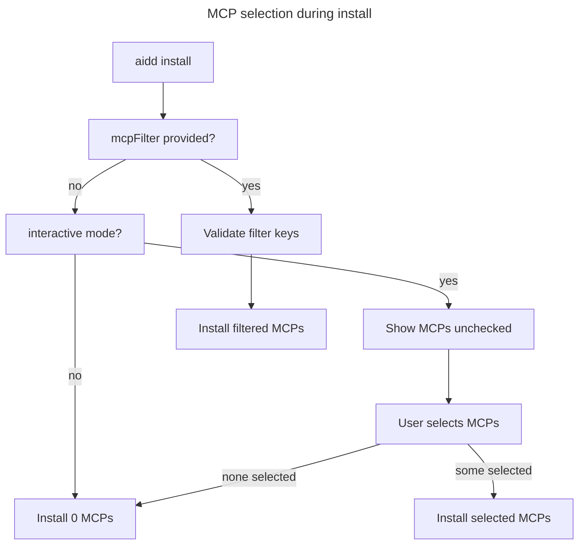

# Instruction: MCPs disabled by default

## Feature

- **Summary**: Change McpUseCase so that no MCP servers are selected by default — neither in non-interactive mode nor when the interactive prompt appears. Users must explicitly opt-in to each MCP server.
- **Stack**: `TypeScript, Vitest`
- **Branch name**: `feat/mcp-disabled-by-default`
- **Parent Plan**: none
- **Sequence**: standalone
- Confidence: 10/10
- Time to implement: 15 min

## Existing files

- @src/application/use-cases/shared/mcp-use-case.ts
- @tests/application/use-cases/shared/mcp-use-case.integration.test.ts
- @tests/application/use-cases/install-use-case.integration.test.ts

### New file to create

- none

## User Journey

## Implementation phases

### Phase 1 — Update McpUseCase logic

> Make no-selection the default in all paths that lack an explicit filter

1. In `execute()`: last fallback `return allKeys` → `return new Set()`
2. In `prompt()`: `checked: true` → `checked: false`
3. In `prompt()` guard: `if (!this.prompter) return allKeys` → `if (!this.prompter) return new Set()`

### Phase 2 — Update tests

> Align all test assertions with the new "none by default" behavior

1. `mcp-use-case.integration.test.ts`:
   - "calls prompter.checkbox with all available keys pre-checked" → update description to "unchecked" + assert `checked: false`
   - "returns all servers when prompter is absent in interactive mode" → expect 0 servers
   - "returns all available servers without prompting" (non-interactive) → expect 0 servers

2. `install-use-case.integration.test.ts`:
   - Interactive mode test (line ~851-852): `checked: true` assertions → `checked: false`
   - Non-interactive test (line ~862): rename to "installs no MCP servers in non-interactive mode without mcpFilter", assert neither `playwright` nor `github` present, assert `excludedMcp` contains both entries

## Validation flow

1. Run `pnpm test:integration` — all tests pass
2. Run `pnpm test:unit` — no regressions
3. Manual: `aidd install --tool claude` interactively → MCPs appear unchecked
4. Manual: `aidd install --tool claude` non-interactively → no MCP servers written to `.mcp.json`
