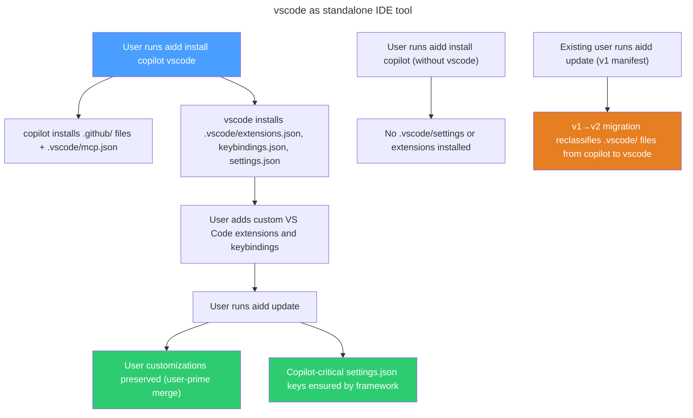

# Instruction: feat(tools): vscode as standalone IDE tool

## Feature

- **Summary**: Separate VS Code IDE config from Copilot AI tool — create a dedicated `vscode` ToolConfig (config-only), extend merge infrastructure for per-key strategy on `settings.json`, clean up `copilot` tool, and migrate existing manifests to reclassify ownership
- **Stack**: `TypeScript 5.x`, `Node.js >= 24`, `vitest`
- **Branch name**: `feat/124-vscode-standalone-tool`
- **Parent Plan**: `none`
- **Sequence**: `master (2 parts)`
- Confidence: 9/10
- Time to implement: 2 sessions

## Parts

| Part | Scope | Branch | Depends on | Independently deployable |
|------|-------|--------|------------|--------------------------|
| [Part 1](2026_04_15-#124-vscode-standalone-tool-part-1.md) | Per-key merge + vscode ToolConfig + copilot cleanup | `feat/124-vscode-standalone-tool-part-1` | none | YES (new tool available, copilot cleaned up) |
| [Part 2](2026_04_15-#124-vscode-standalone-tool-part-2.md) | Manifest migration v1→v2 | `feat/124-vscode-standalone-tool-part-2` | Part 1 | YES after Part 1 |

## Audit findings

### Current vscode config ownership

| File | Current owner | New owner | Current strategy | New strategy |
|------|--------------|-----------|-----------------|--------------|
| `.vscode/mcp.json` | copilot | copilot (unchanged) | `user-prime` | `user-prime` |
| `.vscode/extensions.json` | copilot | vscode | `none` | `user-prime` |
| `.vscode/keybindings.json` | copilot | vscode | `none` | `user-prime` |
| `.vscode/settings.json` | copilot | vscode | `framework-prime` | per-key (Copilot-critical → `framework-prime`, rest → `user-prime`) |

### Infrastructure gaps

- `MergeStrategy` type is per-file only — needs `PerKeyMergeStrategy` variant
- `mergeJsonFile` applies single strategy to entire file — needs key-level override support
- No manifest migration mechanism — `fromJSON` throws on version mismatch; requires migration logic
- Manifest currently at v1. **Coordinate with #123** which also targets v2.

### What does NOT change

- `sync` already excludes all `.vscode/` paths in `sync-exclusions.ts` — no change needed
- `vscode` tool has no agents, commands, rules, skills — config section only
- `.vscode/mcp.json` stays under `copilot`

## User Journey

## Validation flow (end-to-end after all parts)

1. Run `aidd install vscode` on a clean project — verify `.vscode/extensions.json`, `.vscode/keybindings.json`, `.vscode/settings.json` installed and tracked under `vscode` tool in manifest
2. Run `aidd install copilot` separately — verify `.vscode/mcp.json` installed under `copilot`, NO `.vscode/settings.json` or `extensions.json`
3. Add a custom extension to `extensions.json`, run `aidd update`, verify custom extension preserved
4. Verify a Copilot-critical key in `settings.json` cannot be overridden by user (framework-prime key wins)
5. Verify a non-critical key added by user in `settings.json` is preserved on update (user-prime wins)
6. Create a v1 manifest with `.vscode/` files under `copilot`, run `aidd update`, verify manifest migrated and files reclassified under `vscode`
7. Run `pnpm test` — all tiers pass

## Risks and confidence

- 9/10 confidence
- **MEDIUM**: Manifest version coordination with #123 — both target v2. If #123 lands first, Part 2 migration must target v2→v3. Flag in Part 2.
- **LOW**: Per-key strategy in `mergeJsonFile` applies only to top-level keys. Copilot-critical keys in `settings.json` are all top-level (e.g., `github.copilot.enable`) — no deep key traversal needed.
- **LOW**: `deepMerge` for arrays in `extensions.json` (recommendations array) and `keybindings.json` already deduplicates by JSON identity — correct behavior for user-prime.
