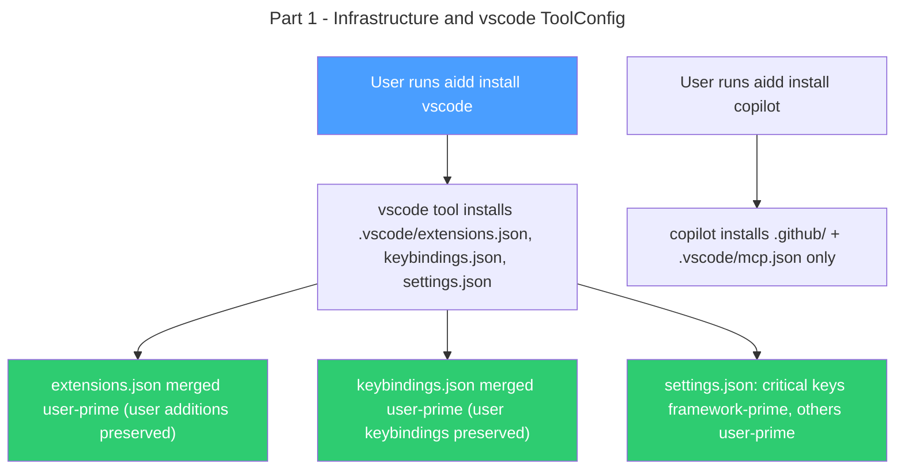

# Instruction: vscode standalone tool — Part 1: Infrastructure + ToolConfig

## Feature

- **Summary**: Extend `MergeStrategy` with per-key variant, update `mergeJsonFile`, create `vscode` ToolConfig with hardcoded Copilot-critical keys, remove vscode config files from `copilot`, register the new tool
- **Stack**: `TypeScript 5.x`, `Node.js >= 24`, `vitest`
- **Branch name**: `feat/124-vscode-standalone-tool-part-1`
- **Parent Plan**: `2026_04_15-#124-vscode-standalone-tool-master.md`
- **Sequence**: `1 of 2`
- Confidence: 9/10
- Time to implement: 1 session

## Existing files

- @src/domain/models/merge-strategy.ts
- @src/domain/models/tool-config.ts
- @src/domain/models/framework-descriptor.ts
- @src/domain/ports/file-system.ts
- @src/domain/tools/copilot.ts
- @src/infrastructure/adapters/file-system-adapter.ts
- @src/infrastructure/deps.ts
- @tests/domain/tools/copilot.unit.test.ts

### New files to create

- src/domain/tools/vscode.ts
- tests/domain/tools/vscode.unit.test.ts

## User Journey



## Implementation phases

### Phase 1: Per-key merge strategy

> Extend MergeStrategy type and mergeJsonFile to support key-level overrides

1. Add `PerKeyMergeStrategy` type to `merge-strategy.ts`:
   ```ts
   export type PerKeyMergeStrategy = {
     default: "framework-prime" | "user-prime";
     frameworkPrimeKeys: string[];
   };
   export type MergeStrategy = "none" | "framework-prime" | "user-prime" | PerKeyMergeStrategy;
   ```
2. Add `isPerKeyMergeStrategy` type guard function in the same file
3. Update `mergeJsonFile` in `file-system-adapter.ts`: when strategy is `PerKeyMergeStrategy`, apply `framework-prime` for keys in `frameworkPrimeKeys`, `default` strategy for all others — merge result is assembled key by key from the two inputs
4. Update `FileSystem` port signature in `file-system.ts` to match (strategy type is already `MergeStrategy` — no change needed if type is re-exported correctly)

### Phase 2: vscode ToolConfig

> New config-only tool owning .vscode/extensions.json, keybindings.json, settings.json

1. Add `"vscode"` to `ToolId` union and `VALID_TOOL_IDS` array in `tool-config.ts`
2. Create `src/domain/tools/vscode.ts`:
   - `toolId: "vscode"`, `directory: ".vscode/"`, `toolSuffix: ""`, `signalDir: null` (no signal detection)
   - `agents()`, `commands()`, `rules()`, `skills()` all return null-handler (no sections)
   - `config()` returns `ConfigHandler` with:
     - `outputPath`: `extensions.json` → `.vscode/extensions.json`, `keybindings.json` → `.vscode/keybindings.json`, `settings.json` → `.vscode/settings.json`
     - `mergeStrategy("vscodeExtensions")` → `"user-prime"`
     - `mergeStrategy("vscodeKeybindings")` → `"user-prime"`
     - `mergeStrategy("vscodeSettings")` → `PerKeyMergeStrategy` with hardcoded `frameworkPrimeKeys` (Copilot-critical keys: `github.copilot.enable`, `github.copilot.editor.enableAutoCompletions`, `chat.agent.enabled`, `github.copilot.chat.agent.thinkingTool.enabled`) and `default: "user-prime"`
     - `entrySection`: `null` for all
   - `memoryBank()` returns null-handler
   - Call `registerTool(vscodeToolConfig)` at module level
3. Add import `../domain/tools/vscode.js` to `src/infrastructure/deps.ts`

### Phase 3: Copilot cleanup

> Remove .vscode/extensions.json, keybindings.json, settings.json from copilot tool

1. In `copilot.ts` `config()`:
   - Remove `if (configName === CONFIG_VSCODE_EXTENSIONS)` block from `outputPath`
   - Remove `if (configName === CONFIG_VSCODE_KEYBINDINGS)` block from `outputPath`
   - Remove `if (configName === CONFIG_VSCODE_SETTINGS)` block from `outputPath` and `mergeStrategy`
   - Keep `CONFIG_MCP` handling unchanged
2. Remove unused imports of `CONFIG_VSCODE_EXTENSIONS`, `CONFIG_VSCODE_KEYBINDINGS`, `CONFIG_VSCODE_SETTINGS` from `copilot.ts`

### Phase 4: Tests

> Cover new merge behavior and vscode tool config

1. Unit tests for `PerKeyMergeStrategy` in `merge-strategy.ts` (type guard + structural checks)
2. Unit tests for `mergeJsonFile` per-key behavior: critical key uses framework-prime (framework wins), non-critical key uses user-prime (existing wins), key absent from disk is added regardless
3. Unit tests for `vscode.ts`:
   - `config().outputPath()` maps all 3 config names correctly
   - `config().mergeStrategy("vscodeExtensions")` → `"user-prime"`
   - `config().mergeStrategy("vscodeKeybindings")` → `"user-prime"`
   - `config().mergeStrategy("vscodeSettings")` → `PerKeyMergeStrategy` with correct critical keys
4. Update `copilot.unit.test.ts`: remove test cases for `vscodeExtensions`, `vscodeKeybindings`, `vscodeSettings` from `config().outputPath()` tests

## Validation flow

1. Run `aidd install vscode` and verify 3 files installed under `.vscode/` tracked under `vscode` in manifest
2. Run `aidd install copilot` and verify NO `.vscode/settings.json` or `extensions.json` installed
3. Add custom extension to `extensions.json`, run `aidd install vscode --force`, verify custom extension preserved
4. Add a non-critical key to `settings.json`, run `aidd install vscode --force`, verify non-critical key preserved
5. Run `pnpm test` — all tiers pass

## Risks and confidence

- 9/10 confidence
- **LOW**: `PerKeyMergeStrategy` logic in `mergeJsonFile` — only top-level keys involved, no deep traversal needed
- **LOW**: Copilot-critical keys list is hardcoded for now — future enhancement to load from framework file (separate issue)
- **NONE**: `signalDir: null` on vscode tool — `adopt` signal detection already scopes to per-tool signal directories and handles null gracefully (verify in `adopt-use-case.ts`)
