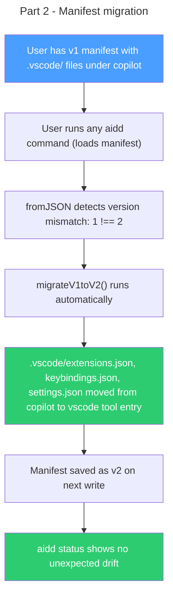

# Instruction: vscode standalone tool — Part 2: Manifest migration

## Feature

- **Summary**: Bump manifest version and add v1→v2 migration logic that reclassifies `.vscode/extensions.json`, `.vscode/keybindings.json`, `.vscode/settings.json` from `copilot` tool to `vscode` tool — transparent to the user, triggered on next manifest load
- **Stack**: `TypeScript 5.x`, `Node.js >= 24`, `vitest`
- **Branch name**: `feat/124-vscode-standalone-tool-part-2`
- **Parent Plan**: `2026_04_15-#124-vscode-standalone-tool-master.md`
- **Sequence**: `2 of 2`
- Confidence: 9/10
- Time to implement: 1 session

## Existing files

- @src/domain/models/manifest.ts
- @tests/domain/models/manifest.unit.test.ts

### New files to create

- none

## Coordination note

**#123 also targets a manifest v1→v2 bump.** Check which issue lands first:
- If #123 merged first: this part targets v2→v3 (adjust `MANIFEST_VERSION` and migration guard accordingly)
- If #124 lands first: this part bumps v1→v2

## User Journey

## Implementation phases

### Phase 1: Migration logic

> Replace strict version equality with migration-aware fromJSON

1. Bump `MANIFEST_VERSION` from `1` to `2` (or `2` to `3` if #123 landed — see coordination note above)
2. Replace the strict `raw.version !== MANIFEST_VERSION` throw in `fromJSON` with a migration dispatch:
   - `version === MANIFEST_VERSION` → load as-is (current behavior)
   - `version === MANIFEST_VERSION - 1` → run migration function, then load
   - Any other version → throw `ManifestValidationError` (unchanged behavior)
3. Implement `migrateVnToVm(raw)` pure function (e.g., `migrateV1toV2`):
   - Locate `copilot` tool entry in `raw.tools`
   - Extract files matching the 3 paths: `.vscode/extensions.json`, `.vscode/keybindings.json`, `.vscode/settings.json`
   - Remove those files from `copilot.files`
   - Add (or create) a `vscode` tool entry with those files (preserve existing hash, version from `copilot`)
   - If no `copilot` entry exists or none of the 3 paths are present → no-op (clean install)
   - Return the mutated raw data

### Phase 2: Tests

> Verify migration correctness and non-regression

1. Unit test: v1 manifest with `.vscode/` files under `copilot` → after `fromJSON`, those files are under `vscode`, not `copilot`
2. Unit test: v1 manifest WITHOUT `.vscode/` files (copilot-only install, no vscode) → migration is no-op, copilot entry unchanged
3. Unit test: v1 manifest with no `copilot` entry at all → migration is no-op
4. Unit test: v2 manifest (current version) → loads without migration
5. Unit test: v0 manifest (hypothetical past) → still throws `ManifestValidationError`
6. Unit test: `isFileTracked(".vscode/extensions.json")` returns true after migration (tracked under `vscode`)
7. Unit test: `getToolVersion("vscode")` returns correct version after migration

## Validation flow

1. Create a v1 manifest JSON manually with `.vscode/extensions.json` tracked under `copilot`
2. Run `aidd status` and verify no error thrown, migration applied, `.vscode/extensions.json` now under `vscode`
3. Verify manifest on disk is written as v2 after next manifest save
4. Run on a project with v1 manifest that has NO vscode files under copilot — verify no crash, no data loss
5. Run `pnpm test` — all tiers pass

## Risks and confidence

- 9/10 confidence
- **MEDIUM**: Version number coordination with #123. Mitigated by the coordination note — check PR history before implementing.
- **LOW**: Migration hardcodes 3 file paths. These paths are stable (`.vscode/extensions.json`, `.vscode/keybindings.json`, `.vscode/settings.json`) and determined by prior tool config, not user-configurable.
- **LOW**: `vscode` tool entry created in manifest via migration even if user never ran `aidd install vscode`. This is correct — it preserves their existing installed files under the right tool.
