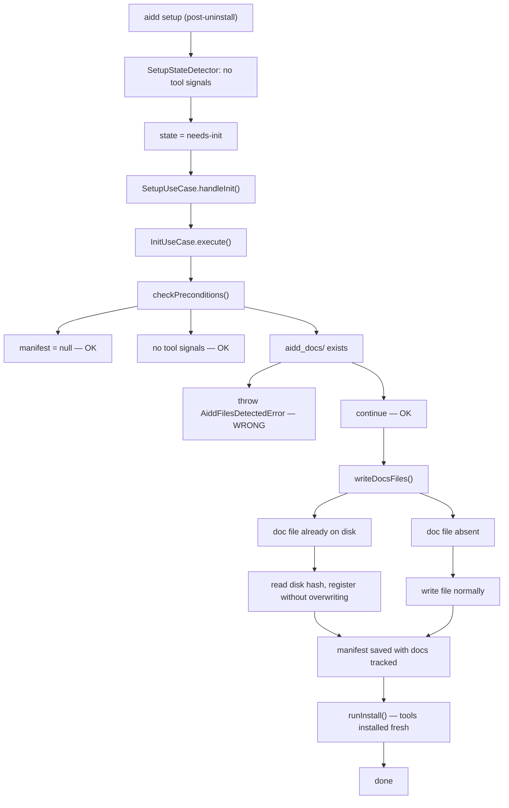

# Instruction: InitUseCase handles existing aidd_docs gracefully

## Feature

- **Summary**: Remove the wrong guard that blocks `aidd init` when `aidd_docs/` already exists. Make `writeDocsFiles` register existing doc files with their disk hash instead of overwriting or aborting. This fixes the post-uninstall dead-end where `aidd setup` fails because `AdoptUseCase` expects tool dirs that no longer exist.
- **Stack**: `TypeScript`, `Node.js`
- **Branch name**: `fix/init-handles-existing-docs`
- **Parent Plan**: none
- **Sequence**: standalone
- Confidence: 9/10
- Time to implement: 30 min

## Existing files

- @src/application/use-cases/init-use-case.ts
- @src/application/use-cases/setup-use-case.ts
- @tests/application/use-cases/init-use-case.integration.test.ts
- @tests/application/use-cases/setup-use-case.integration.test.ts

### New files to create

- none

## User Journey

## Implementation phases

### Phase 1 — Fix InitUseCase

> Remove wrong guard, handle existing doc files gracefully in writeDocsFiles

1. `checkPreconditions()`: delete the `if (await this.fs.fileExists(join(projectRoot, resolvedDocsDir)))` block (3 lines). Keep the manifest guard and the tool-signals guard.
2. `writeDocsFiles()` non-force path: add a check — if `outputPath` already exists on disk, read its hash with `fs.readFileHash` and push a `GeneratedFile` with the disk hash without calling `fs.writeFile`. Only write when the file is absent.

### Phase 2 — Clean up SetupUseCase

> Remove the seedBareManifest workaround, now that InitUseCase handles the case

1. `handleInit()`: remove the `docsDirExists` check and the ternary that dispatches to `seedBareManifest`. Always call `runInit`.
2. Delete the `seedBareManifest` private method.
3. Remove the `import { join }` added in `setup-use-case.ts` if no longer used.

### Phase 3 — Update tests

> Align tests with the new correct behavior

1. `init-use-case.integration.test.ts`: update "aborts with adopt guidance when docs directory already exists" — it should now SUCCEED, return a `fileCount` of 0 (files registered, not re-written), and the manifest should track the existing files.
2. `setup-use-case.integration.test.ts`: update the test "aidd_docs exists without tool signals routes to init and installs tools without re-writing docs" — assert `fileCount` reflects registered (not written) docs count from the framework fixture.

## Validation flow

1. Create a temp dir with only `aidd_docs/` (no manifest, no tool dirs)
2. Run `aidd setup --tools claude --from <version>` — should succeed, manifest created, claude tool files installed, existing docs registered
3. Run `aidd doctor` — no "untracked docs" warning
4. Run `aidd init` in same dir — should throw `AlreadyInitializedError` (manifest now exists)
5. Run `aidd init` in a dir with only `aidd_docs/` and no manifest — should succeed (register existing docs, create manifest)
6. Integration tests pass: `pnpm test:integration`
