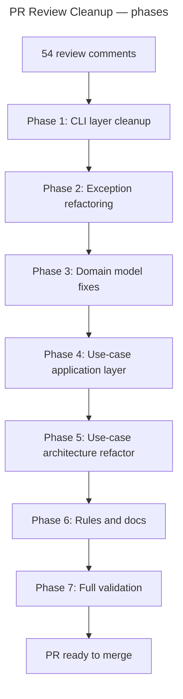

# Instruction: PR #143 Review Cleanup — Master Plan

## Feature

- **Summary**: Address all 54 inline review comments from PR #143. Comments fall into 6 categories: CLI layer duplication, domain model issues, use-case responsibility violations, large use-cases refactor, naming/exceptions, and docs/rules cleanup.
- **Stack**: `TypeScript`, `Node.js`, `Commander.js`, `Biome`, `Vitest`
- **Branch name**: `fix/143-pr-review-cleanup`
- **Parent Plan**: none
- **Sequence**: standalone
- Confidence: 8/10
- Time to implement: ~4–6h

## Existing files

- @src/application/commands/doctor.ts
- @src/application/commands/install.ts
- @src/application/commands/setup.ts
- @src/application/commands/status.ts
- @src/application/commands/uninstall.ts
- @src/application/commands/global-options.ts
- @src/application/use-cases/install-use-case.ts
- @src/application/use-cases/restore-use-case.ts
- @src/application/use-cases/setup-use-case.ts
- @src/application/use-cases/doctor-use-case.ts
- @src/application/use-cases/status-use-case.ts
- @src/application/use-cases/uninstall-use-case.ts
- @src/application/use-cases/update-use-case.ts
- @src/application/use-cases/adopt-use-case.ts
- @src/application/use-cases/shared/ide-patch-use-case.ts
- @src/domain/models/config-ref-filter.ts
- @src/domain/models/distribution.ts
- @src/domain/models/manifest.ts
- @src/domain/models/merge-strategy.ts
- @src/domain/models/tool-config.ts
- @.claude/rules/00-architecture/0-layer-responsibilities.md
- @.claude/rules/05-testing/5-test-pyramid.md
- @.claude/rules/08-domain/8-value-objects.md
- @aidd_docs/memory/architecture.md
- @aidd_docs/memory/project_brief.md

### New file to create

- none (no utils files — rule: helpers live in the most relevant existing module, e.g. `global-options.ts`)

## User Journey



## IMPORTANT: How to follow this plan

- Execute phases strictly in order — each phase builds on the previous
- After each phase: run `pnpm typecheck && pnpm test` before moving on
- Do not batch multiple phases in one commit
- One commit per phase minimum

---

## Phase 1 — CLI layer cleanup

> Eliminate duplication in command files, align patterns, move validation before `createDeps`

### Checklist

- [ ] 1. Add `parseCategoryArg(arg: string | undefined, output: CLIOutput): ToolCategory | undefined` into `global-options.ts` (no new file — no utils):
  - Validates "ai" | "ide", calls `output.error()` + `process.exit(1)` on invalid value
  - Replaces the inline ternary in: `doctor.ts`, `install.ts`, `status.ts`, `uninstall.ts`
- [ ] 2. `install.ts` — move the non-interactive guard (currently line 48, after `createDeps`) to before `createDeps`, matching the `setup.ts` pattern
- [ ] 3. `status.ts` — remove `--tool <toolId>` flag entirely (reviewer comment: "On voulait aligner pourquoi on a encore le flag tool"), remove associated `filterToolId` usage, update help text
- [ ] 4. `status.ts` — move mutual-exclusion checks (currently after `createDeps`) to before `createDeps`
- [ ] 5. `setup.ts:113` — clarify `toolIds` semantics: replace `rawToolIds ?? undefined` with explicit `[]` or a typed union; align with `SetupUseCase` signature expectations
- [ ] 6. `uninstall.ts:75` — replace `output.error() + process.exit(1)` with a dedicated `NoToolsInstalledError` (check if it exists in `errors.ts`, create if not)
- [ ] 7. Align `install.ts` positional arg parsing style to match `setup.ts` pattern (`resolveToolIds` helper function)

---

## Phase 2 — Exception refactoring

> All exceptions must build their own messages internally. Callers pass data, not strings.
> Rule: if the same template message repeats, or if the message is predictable from parameters, it belongs in the constructor.
> `InputRequiredError(message)` and `FrameworkResolutionError(message)` remain generic — their messages are contextually unique per callsite.

### Checklist

#### New exceptions to create in `domain/errors.ts`
- [ ] 1. `InvalidToolIdError(invalid: string[])` — bakes "Unknown tool(s): X. Valid tools: claude, cursor, ..." — replaces `ToolValidationError` in `assertValidToolIds`
- [ ] 2. `CategoryMismatchError(wrong: string[], category: ToolCategory)` — bakes "X is not an AI tool. Valid AI tools: ..." — replaces `ToolValidationError` in `assertToolIdsMatchCategory`
- [ ] 3. `UnregisteredToolError(toolId: string)` — bakes "Tool 'X' is not registered." — replaces `ToolValidationError` in `getToolConfig`
- [ ] 4. `ToolNotInManifestError(toolId: string)` — bakes "Tool 'X' is not installed in the manifest." — replaces 5 identical `ManifestValidationError` in `manifest.ts`
- [ ] 5. `InvalidRepoFormatError()` — static message "Invalid repository format. Expected: owner/repo" — replaces `ManifestValidationError` in `manifest.ts:22`
- [ ] 6. `InvalidManifestDataError(detail?: string)` — bakes "Invalid manifest data: {detail}" — replaces 2 `ManifestValidationError` on parsing
- [ ] 7. `InvalidManifestToolIdError(key: string)` — bakes "Invalid tool id in manifest: 'X'." — replaces `ManifestValidationError` in `manifest.ts:453`
- [ ] 8. `InvalidMcpServerConfigError(name: string)` — bakes "MCP server 'X' must have either a 'command' or 'url' field" — replaces `McpConfigError` in `opencode.ts`; remaining static McpConfigErrors get static constructors or inline constants
- [ ] 9. `OpencodeDualConfigError()` — static "Both opencode.json and opencode.jsonc exist. Remove one." — replaces `ConfigConflictError` in `opencode.ts`
- [ ] 10. `PackageManagerDetectionError()` — bakes the full "Could not detect package manager. Run manually:..." with PM commands — replaces `PackageManagerError` in `cli-updater-adapter.ts`

#### New exceptions to create in `application/errors.ts`
- [ ] 11. `InvalidCategoryError(category: string)` — bakes "Invalid category 'X'. Use 'ai' or 'ide'." — used in `parseCategoryArg` in `global-options.ts` (replaces inline `output.error()`)
- [ ] 12. `NoToolsInstalledError(category?: ToolCategory)` — bakes "No AI tools installed." / "No IDE tools installed." / "No tools installed." — replaces inline `output.error()` in `uninstall.ts:75`

#### Remove `ToolValidationError` from `domain/errors.ts`
- [ ] 13. Delete `ToolValidationError` once all 3 call sites are replaced; verify with `pnpm knip`

#### Fix duplicate validation in `adopt-use-case.ts:110`
- [ ] 14. Remove the inline `validateToolIds` method in `AdoptUseCase` that duplicates `assertValidToolIds`; call `assertValidToolIds` directly (now throws `InvalidToolIdError`)

---

## Phase 3 — Domain model fixes

> Make the domain layer explicit, exhaustive, and self-describing

### Checklist

- [ ] 1. `tool-config.ts:22` — replace ternary in `toolIdsForCategory` with an exhaustive `switch` + `default: throw` to catch future categories at compile time
- [ ] 2. `tool-config.ts:115` — replace duck-typing `"agents" in config` in `isAiToolConfig` with an explicit discriminant field `kind: "ai" | "ide"` on `AiToolConfig` and `IdeToolConfig` interfaces; update all callers
- [ ] 3. `merge-strategy.ts:3` — rename the ambiguous `frameworkPrimeKeys` field or the type name `PerKeyMergeStrategy` to clearly describe the semantics ("keys where framework wins vs user wins")
- [ ] 4. `distribution.ts:28` — identify the two config methods that should be mutualized and extract a shared helper
- [ ] 5. `distribution.ts:131` — rename the unclear function/variable at that line
- [ ] 6. `manifest.ts:11` — move `VSCODE_MIGRATION_PATHS` (or equivalent VSCode-specific constant) out of the generic manifest model and into the vscode tool config
- [ ] 7. `manifest.ts:89` — evaluate if the migration block is still needed; remove if not, add a comment explaining why if kept
- [ ] 8. `config-ref-filter.ts:5` — clarify the domain responsibility: rename the file/function to better express what "filtering by IDE context" means; or move into `tool-config.ts` where IDE context is defined

---

## Phase 4 — Use-case application layer cleanup

> Fix responsibility violations and duplication within individual use-cases

### Checklist

- [ ] 1. `install-use-case.ts:100` — remove the first call to `resolveIdeContext`; call it only once after `toolIds` is finalized (after `maybySuggestVscode`)
- [ ] 2. `install-use-case.ts:197` — move `resolveToolIds` logic entirely to the command layer; use-case receives `toolIds: ToolId[]` already resolved; delete `resolveToolIds` from the use-case
- [ ] 3. `install-use-case.ts:253` — rename `maybySuggestVscode` to `maybeSuggestRequiredIde`; generalize using `config.requiredIdeIds` from `AiToolConfig` instead of hardcoding copilot+vscode
- [ ] 4. `install-use-case.ts:340` — unify `generateToolFiles` two branches into a single helper `generateForConfig(config, ...)` that dispatches internally; same fix applies to identical patterns in `update-use-case.ts:231`, `update-use-case.ts:372`, `restore-use-case.ts:249`
- [ ] 5. `install-use-case.ts:181` + `ide-patch-use-case.ts:33` — eliminate `IdePatchUseCase`; replace its call with a direct call to `installOneTool` inside `patchIdeAfterInstall`
- [ ] 6. `install-use-case.ts:243` — move IDE filtering logic (`IDE_TOOL_IDS` membership check) into `tool-config.ts` as `isIdeToolId(id): id is IdeToolId`; use it in all callers
- [ ] 7. `install-use-case.ts:363` — rename `applyIdeAndMcpFilters` / `selectMcpServers` to clarify purpose; evaluate if MCP selection warrants a dedicated `McpSelectionService` or private method group
- [ ] 8. `install-use-case.ts:508` — add a dedicated error class for the unclear condition at that line; replace raw throw/message with the typed error
- [ ] 9. `status-use-case.ts:67` — evaluate the skip logic: if we can simply ignore the item, do so; remove the conditional if it's overly defensive
- [ ] 10. `status-use-case.ts:79` — remove if mutualized (connect with Phase 3 step 4 outcome)
- [ ] 11. `status-use-case.ts:125` — move the domain logic at that line into the appropriate domain model
- [ ] 12. `adopt-use-case.ts:142` — refactor the switch/if block so callers don't need to branch externally; hide the dispatch behind a single method with identical signature

---

## Phase 5 — Use-case architecture refactor (large files)

> Slim down the four oversized use-cases by moving responsibilities to correct layers

### Checklist

- [ ] 1. `setup-use-case.ts` (515 lines) — audit each `handleXxx` private method:
  - If it duplicates logic from `InstallUseCase`, `AdoptUseCase`, `UpdateUseCase` → delete and call those use-cases instead
  - `SetupUseCase` should only: detect state, resolve framework, then delegate to the correct use-case
  - Target: < 200 lines
- [ ] 2. `restore-use-case.ts` (583 lines) — simplify the restore concept:
  - Core: identify changed files → revert to framework-version content → call `installOneTool` equivalent
  - Extract complex private methods into domain helpers or a `RestoreStrategyService`
  - Target: < 300 lines
- [ ] 3. `doctor-use-case.ts` (301 lines) — move domain-level validations (file existence checks, manifest integrity, hash comparisons) into domain models or ports; `DoctorUseCase` should only orchestrate and format issues
- [ ] 4. `uninstall-use-case.ts:116` — extract merge-file management into a dedicated `MergeFileCleanupService` or move into `Manifest` domain model; evaluate if a sub-use-case makes sense here

---

## Phase 6 — Rules and docs cleanup

> Fix editorial issues in rules files and memory documents

### Checklist

- [ ] 1. `.claude/rules/00-architecture/0-layer-responsibilities.md:12` — split mixed rules into separate lines
- [ ] 2. `.claude/rules/05-testing/5-test-pyramid.md:53` — split into two distinct lines
- [ ] 3. `.claude/rules/08-domain/8-value-objects.md:51` — verify if still current; remove or update the outdated rule
- [ ] 4. `aidd_docs/memory/architecture.md:29-33` — replace overly-specific implementation details with higher-level architectural statements
- [ ] 5. `aidd_docs/memory/project_brief.md:58` — same: elevate to higher-level, remove implementation specifics

---

## Phase 7 — Full validation in loop on local directories

> End-to-end smoke tests using the local framework (`--path ../framework/`). Create a fresh temp directory for each command group, run every combination, verify output.

### Setup

```bash
mkdir -p /tmp/aidd-test-install /tmp/aidd-test-uninstall /tmp/aidd-test-status /tmp/aidd-test-setup /tmp/aidd-test-doctor /tmp/aidd-test-restore
```

### Checklist

#### `aidd install` — in `/tmp/aidd-test-install`
- [ ] `aidd install --path ../framework/ claude` — happy path AI tool
- [ ] `aidd install --path ../framework/ vscode` — happy path IDE tool
- [ ] `aidd install --path ../framework/ ai claude` — positional category AI
- [ ] `aidd install --path ../framework/ ide vscode` — positional category IDE
- [ ] `aidd install --path ../framework/ ai` — all AI tools (interactive skip)
- [ ] `aidd install --path ../framework/ ide` — all IDE tools
- [ ] `aidd install --path ../framework/ --all` — install everything
- [ ] `aidd install --path ../framework/ --force claude` — force reinstall
- [ ] `aidd install --path ../framework/ --mcp context7 claude` — with MCP filter
- [ ] `aidd install --path ../framework/ ide claude` → must fail: cross-category error
- [ ] `aidd install --path ../framework/ ai vscode` → must fail: cross-category error
- [ ] `aidd install --path ../framework/ unknownTool` → must fail: ToolValidationError
- [ ] `echo "" | aidd install --path ../framework/` → must fail: non-interactive no-args error

#### `aidd uninstall` — in `/tmp/aidd-test-uninstall` (pre-install first)
- [ ] `aidd uninstall claude` — single tool
- [ ] `aidd uninstall ai claude` — with category
- [ ] `aidd uninstall --all` — everything
- [ ] `aidd uninstall --all ai` — all AI only
- [ ] `aidd uninstall --all ide` — all IDE only
- [ ] `aidd uninstall ide claude` → must fail: cross-category error
- [ ] `echo "" | aidd uninstall` → must fail: non-interactive no-args error

#### `aidd status` — in `/tmp/aidd-test-status` (pre-install first)
- [ ] `aidd status` — all tools
- [ ] `aidd status ai` — AI tools only
- [ ] `aidd status ide` — IDE tools only
- [ ] `aidd status --docs` — docs only
- [ ] `aidd status badcat` → must fail: invalid category
- [ ] `aidd status ai --docs` → must fail: mutually exclusive

#### `aidd doctor` — in `/tmp/aidd-test-doctor` (pre-install first)
- [ ] `aidd doctor` — full check
- [ ] `aidd doctor ai` — AI tools only
- [ ] `aidd doctor ide` — IDE tools only
- [ ] `aidd doctor badcat` → must fail: invalid category

#### `aidd setup` — in `/tmp/aidd-test-setup` (fresh dir)
- [ ] `aidd setup --path ../framework/ --ai claude` — AI-only setup
- [ ] `aidd setup --path ../framework/ --ide vscode` — IDE-only setup
- [ ] `aidd setup --path ../framework/ --all` — full setup
- [ ] `aidd setup --path ../framework/ --ai claude --ide vscode` — combined
- [ ] Re-run setup on existing install → should detect and update

#### `aidd restore` — in `/tmp/aidd-test-restore` (pre-install + modify a file first)
- [ ] `aidd restore --path ../framework/` — restore all drifted files
- [ ] `aidd restore --path ../framework/ --force` — force restore
- [ ] `aidd restore --path ../framework/ claude` — restore specific tool

#### Test suite
- [ ] `pnpm typecheck` — 0 errors
- [ ] `pnpm test` — all pass
- [ ] `pnpm knip` — 0 unused exports

#### Documentation
- [ ] README — all command examples still valid after `--tool` removal from `status`
- [ ] `aidd_docs/memory/architecture.md` — reflects refactored structure
- [ ] `codebase_map` — updated if files added/removed

---

## Validation flow

1. After each phase: `pnpm typecheck && pnpm test`
2. After Phase 2: `pnpm knip` — verify `ToolValidationError` is fully dead and removed
3. After Phase 5: `pnpm knip` — catch dead code from deleted use-cases
4. After Phase 7: manual smoke test of all commands listed above

## Confidence

- ✅ All issues are clearly identified and localized
- ✅ Phases are ordered by dependency (CLI before use-case, domain before application)
- ✅ Phase 3/4 are the riskiest but are well-scoped
- ❌ Phase 4 (large refactors) may reveal hidden coupling not visible from PR comments alone
- ❌ `RestoreUseCase` simplification may require deeper understanding of restore semantics before cutting
