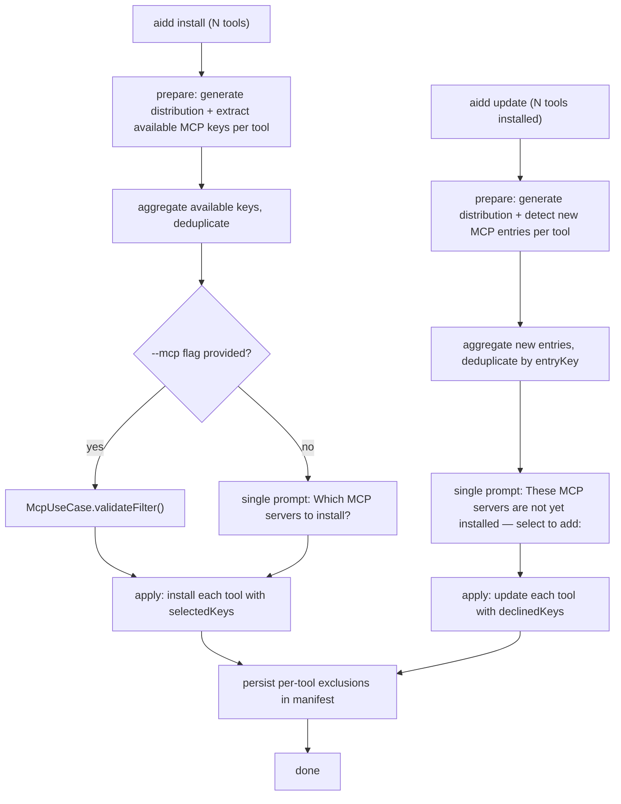

# Instruction: MCP prompt fires once across all tools (install + update)

## Feature

- **Summary**: Fix MCP server selection/exclusion prompt firing once per installed tool during `install` and `update`. In both use cases, aggregate all MCP entries across tools before any prompt, deduplicate by `entryKey`/key, prompt once with corrected messages, then apply decisions back per tool. Remove prompt from `McpUseCase` — it becomes validate-only.
- **Stack**: `TypeScript 5`, `Node.js`
- **Branch name**: `fix/142-mcp-single-prompt`
- **Parent Plan**: none
- **Sequence**: standalone
- Confidence: 9/10
- Time to implement: 2h

## Existing files

- @src/application/use-cases/install-use-case.ts
- @src/application/use-cases/update-use-case.ts
- @src/application/use-cases/shared/mcp-use-case.ts
- @src/domain/models/mcp.ts
- @src/domain/models/mcp-exclusion.ts
- @tests/application/use-cases/install-use-case.integration.test.ts
- @tests/application/use-cases/update-use-case.integration.test.ts

### New files to create

- none

## User Journey

## Implementation phases

### Phase 1 — Refactor `McpUseCase` to validate-only

> Remove the prompter from `McpUseCase` — prompt is now handled upstream at the loop level

1. Remove `Prompter` constructor parameter from `McpUseCase`.
2. Remove `prompt()` private method. `execute()` now has two branches: `mcpFilter` provided → `validateFilter()`; else → return empty `Set` (no prompt, no auto-select-all).
3. Update all callers: `InstallUseCase` no longer passes `this.prompter` to `McpUseCase`.

### Phase 2 — Aggregate MCP prompt in `installAllTools`

> Prompt once before the per-tool loop using aggregated available keys

1. Add `ToolInstallData` interface: `toolId`, `generated: GeneratedFile[]`, `configHandler`, `configRefs`.
2. Extract `prepareToolInstall(toolId, ...): Promise<ToolInstallData>` — runs `generateToolFiles` + `filterByIdeRequirements`, returns data without writing or prompting.
3. Add `aggregateAvailableMcpKeys(data: ToolInstallData[]): Set<string>` — collects all MCP keys across tools, deduplicates.
4. Add `promptMcpSelection(allKeys: Set<string>, mcpFilter: string[], interactive: boolean): Promise<Set<string>>` — calls `McpUseCase.validateFilter` if `mcpFilter` provided, else if `interactive` calls `this.prompter.checkbox("Which MCP servers do you want to install?", ...)`, else returns empty Set.
5. Refactor `installAllTools`: prepare loop → aggregate → prompt once → `selectedKeys: Set<string>` → apply loop with `selectedKeys`.
6. `selectMcpServers` receives `selectedKeys: Set<string>` instead of `mcpFilter: string[]` and `interactive: boolean`. Calls `computeMcpExclusions` directly (no `McpUseCase`).

### Phase 3 — Aggregate MCP prompt in `updateAllTools`

> Prompt once before the per-tool apply loop using aggregated new MCP entries

1. Add `ToolUpdatePrepared` interface: `toolId`, `version`, `newDistribution`, `newDistMap`, `diff`, `entryDiffs`, `configHandler`, `configRefs`, `newMcpEntries: McpExclusion[]`, `manifestFiles`.
2. Extract `prepareToolUpdate(toolId, ...): Promise<ToolUpdatePrepared>` — runs `generateForConfig`, `filterByIdeRequirements`, `computeDiff`, `computeMergeEntryDiff`, and `detectNewMcpEntries`. No writes, no prompt.
3. Add `aggregateNewMcpEntries(prepared: ToolUpdatePrepared[]): McpExclusion[]` — flattens all `newMcpEntries`, deduplicates by `entryKey` (first occurrence wins).
4. Add `promptDeclinedMcp(entries: McpExclusion[], interactive: boolean): Promise<Set<string>>` — if `entries.length === 0` or `!interactive`: return empty Set. Else: call `this.prompter.checkbox("These MCP servers are not yet installed — select which ones to add:", ...)`, return Set of declined `entryKey` values.
5. Refactor `updateAllTools`: prepare loop → aggregate → single prompt → `declinedKeys: Set<string>` → apply loop calls `applyToolUpdateFromData(data, declinedKeys)`.
6. Extract `applyToolUpdateFromData(data: ToolUpdatePrepared, manifest, projectRoot, internal, declinedKeys): Promise<UpdateToolResult>` — calls `applyToolUpdate` with pre-computed exclusions.
7. Replace `resolveNewExclusions` with `computeToolExclusions(toolId, manifest, newMcpEntries, declinedKeys): McpExclusion[]` — pure, no prompt. Merges declined entries with `manifest.getExcludedMcp(toolId)`.
8. Update `applyMcpExclusions`: accept `declinedKeys: Set<string>` instead of calling `resolveNewExclusions`. Delete `promptNewMcpEntries` and `resolveNewExclusions`.

### Phase 4 — Update tests

> Align tests with single-prompt behavior for both use cases

1. `install-use-case.integration.test.ts`: assert `prompter.checkboxCalls.length === 1` when installing multiple tools with shared MCP servers. Assert message is `"Which MCP servers do you want to install?"`.
2. `update-use-case.integration.test.ts`: assert `prompter.checkboxCalls.length === 1` when updating. Update message assertion to `"not yet installed"`. Add test: single prompt fires when two tools share a new MCP entry.

## Validation flow

1. Install two tools with shared MCP entries interactively — single prompt appears
2. Decline one entry — excluded in manifest for both tools
3. Run update with new MCP entry shared across two tools — single prompt appears
4. Re-run update — no prompt (already decided)
5. Run install/update with `--mcp playwright` — no prompt, validated silently
6. Integration tests pass: `pnpm test:integration`
