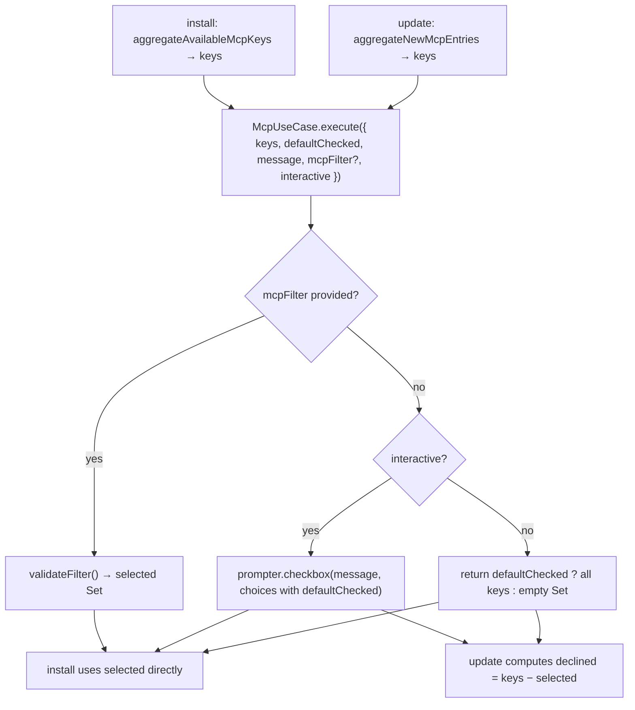

# Instruction: Centralize MCP prompt logic in shared McpUseCase

## Feature

- **Summary**: Extract the MCP checkbox prompt from `install-use-case.ts` and `update-use-case.ts` into the shared `McpUseCase`. Both use cases currently duplicate the same pattern (aggregate keys → prompt → return decision). The shared use case becomes the single place for MCP server selection, with configurable opt-in (`defaultChecked: false`) and opt-out (`defaultChecked: true`) modes.
- **Stack**: `TypeScript 5`, `Node.js`
- **Branch name**: `fix/142-mcp-single-prompt` (current branch, continuation)
- **Parent Plan**: none
- **Sequence**: standalone
- Confidence: 9/10
- Time to implement: 45min

## Existing files

- @src/application/use-cases/shared/mcp-use-case.ts
- @src/application/use-cases/install-use-case.ts
- @src/application/use-cases/update-use-case.ts
- @tests/application/use-cases/shared/mcp-use-case.integration.test.ts

### New files to create

- none

## User Journey



## Implementation phases

### Phase 1 — Extend McpUseCase with prompt capability

> Replace the `available: Map` input with flat `keys: string[]`, add prompter + prompt config

1. Replace `McpOptions` interface:
   ```typescript
   interface McpOptions {
     keys: string[];
     defaultChecked: boolean;
     message: string;
     mcpFilter?: string[];
     interactive: boolean;
   }
   ```
2. Add `Prompter` optional constructor param: `constructor(private readonly prompter?: Prompter)`.
3. Rewrite `execute()`: 3 branches — `mcpFilter` provided → `validateFilter(mcpFilter, keys)`; `interactive && prompter` → `prompt(keys, defaultChecked, message)`; else → `defaultChecked ? new Set(keys) : new Set()`.
4. `validateFilter`: adapt to accept `string[]` instead of `Set<string>`.
5. Add private `prompt(keys, defaultChecked, message)`: maps keys to choices with `checked: defaultChecked`, calls `this.prompter.checkbox(message, choices)`, returns `new Set(selected)`.
6. Remove `collectAllKeys` (no longer needed — caller passes flat keys).

### Phase 2 — Update install to delegate to McpUseCase

> Remove inline checkbox from `promptMcpSelection`, call McpUseCase instead

1. In `promptMcpSelection`: replace the inline `this.prompter.checkbox(...)` block and the `new McpUseCase().execute(...)` call with a single `new McpUseCase(this.prompter).execute({ keys: [...allKeys], defaultChecked: false, message: "Which MCP servers do you want to install?", mcpFilter, interactive })`.
2. Remove the `Prompter` import from install if no longer used elsewhere (keep if still used for other prompts).

### Phase 3 — Update update to delegate to McpUseCase

> Remove inline checkbox from `promptDeclinedMcp`, call McpUseCase instead

1. In `promptDeclinedMcp`: replace the inline `this.prompter.checkbox(...)` block with `new McpUseCase(this.prompter).execute({ keys: entries.map(e => e.entryKey), defaultChecked: true, message: "These MCP servers are not yet installed — select which ones to add:", interactive })` → `selected: Set<string>`.
2. Compute declined from result: `new Set(entries.map(e => e.entryKey).filter(k => !selected.has(k)))`.
3. Return `declinedKeys`.

### Phase 4 — Update McpUseCase tests

> Cover the new branches: prompt opt-in, prompt opt-out, no-interactive defaults

1. Remove tests that relied on the old `available: Map<string, string[]>` shape.
2. Add test: `interactive=true, defaultChecked=false` — prompt fires, returns only selected keys (install mode).
3. Add test: `interactive=true, defaultChecked=true` — prompt fires with all pre-checked, returns selected keys (update mode).
4. Add test: `interactive=false, defaultChecked=false` — no prompt, returns empty Set.
5. Add test: `interactive=false, defaultChecked=true` — no prompt, returns all keys.
6. Keep existing `mcpFilter` validation tests, adapt input shape to `keys: string[]`.

## Validation flow

1. `pnpm typecheck` — 0 errors
2. `pnpm test:integration -- --testPathPattern="mcp-use-case|install-use-case|update-use-case"` — all pass
3. `pnpm test` — 1074+ tests pass
