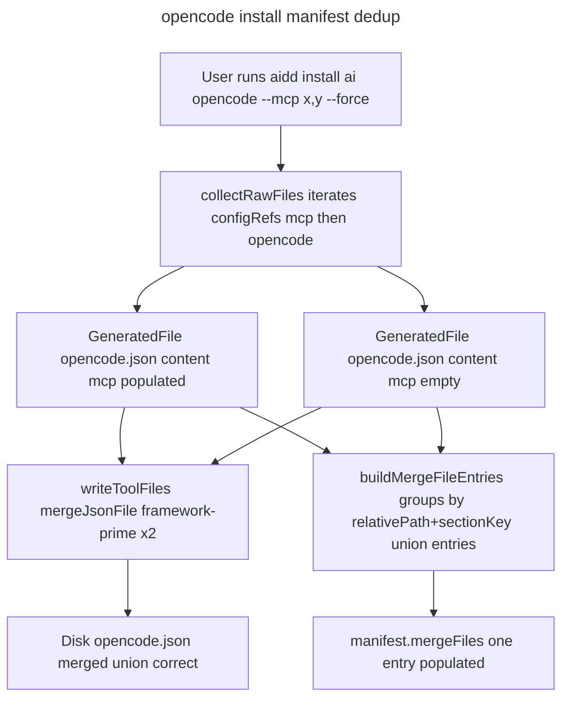

# Instruction: Fix opencode duplicate mergeFile entry in manifest

## Feature

- **Summary**: Dedup `MergeFileEntry` records in `buildMergeFileEntries` so opencode installs write a single manifest entry per `(relativePath, sectionKey)` pair, merging entries across framework configRefs that share the same output file.
- **Stack**: `TypeScript 5.x`, `Node.js 22`, `Vitest`
- **Branch name**: `fix/156-opencode-duplicate-mergefile-entry`
- **Parent Plan**: `none`
- **Sequence**: `standalone`
- Confidence: 9/10
- Time to implement: small (<1h)

## Existing files

- @src/domain/models/merge-entry.ts
- @src/application/use-cases/install-use-case.ts
- @src/application/use-cases/update-use-case.ts
- @tests/domain/models/merge-entry.unit.test.ts
- @tests/domain/tools/ai/opencode.unit.test.ts
- @tests/application/use-cases/install-use-case.integration.test.ts

### New file to create

- none

## User Journey

## Implementation phases

### Phase 1: Dedup logic in buildMergeFileEntries

> Group by `(relativePath, sectionKey)` and merge `entries` records (later ref wins on key conflict to match disk-side framework-prime merge order).

1. In `src/domain/models/merge-entry.ts`, replace the `MergeFileEntry[]` accumulator with a `Map<string, MergeFileEntry>` keyed on `${relativePath}::${sectionKey ?? ""}`
2. For each processed file, spread previous `entries` then current `hashes` so later ref overrides colliding keys
3. Return `[...map.values()]` preserving first-insertion order
4. No signature change for callers (still returns `MergeFileEntry[]`)

### Phase 2: Unit test coverage

> Lock the invariant at the helper level.

1. In `tests/domain/models/merge-entry.unit.test.ts`, add `describe("buildMergeFileEntries dedup")` block with:
   - two `GeneratedFile` inputs sharing `relativePath="opencode.json"` and `sectionKey="mcp"` → assert result length 1 and `entries` is union
   - colliding key across the two inputs → later wins
   - disjoint `sectionKey` same `relativePath` → two entries (defensive)

### Phase 3: Integration regression on opencode install

> Guard against manifest regression end-to-end.

1. In `tests/application/use-cases/install-use-case.integration.test.ts`, add a case that installs `opencode` with MCP filter set, then asserts:
   - `manifest.getMergeFiles("opencode")` length === 1
   - single entry `relativePath === "opencode.json"` and `sectionKey === "mcp"`
   - `entries` contains the selected MCP server keys

### Phase 4: Local end-to-end validation with real framework

> Manual verification against the real framework at `../../../../framework/` (absolute: `/Users/baptistelafourcade/Projects/freelance/aidd/aidd/framework`). Each case MUST run in its own fresh `/tmp/aidd-156-caseN` directory — no state carried across cases.

Setup steps (run once before all cases):

1. From the worktree root, `pnpm build` — produces `dist/cli.js`
2. Export alias: `AIDD="node $(pwd)/dist/cli.js"`
3. Export framework path: `FW="$(pwd)/../../../../framework"`
4. Verify `ls $FW/config/.opencode/opencode.json && ls $FW/config/mcp.json` — both must exist

Each case below: `mkdir /tmp/aidd-156-caseN && cd /tmp/aidd-156-caseN` before running, fresh every time.

Case 1 — Repro from issue (full MCP set):

1. `$AIDD setup --path $FW --docs-dir aidd_docs`
2. `$AIDD install ai opencode --path $FW --mcp playwright,figma,mcp-atlassian --force`
3. Assert `jq '.tools.opencode.mergeFiles | length' .aidd/manifest.json` == `1`
4. Assert `jq '.tools.opencode.mergeFiles[0].relativePath' .aidd/manifest.json` == `"opencode.json"`
5. Assert `jq '.tools.opencode.mergeFiles[0].sectionKey' .aidd/manifest.json` == `"mcp"`
6. Assert `jq '.tools.opencode.mergeFiles[0].entries | keys' .aidd/manifest.json` contains `playwright`, `figma`, `mcp-atlassian`

Case 2 — No `--mcp` flag (non-interactive, so selection is empty):

1. `$AIDD setup --path $FW --docs-dir aidd_docs`
2. `$AIDD install ai opencode --path $FW --force`
3. Assert `jq '.tools.opencode.mergeFiles | length'` == `1`
4. Assert `jq '.tools.opencode.mergeFiles[0].entries'` == `{}`

Case 3 — Single MCP server:

1. `$AIDD setup --path $FW --docs-dir aidd_docs`
2. `$AIDD install ai opencode --path $FW --mcp playwright --force`
3. Assert length == `1`, `entries` contains only `playwright`

Case 4 — Force reinstall over pre-existing duplicate (simulates v3.9.0-shipped manifest):

1. `$AIDD setup --path $FW --docs-dir aidd_docs`
2. `$AIDD install ai opencode --path $FW --mcp playwright,figma --force` (under fix: expect 1 entry)
3. Manually corrupt manifest: use `jq` to inject a second empty `mergeFiles` entry for `opencode.json` and write back
4. `$AIDD install ai opencode --path $FW --mcp playwright,figma --force`
5. Assert `length` == `1` (re-install converges to deduped state)

Case 5 — Update path:

1. `$AIDD setup --path $FW --docs-dir aidd_docs`
2. `$AIDD install ai opencode --path $FW --mcp playwright --force`
3. `$AIDD update --path $FW --mcp playwright,figma`
4. Assert `length` == `1`, `entries` contains `playwright` and `figma`

Case 6 — Multi-tool install no regression (opencode + claude):

1. `$AIDD setup --path $FW --docs-dir aidd_docs`
2. `$AIDD install ai opencode claude --path $FW --mcp playwright,figma --force`
3. Assert `jq '.tools.opencode.mergeFiles | length'` == `1`
4. Assert `jq '.tools.claude.mergeFiles | length'` == `1` (claude uses `.mcp.json`)
5. Assert `jq '.tools.claude.mergeFiles[0].relativePath'` == `".mcp.json"`

Case 7 — Non-opencode only regression guard (claude alone):

1. `$AIDD setup --path $FW --docs-dir aidd_docs`
2. `$AIDD install ai claude --path $FW --mcp playwright,figma --force`
3. Assert `jq '.tools.claude.mergeFiles | length'` == `1`
4. Assert entries contain selected MCP keys

Recording: for each case write output of `jq '.tools' .aidd/manifest.json` into `/tmp/aidd-156-caseN/result.json` and review all 7 side by side.

## Validation flow

1. `pnpm test:unit tests/domain/models/merge-entry.unit.test.ts` — new dedup cases pass
2. `pnpm test:integration tests/application/use-cases/install-use-case.integration.test.ts` — opencode regression case passes
3. Reproduce issue manually:
   - `mkdir /tmp/aidd-156 && cd /tmp/aidd-156`
   - `aidd setup --path <local-framework> --docs-dir aidd_docs`
   - `aidd install ai opencode --path <local-framework> --mcp playwright,figma --force`
   - `cat .aidd/manifest.json` → `tools.opencode.mergeFiles` has exactly one entry, `entries` populated, no empty duplicate
4. Re-run with no `--mcp` → still one entry, `entries` empty
5. `pnpm test` — full suite green
6. `biome check --write` — no lint regression
