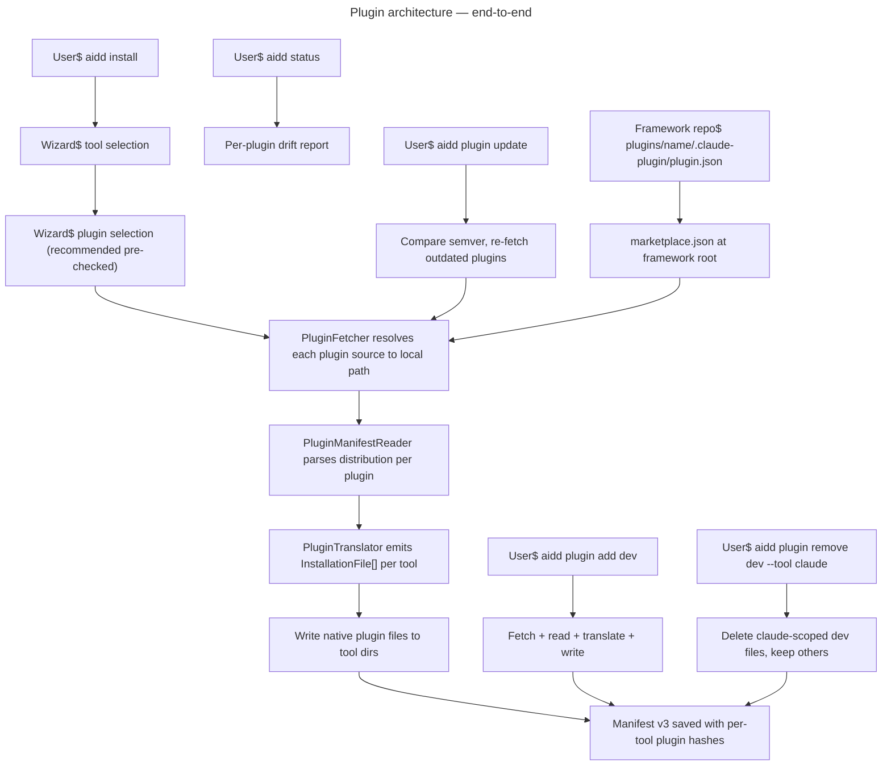

# Instruction: feat(#260): plugin architecture — AIDD as plugin-based system

## Feature

- **Summary**: Transform AIDD from monolithic framework delivery into a plugin-based system. Each domain (dev, pm, qa, context-engineering, version-control) is independently installable. CLI reads any plugin format (Claude Code, Cursor, Codex, Copilot VS Code), translates to each target tool's native format. New `aidd plugin` command covers full lifecycle. Manifest bumps v2→v3 with per-tool plugin tracking. Framework repo restructured into Claude Code marketplace format.
- **Stack**: `TypeScript 5.x`, `Node.js >= 24`, `vitest`, `commander`, `simple-git 3.36.0`
- **Branch name prefix**: `feat/260-plugin-architecture-`
- **Parent Plan**: `none`
- **Sequence**: `master (8 parts)`
- Confidence: 8/10
- Time to implement: 12-18 sessions (3 weeks)

## Plugin install modes

| Tool | Mode | Plugin dir | Manifest file |
|------|------|-----------|--------------|
| Claude | native | `.claude/plugins/<name>/` | `.claude-plugin/plugin.json` |
| Cursor | native | `.cursor/plugins/<name>/` | `.cursor-plugin/plugin.json` |
| Codex | native | `.codex/plugins/<name>/` | `.codex-plugin/plugin.json` |
| Copilot VS Code | native | `.github/plugins/<name>/` | `plugin.json` |
| Opencode | flat | `.opencode/*/` prefixed frontmatter | — |
| VSCode | unsupported | — | — |

## Parts

| Part | Scope | Branch | Depends on |
|------|-------|--------|-----------|
| [Part 1](2026_04_27-#260-plugin-architecture-part-1.md) | Plugin domain model + manifest v3 + migration | `feat/260-plugin-architecture-part-1` | none |
| [Part 2](2026_04_27-#260-plugin-architecture-part-2.md) | Plugin format detection + PluginManifestReader + PluginTranslator | `feat/260-plugin-architecture-part-2` | Part 1 |
| [Part 3](2026_04_27-#260-plugin-architecture-part-3.md) | Framework loader plugin-aware + marketplace.json catalog | `feat/260-plugin-architecture-part-3` | Part 2 |
| [Part 4](2026_04_27-#260-plugin-architecture-part-4.md) | Plugin fetch pipeline + install adapters | `feat/260-plugin-architecture-part-4` | Part 3 |
| [Part 5](2026_04_27-#260-plugin-architecture-part-5.md) | `aidd plugin` command (add/remove/list/update) | `feat/260-plugin-architecture-part-5` | Part 4 |
| [Part 6](2026_04_27-#260-plugin-architecture-part-6.md) | Install wizard plugin selection step | `feat/260-plugin-architecture-part-6` | Part 5 |
| [Part 7](2026_04_27-#260-plugin-architecture-part-7.md) | Read/Write commands plugin-aware | `feat/260-plugin-architecture-part-7` | Part 6 |
| [Part 8](2026_04_27-#260-plugin-architecture-part-8.md) | Framework repo — Claude marketplace layout | `feat/260-plugin-architecture-part-8` | Part 7 validated |

## User Journey

## Architecture decisions

- `HasPlugins` capability on every AI tool — carries `mode`, `pluginsDir`, `pluginManifestRelativePath`, `flatNamespacePrefix`
- `PluginTranslator` dispatches on `"plugins" in tool.capabilities` — zero tool IDs in domain services
- `PluginManifestReader` auto-detects format by probing manifest paths in priority order
- Manifest v2→v3 migration is silent and idempotent — existing users unaffected on next command
- Plugin cache at `<projectRoot>/.aidd/plugin-cache/` — deterministic, gitignored

## Breaking changes

- Manifest v2→v3: silent migration adds `plugins: []` per tool entry, no data loss
- `FrameworkLoader.loadFromDirectory()` return type gains `catalog: PluginCatalog | null`

## Non-goals

- Plugin dependencies
- Private marketplace auth in CI
- LSP servers, `bin/` inside plugins
- Official marketplace submission

## End-to-end validation (after all parts)

1. Clean install: `aidd install` → wizard shows tools + plugins → pick claude+cursor+opencode + starter pack → verify 3 plugins in 3 formats
2. Custom plugin: `aidd plugin add owner/repo@v1.2.0` → verify fetch + translate + manifest tracking
3. Drift: modify a plugin file → `aidd status` → per-plugin drift reported with file path
4. Update: bump framework plugin version → `aidd plugin update` → only outdated plugins re-fetched
5. Remove scoped: `aidd plugin remove dev --tool claude` → claude files gone, cursor+opencode intact
6. Remove all: `aidd plugin remove dev` → all tool files for dev removed, manifest entry dropped
7. Migration: start from v2 manifest → run `aidd update` → verify v3 with empty plugins arrays, all data preserved
8. CI mode: `aidd install --yes --tools claude --plugins dev,pm` → no wizard, exact plugins installed
9. `pnpm test` — all 1200+ tests pass

## Risks

- **HIGH**: Part 4 external fetch — git clone + npm add in integration tests require network or mocking. Mitigate: unit-test translation logic separately; integration tests use local fixture as source.
- **MEDIUM**: Manifest migration — current version switch uses `MANIFEST_VERSION - 1` (single-hop). v3 bump requires explicit 3-way branch (v1/v2/v3) to avoid skipping the v1→v2→v3 chain. Covered in Part 1.
- **MEDIUM**: Manifest migration for users with multiple tools already installed. Mitigate: comprehensive v2→v3 migration tests with real multi-tool fixtures.
- **MEDIUM**: Opencode flat namespace collisions between plugins sharing command names. Mitigate: detect pre-install, warn user.
- **LOW**: Framework restructure (Part 8) may break users running `aidd update` mid-migration. Mitigate: backward-compat catalog entry pointing to old flat paths during transition.
