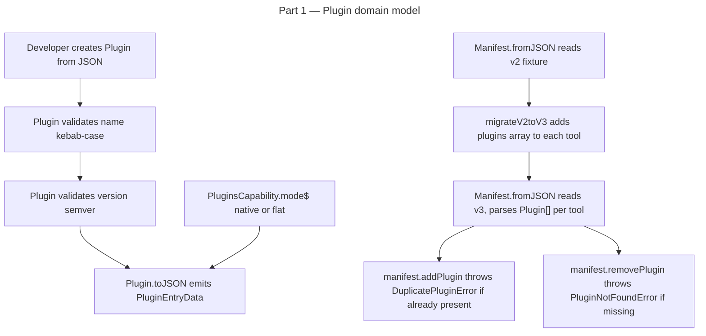

# Instruction: plugin architecture — Part 1: Plugin domain model + manifest v3

## Feature

- **Summary**: Introduce `PluginSource` discriminated union, `Plugin` value object, and `PluginsCapability` class with `HasPlugins` interface. Bump manifest to v3 with `plugins: Plugin[]` per tool entry. Implement silent v2→v3 migration with explicit 3-way version switch (v1/v2/v3). Add `HasPlugins` to all 5 AI tools with correct mode and path config. Pure domain work — no adapters, no commands.
- **Stack**: `TypeScript 5.x`, `Node.js >= 24`, `vitest`
- **Branch name**: `feat/260-plugin-architecture-part-1`
- **Parent Plan**: `2026_04_27-#260-plugin-architecture-master.md`
- **Sequence**: `1 of 8`
- Confidence: 9/10
- Time to implement: 1 session

## Existing files

- @src/domain/models/manifest.ts
- @src/domain/models/file.ts
- @src/domain/models/merge.ts
- @src/domain/models/semver.ts
- @src/domain/models/tool-ids.ts
- @src/domain/tools/contracts.ts
- @src/domain/tools/ai/claude.ts
- @src/domain/tools/ai/cursor.ts
- @src/domain/tools/ai/copilot.ts
- @src/domain/tools/ai/opencode.ts
- @src/domain/tools/ai/codex.ts
- @src/domain/capabilities/agents-capability.ts
- @src/domain/errors.ts

### New files to create

- src/domain/models/plugin-source.ts
- src/domain/models/plugin.ts
- src/domain/capabilities/plugins-capability.ts
- tests/domain/models/plugin-source.unit.test.ts
- tests/domain/models/plugin.unit.test.ts
- tests/domain/models/manifest-v3-migration.unit.test.ts
- tests/domain/capabilities/plugins-capability.unit.test.ts

## User Journey



## Implementation phases

### Phase 1: PluginSource discriminated union + new errors

> Type-safe source variants for all plugin origin kinds.

1. Create `src/domain/models/plugin-source.ts`:
   - Types: `PluginSourceGitHub { kind:"github"; repo:string; ref?:string; sha?:string }`, `PluginSourceUrl { kind:"url"; url:string; ref?:string; sha?:string }`, `PluginSourceGitSubdir { kind:"git-subdir"; url:string; path:string; ref?:string; sha?:string }`, `PluginSourceNpm { kind:"npm"; package:string; version?:string; registry?:string }`, `PluginSourceLocal { kind:"local"; path:string }`
   - Union: `type PluginSource = PluginSourceGitHub | PluginSourceUrl | PluginSourceGitSubdir | PluginSourceNpm | PluginSourceLocal`
   - `parsePluginSource(raw: unknown): PluginSource` — validates shape by `kind`, throws `InvalidPluginSourceError`
   - `serializePluginSource(src: PluginSource): Record<string, unknown>`
   - Constants: `GITHUB_REPO_REGEX = /^[a-zA-Z0-9_.-]+\/[a-zA-Z0-9_.-]+$/`, `SHA_REGEX = /^[a-f0-9]{40}$/`
2. Add to `src/domain/errors.ts`: `InvalidPluginSourceError`, `InvalidPluginNameError`, `InvalidPluginVersionError`, `InvalidPluginManifestError`, `PluginNotFoundError`, `DuplicatePluginError`

### Phase 2: Plugin value object

> Immutable domain entity for a single installed plugin.

1. Create `src/domain/models/plugin.ts`:
   - `PLUGIN_NAME_REGEX = /^[a-z0-9]+(-[a-z0-9]+)*$/`
   - Interface `PluginEntryData { name, source, version, strict, files: Record<string,string>, mergeFiles?: MergeFileEntryData[] }`
   - Class `Plugin` with readonly fields: `name`, `source: PluginSource`, `version: string`, `strict: boolean`, `files: ReadonlyMap<string, FileHash>`, `mergeFiles: readonly MergeFileEntry[]`
   - `static fromJSON(data: PluginEntryData): Plugin` — validate name via `PLUGIN_NAME_REGEX`, version via `isSemver` (from semver.ts)
   - `toJSON(): PluginEntryData`
   - `isFileTracked(relPath: string): boolean` — checks files map + mergeFiles output paths
   - `withVersion(v: string): Plugin`, `withFiles(f: ReadonlyMap<string, FileHash>): Plugin` — immutable updates

### Phase 3: PluginsCapability + HasPlugins

> Capability class carrying per-tool plugin install config.

1. Create `src/domain/capabilities/plugins-capability.ts`:
   - `type PluginsMode = "native" | "flat" | "unsupported"`
   - `interface NativePluginsParams { mode: "native"; pluginsDir: string; pluginManifestRelativePath: string }`
   - `interface FlatPluginsParams { mode: "flat"; flatNamespacePrefix: string }`
   - `interface UnsupportedPluginsParams { mode: "unsupported" }`
   - Class `PluginsCapability` accepting union params; exposes `mode`, `pluginsDir: string | null`, `pluginManifestRelativePath: string | null`, `flatNamespacePrefix: string | null`
   - Method `pluginOutputDir(pluginName: string): string | null` — returns `${pluginsDir}${pluginName}/` for native, null otherwise
2. Add to `src/domain/tools/contracts.ts`:
   - `import type { PluginsCapability } from "../capabilities/plugins-capability.js"`
   - `interface HasPlugins { readonly plugins: PluginsCapability }`
3. Add `plugins` capability to each AI tool:
   - `claude`: native, `pluginsDir: ".claude/plugins/"`, `pluginManifestRelativePath: ".claude-plugin/plugin.json"`
   - `cursor`: native, `pluginsDir: ".cursor/plugins/"`, `pluginManifestRelativePath: ".cursor-plugin/plugin.json"`
   - `codex`: native, `pluginsDir: ".codex/plugins/"`, `pluginManifestRelativePath: ".codex-plugin/plugin.json"`
   - `copilot`: native, `pluginsDir: ".github/plugins/"`, `pluginManifestRelativePath: "plugin.json"`
   - `opencode`: flat, `flatNamespacePrefix: "aidd-"`

### Phase 4: Manifest v3 migration

> Bump version, add plugins array per tool, bidirectional migration chain.

1. Edit `src/domain/models/manifest.ts`:
   - Bump `MANIFEST_VERSION = 3`
   - Add `readonly plugins: readonly Plugin[]` to `ToolEntry` interface
   - Add `plugins?: PluginEntryData[]` to `ToolEntryData` (optional for v2 backward-compat reads)
   - `parseTools` reads `entry.plugins ?? []`, constructs via `Plugin.fromJSON`
   - `addTool` preserves existing plugins on re-add (reassign from existing entry if present)
   - New methods: `getPlugins(toolId): readonly Plugin[]`, `addPlugin(toolId, plugin): void` (throws `DuplicatePluginError`), `removePlugin(toolId, name): void` (throws `PluginNotFoundError`), `updatePlugin(toolId, plugin): void`
   - Extend `isFileTracked(path)` to also iterate `entry.plugins[].files` map keys and `entry.plugins[].mergeFiles[].relativePath`
   - Add `migrateV2toV3(raw): void` — for each tool entry in `raw.tools`: `entry.plugins ??= []`
   - **Replace** the current single-hop `MANIFEST_VERSION - 1` version switch with explicit 3-way branch:
     ```typescript
     if (raw.version === 1) { migrateV1toV2(raw); migrateV2toV3(raw); }
     else if (raw.version === 2) { migrateV2toV3(raw); }
     else if (raw.version !== 3) { throw new InvalidManifestDataError(...) }
     ```
     Current `MANIFEST_VERSION - 1` pattern is a single-hop — adding v3 would silently misroute v1 manifests through v1→v2 only, skipping v2→v3. Explicit branches required.

### Phase 5: Tests

> Full coverage of new domain objects and migration.

1. `tests/domain/models/plugin-source.unit.test.ts` — `parsePluginSource`/`serializePluginSource` round-trip per kind; invalid shapes throw `InvalidPluginSourceError`
2. `tests/domain/models/plugin.unit.test.ts` — constructor validates name + version; `isFileTracked` true/false; `toJSON`/`fromJSON` round-trip; immutable update methods
3. `tests/domain/models/manifest-v3-migration.unit.test.ts` — v2 multi-tool fixture migrates to v3 with `plugins:[]`; `addPlugin` success + `DuplicatePluginError`; `removePlugin` success + `PluginNotFoundError`; v3 round-trip deep-equal; v1→v3 chain preserves all data
4. `tests/domain/capabilities/plugins-capability.unit.test.ts` — `pluginOutputDir` correct per mode; null returns for flat/unsupported
5. Extend existing tool unit tests (`tests/domain/tools/ai/*.unit.test.ts`) — assert `"plugins" in tool.capabilities` is true; assert mode and paths match table

## Validation flow

1. `pnpm test` — all plugin model + manifest migration tests green
2. `biome check --write` + `tsc --noEmit` clean
3. `knip` — no new ignore entries needed (all new exports consumed by tests or manifest)
4. Craft v2 JSON fixture in REPL or test, call `Manifest.fromJSON(raw)` → assert version=3, `getPlugins("claude")` length=0
5. Call `manifest.addPlugin("claude", plugin)` → `manifest.toJSON()` → assert `plugins` array contains serialized plugin
