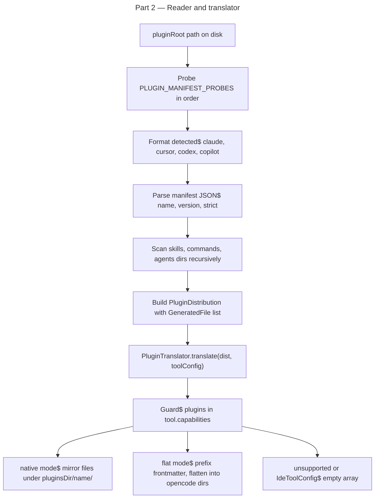

# Instruction: plugin architecture — Part 2: Plugin format detection + reader + translator

## Feature

- **Summary**: Auto-detect plugin format from disk (Claude, Cursor, Codex, Copilot VS Code). Parse into format-agnostic `PluginDistribution`. Translate to per-tool `InstallationFile[]` (canonical file type — no `GeneratedFile` in codebase) via `PluginTranslator` dispatching on `HasPlugins` capability — no tool IDs in domain. `listDirectory` is non-recursive so adapter walks subdirs manually. Add fixtures for all 4 formats plus a broken plugin.
- **Stack**: `TypeScript 5.x`, `Node.js >= 24`, `vitest`
- **Branch name**: `feat/260-plugin-architecture-part-2`
- **Parent Plan**: `2026_04_27-#260-plugin-architecture-master.md`
- **Sequence**: `2 of 8`
- Confidence: 8/10
- Time to implement: 1-2 sessions

## Existing files

- @src/domain/models/plugin-source.ts
- @src/domain/models/plugin.ts
- @src/domain/capabilities/plugins-capability.ts
- @src/domain/tools/contracts.ts
- @src/domain/tools/registry.ts
- @src/domain/ports/file-system.ts
- @src/domain/ports/hasher.ts
- @src/domain/models/file.ts
- @src/domain/formats/command.ts
- @src/domain/errors.ts

### New files to create

- src/domain/models/plugin-format.ts
- src/domain/models/plugin-distribution.ts
- src/domain/ports/plugin-manifest-reader.ts
- src/domain/services/plugin-translator.ts
- src/infrastructure/adapters/plugin-manifest-reader-adapter.ts
- tests/fixtures/plugins/claude-format/sample-plugin/.claude-plugin/plugin.json
- tests/fixtures/plugins/claude-format/sample-plugin/skills/hello/SKILL.md
- tests/fixtures/plugins/claude-format/sample-plugin/commands/greet.md
- tests/fixtures/plugins/claude-format/sample-plugin/agents/reviewer.md
- tests/fixtures/plugins/cursor-format/sample-plugin/.cursor-plugin/plugin.json
- tests/fixtures/plugins/cursor-format/sample-plugin/commands/greet.md
- tests/fixtures/plugins/codex-format/sample-plugin/.codex-plugin/plugin.json
- tests/fixtures/plugins/codex-format/sample-plugin/commands/greet.md
- tests/fixtures/plugins/copilot-format/sample-plugin/plugin.json
- tests/fixtures/plugins/copilot-format/sample-plugin/commands/greet.md
- tests/fixtures/plugins/broken-plugin/.claude-plugin/plugin.json
- tests/domain/services/plugin-translator.unit.test.ts
- tests/infrastructure/adapters/plugin-manifest-reader-adapter.integration.test.ts

## User Journey

## Implementation phases

### Phase 1: PluginFormat + PluginDistribution models

> Pure type definitions, no I/O.

1. Create `src/domain/models/plugin-format.ts`:
   - `type PluginFormat = "claude" | "cursor" | "codex" | "copilot"`
   - `const PLUGIN_MANIFEST_PROBES: readonly { format: PluginFormat; relativePath: string }[]` in probe order:
     1. `{ format: "claude", relativePath: ".claude-plugin/plugin.json" }`
     2. `{ format: "cursor", relativePath: ".cursor-plugin/plugin.json" }`
     3. `{ format: "codex", relativePath: ".codex-plugin/plugin.json" }`
     4. `{ format: "copilot", relativePath: "plugin.json" }` (root — checked last to avoid false positives)
2. Create `src/domain/models/plugin-distribution.ts`:
   - `interface PluginManifestFields { name: string; version: string; description?: string; author?: { name: string; email?: string }; strict?: boolean }`
   - `interface PluginComponentFile { relativePath: string; content: string }`
   - `interface PluginComponents { skills: readonly PluginComponentFile[]; commands: readonly PluginComponentFile[]; agents: readonly PluginComponentFile[] }`
   - `interface PluginDistribution { manifest: PluginManifestFields; format: PluginFormat; files: readonly PluginComponentFile[]; components: PluginComponents }`

### Phase 2: PluginManifestReader port + adapter

> Read plugin from disk, normalize to PluginDistribution.

1. Create `src/domain/ports/plugin-manifest-reader.ts`:
   - `interface PluginManifestReader { read(pluginRoot: string): Promise<PluginDistribution> }`
2. Create `src/infrastructure/adapters/plugin-manifest-reader-adapter.ts`:
   - Class `PluginManifestReaderAdapter implements PluginManifestReader`; constructor: `(fs: FileSystem, hasher: Hasher)`
   - `async read(pluginRoot)`: probe `PLUGIN_MANIFEST_PROBES` via `fs.fileExists`; first hit wins
   - Parse JSON → validate name (`PLUGIN_NAME_REGEX`), version (`isSemver`) → throws `InvalidPluginManifestError` on failure
   - Scan `skills/`, `commands/`, `agents/` — `FileSystem.listDirectory` is **non-recursive** (flat array), so implement a private `walkDir(root, subpath)` that calls `listDirectory` repeatedly for nested subdirs (e.g. `skills/hello/` → `SKILL.md`)
   - Normalize all relative paths using POSIX separator (`path.posix.join`) before storing — avoids Windows backslash bug since `listDirectory` uses `node:path` which is OS-dependent
   - For `skills/<name>/SKILL.md` — collect as skill component
   - Skip `README.md` at plugin root
   - Build `InstallationFile` instances (not a `GeneratedFile` type — that doesn't exist): use `new InstallationFile({ relativePath, content, hash, mergeStrategy: "overwrite" })`
   - Return `PluginDistribution`

### Phase 3: PluginTranslator domain service

> Translate PluginDistribution to InstallationFile[] for any target tool. Zero tool IDs.

1. Create `src/domain/services/plugin-translator.ts`:
   - Class `PluginTranslator`; pure domain, no I/O
   - `translate(dist: PluginDistribution, toolConfig: ToolConfig): InstallationFile[]`
   - Guard: `if (!isAiTool(toolConfig)) return []`
   - Guard: `if (!("plugins" in toolConfig.capabilities)) return []`
   - Dispatch on `toolConfig.capabilities.plugins.mode`:
     - `"native"`: for each `PluginComponentFile` in `dist.files`, compute output path as `pluginOutputDir(name) + file.relativePath`; rewrite the manifest probe path to `pluginManifestRelativePath` (replaces source format path — e.g. `.claude-plugin/plugin.json` stays as-is for claude, becomes `.cursor-plugin/plugin.json` for cursor); build `InstallationFile` with `mergeStrategy: "overwrite"`
     - `"flat"`: for each command file, emit to `toolConfig.directory + "commands/" + dist.manifest.name + "/"` + filename; prefix frontmatter `name:` with `flatNamespacePrefix + dist.manifest.name + ":"` via `convertCommandFrontmatterNoHint` (confirmed export in `formats/command.ts`); build `InstallationFile` with rewritten content
     - `"unsupported"`: return `[]`
   - `detectFlatCollisions(dists: PluginDistribution[], toolConfig: ToolConfig): Array<{ plugin: string; path: string }>` — scan emitted command paths for duplicates across multiple plugins

### Phase 4: Fixtures

> Minimal sample plugins in all 4 formats for deterministic tests.

1. `tests/fixtures/plugins/claude-format/sample-plugin/.claude-plugin/plugin.json` — `{ "name": "sample-plugin", "version": "1.0.0" }`
2. Add `skills/hello/SKILL.md` with valid frontmatter
3. Add `commands/greet.md` with valid frontmatter (`name: aidd:04:greet`)
4. Add `agents/reviewer.md`
5. Mirror minimal versions for `cursor-format` (`.cursor-plugin/plugin.json`) and `codex-format` (`.codex-plugin/plugin.json`)
6. `copilot-format/sample-plugin/plugin.json` at root
7. `broken-plugin/.claude-plugin/plugin.json` — `{ "name": "Invalid_Name", "version": "1.0.0" }` (uppercase → fails regex)

### Phase 5: Tests

> Reader and translator end-to-end on fixtures.

1. `tests/infrastructure/adapters/plugin-manifest-reader-adapter.integration.test.ts`:
   - Read claude-format fixture → assert format=claude, files count, hash deterministic
   - Read cursor-format → format=cursor; codex-format → format=codex; copilot-format → format=copilot
   - Read broken-plugin → throws `InvalidPluginManifestError`
   - Read non-existent dir → throws typed error
2. `tests/domain/services/plugin-translator.unit.test.ts`:
   - Translate claude-format dist for claude tool → assert output paths under `.claude/plugins/sample-plugin/`
   - Translate for cursor → paths under `.cursor/plugins/sample-plugin/`, manifest at `.cursor-plugin/plugin.json`
   - Translate for codex → paths under `.codex/plugins/sample-plugin/`, manifest at `.codex-plugin/plugin.json`
   - Translate for copilot → paths under `.github/plugins/sample-plugin/`, manifest at `plugin.json`
   - Translate for opencode → commands in `.opencode/commands/sample-plugin/greet.md`, frontmatter name prefixed `aidd-sample-plugin:`
   - Translate for vscode (IdeToolConfig) → empty array
   - Collision detection: two dists both exposing `greet.md` → collision reported for opencode flat

## Validation flow

1. `pnpm test` — reader + translator tests green
2. `biome check --write` + `tsc --noEmit` clean
3. `knip` — `plugin-manifest-reader.ts` and `plugin-translator.ts` consumed by tests; add to knip ignore only if still unused (must shrink in Part 3/4 as consumers are wired)
4. Manually run reader on claude-format fixture from a test script → verify PluginDistribution printed
