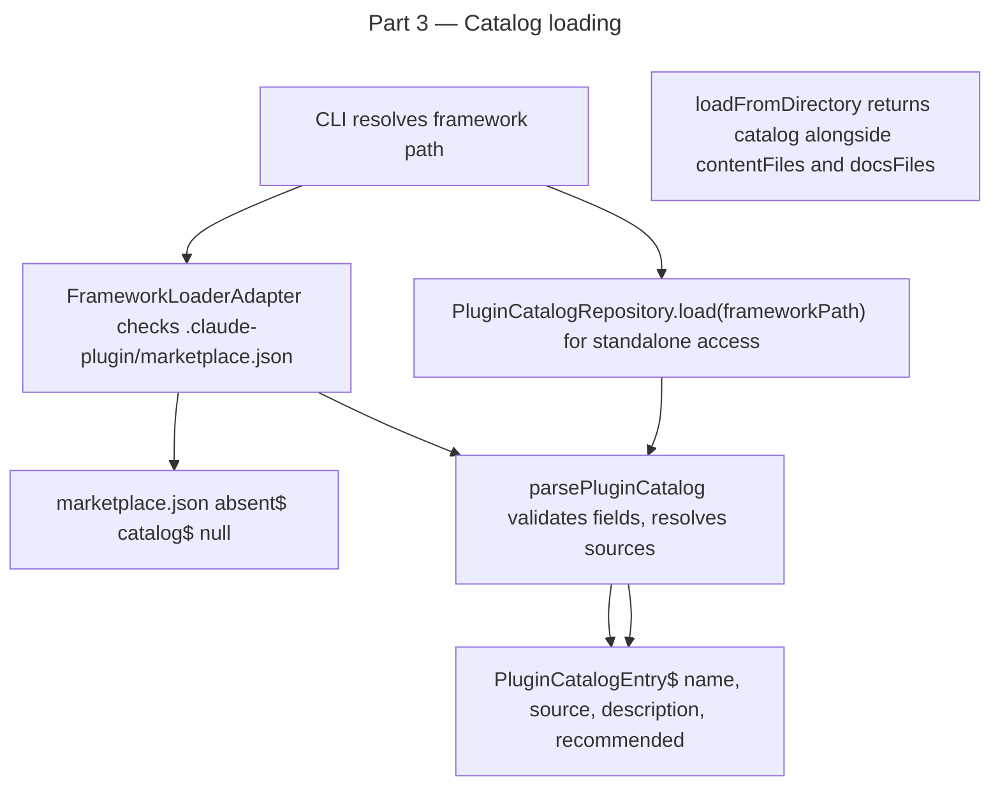

# Instruction: plugin architecture — Part 3: Framework loader plugin-aware + catalog

## Feature

- **Summary**: Add `PluginCatalog` model and `PluginCatalogRepository` port + adapter that reads `.claude-plugin/marketplace.json` from the framework path. **Do NOT change `FrameworkLoader` return type** — `loadFromDirectory` has 4 callers (install, restore, init, update use-cases) and changing the return type breaks all of them. Instead, `PluginCatalogRepository` is injected directly into use-cases that need catalog access. Wire in `deps.ts`. Returns null if marketplace.json absent.
- **Stack**: `TypeScript 5.x`, `Node.js >= 24`, `vitest`
- **Branch name**: `feat/260-plugin-architecture-part-3`
- **Parent Plan**: `2026_04_27-#260-plugin-architecture-master.md`
- **Sequence**: `3 of 8`
- Confidence: 9/10
- Time to implement: 1 session

## Existing files

- @src/domain/ports/framework-loader.ts
- @src/infrastructure/adapters/framework-loader-adapter.ts
- @src/infrastructure/adapters/framework-resolver-adapter.ts
- @src/domain/models/plugin-source.ts
- @src/domain/models/plugin-distribution.ts
- @src/domain/ports/plugin-manifest-reader.ts
- @src/infrastructure/adapters/plugin-manifest-reader-adapter.ts
- @src/infrastructure/deps.ts

### New files to create

- src/domain/models/plugin-catalog.ts
- src/domain/ports/plugin-catalog-repository.ts
- src/infrastructure/adapters/plugin-catalog-repository-adapter.ts
- tests/domain/models/plugin-catalog.unit.test.ts
- tests/infrastructure/adapters/plugin-catalog-repository-adapter.integration.test.ts
- tests/fixtures/framework/marketplace-sample/.claude-plugin/marketplace.json

## User Journey

## Implementation phases

### Phase 1: PluginCatalog model

> Parse and validate marketplace.json structure.

1. Create `src/domain/models/plugin-catalog.ts`:
   - `interface PluginCatalogEntry { name: string; source: PluginSource; description?: string; version?: string; recommended: boolean; strict: boolean }`
   - `interface PluginCatalog { plugins: readonly PluginCatalogEntry[] }`
   - `function parsePluginCatalog(raw: unknown): PluginCatalog`:
     - Validate `raw.plugins` is array
     - Each entry: validate required `name`, `source`; parse `source` via `parsePluginSource`; `recommended` defaults false, `strict` defaults false
     - Throws `InvalidPluginManifestError` on malformed entries

### Phase 2: PluginCatalogRepository port + adapter

> Load catalog from framework path, return null if absent.

1. Create `src/domain/ports/plugin-catalog-repository.ts`:
   - `interface PluginCatalogRepository { load(frameworkPath: string): Promise<PluginCatalog | null> }`
2. Create `src/infrastructure/adapters/plugin-catalog-repository-adapter.ts`:
   - Class `PluginCatalogRepositoryAdapter implements PluginCatalogRepository`; constructor: `(fs: FileSystem)`
   - `async load(frameworkPath)`: check `<frameworkPath>/.claude-plugin/marketplace.json` exists
   - If absent → return null
   - Read + JSON.parse → `parsePluginCatalog(raw)` → return `PluginCatalog`
   - Parse errors → throw `InvalidPluginManifestError` with path

### Phase 3: Wire in deps.ts

> Add adapter to Deps interface and factory — no changes to FrameworkLoader.

1. Edit `src/infrastructure/deps.ts`:
   - Add `pluginCatalogRepository: PluginCatalogRepository` to `Deps` interface
   - Instantiate `PluginCatalogRepositoryAdapter(fs)` in `createDeps`
   - Use-cases that need catalog access (Part 4+) receive it via constructor injection, not via `loader.loadFromDirectory()`
   - `FrameworkLoader` port and `FrameworkLoaderAdapter` remain **unchanged** — the 4 existing callers are not touched

### Phase 5: Tests

> Catalog parsing and integration with loader.

1. `tests/fixtures/framework/marketplace-sample/.claude-plugin/marketplace.json` — 2 entries (one recommended, one not); sources: one local `"./plugins/dev"`, one github `"owner/repo"`
2. `tests/domain/models/plugin-catalog.unit.test.ts` — valid fixture parses correctly; missing `source` throws; malformed source throws
3. `tests/infrastructure/adapters/plugin-catalog-repository-adapter.integration.test.ts`:
   - Framework with marketplace.json → catalog with 2 entries
   - Framework without marketplace.json → null
   - Malformed marketplace.json → throws `InvalidPluginManifestError`
4. Extend existing `framework-loader-adapter.integration.test.ts` if it exists — assert `catalog` field present when fixture has marketplace.json, null when absent

## Validation flow

1. `pnpm test` — catalog + loader tests green
2. `biome check --write` + `tsc --noEmit` clean
3. `knip` — `plugin-catalog-repository.ts` consumed by adapter; adapter consumed by deps.ts; no ignores needed
4. Point loader at framework fixture with marketplace.json → verify catalog returned with correct entries
