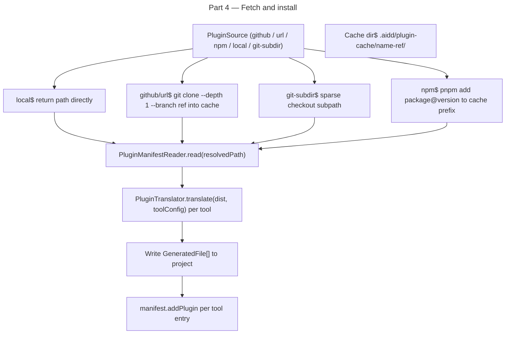

# Instruction: plugin architecture — Part 4: Plugin fetch pipeline + install adapters

## Feature

- **Summary**: Add `PluginFetcher` port and adapter that resolves any `PluginSource` to a local directory (github/url/git-subdir→`simple-git`, npm→pnpm exec, local→direct path). `simple-git 3.36.0` added as dependency — existing `GitAdapter` has zero git CLI calls (pure file I/O), so no migration needed. Add `InstallPluginsUseCase` that fetches, reads, translates, and writes plugin files per tool. `InstallUseCase.installAllTools()` is currently 45 lines (rule: ≤20) — refactor it before adding the plugin hook. Wire into `InstallUseCase` and `deps.ts`.
- **Stack**: `TypeScript 5.x`, `Node.js >= 24`, `vitest`, `simple-git 3.36.0`
- **Branch name**: `feat/260-plugin-architecture-part-4`
- **Parent Plan**: `2026_04_27-#260-plugin-architecture-master.md`
- **Sequence**: `4 of 8`
- Confidence: 7/10
- Time to implement: 2-3 sessions

## Existing files

- @src/domain/models/plugin-source.ts
- @src/domain/models/plugin.ts
- @src/domain/models/plugin-catalog.ts
- @src/domain/ports/plugin-manifest-reader.ts
- @src/domain/services/plugin-translator.ts
- @src/domain/models/manifest.ts
- @src/domain/ports/file-system.ts
- @src/domain/ports/version-control.ts
- @src/infrastructure/adapters/git-adapter.ts
- @src/domain/ports/version-control.ts
- @src/application/use-cases/install/install-use-case.ts
- @src/infrastructure/deps.ts

### New files to create

- src/domain/ports/plugin-fetcher.ts
- src/infrastructure/adapters/plugin-fetcher-adapter.ts
- src/application/use-cases/install/install-plugins-use-case.ts
- tests/infrastructure/adapters/plugin-fetcher-adapter.integration.test.ts
- tests/application/use-cases/install/install-plugins-use-case.integration.test.ts

## User Journey

## Implementation phases

### Phase 1: PluginFetcher port

> Resolve any PluginSource to a local directory path.

1. Create `src/domain/ports/plugin-fetcher.ts`:
   - `interface PluginFetcher { fetch(source: PluginSource, cacheDir: string): Promise<string> }` — returns absolute local path to plugin root

### Phase 2: PluginFetcherAdapter

> I/O implementation per source kind using simple-git API.

1. Create `src/infrastructure/adapters/plugin-fetcher-adapter.ts`:
   - Class `PluginFetcherAdapter implements PluginFetcher`; constructor: `(fs: FileSystem)`
   - Import `simpleGit` from `"simple-git"`
   - `"local"`: validate path exists via `fs.fileExists`, return `path.resolve(source.path)`
   - `"github"`: cache key = `<cacheDir>/<owner>-<repo>-<ref||"HEAD">/`; skip if dir exists; else `simpleGit().clone("https://github.com/<repo>.git", targetDir, ["--depth", "1", "--branch", ref])`
   - `"url"`: same cache logic; `simpleGit().clone(url, targetDir, ["--depth", "1", "--branch", ref])` if git URL
   - `"git-subdir"`: `simpleGit().clone(url, targetDir, ["--filter=blob:none", "--no-checkout"])` → `simpleGit(targetDir).raw(["sparse-checkout", "set", subpath])` → `simpleGit(targetDir).checkout(ref ?? "HEAD")`; return `join(targetDir, subpath)`
   - `"npm"`: `execFile("pnpm", ["add", "--prefix", cacheDir, `${pkg}@${version ?? "latest"}`])`; return `join(cacheDir, "node_modules", pkg)`
   - All `simple-git` errors → catch `GitError` + wrap in `PluginFetchError` (add to `errors.ts`) with original message
   - Cache dir: `join(projectRoot, ".aidd", "plugin-cache")`

### Phase 2b: Refactor InstallUseCase.installAllTools()

> Required before adding plugin hook — method is 45 lines, rule is ≤20.

1. Edit `src/application/use-cases/install/install-use-case.ts`:
   - Extract `installAllTools()` body into named private methods (e.g. `resolveToolList()`, `installSingleTool()`, `collectResults()`) until each is ≤20 lines
   - No behavior change — pure structural refactor

### Phase 3: InstallPluginsUseCase

> Orchestrate fetch → read → translate → write per plugin per tool.

1. Create `src/application/use-cases/install/install-plugins-use-case.ts`:
   - Class `InstallPluginsUseCase`; constructor receives `pluginFetcher`, `pluginManifestReader`, `pluginTranslator`, `fs`, `manifest`
   - `execute({ plugins: PluginSource[], toolConfigs: ToolConfig[], projectRoot: string }): Promise<void>`
   - For each plugin: fetch → `pluginManifestReader.read(localPath)` → for each tool: `pluginTranslator.translate(dist, tool)` → write files → `manifest.addPlugin(toolId, plugin)`
   - Use `Promise.all` for tool-level translation (independent per tool)
   - Skip tools where `translate` returns empty array (unsupported or no capability)

### Phase 4: Wire into InstallUseCase

> Plugin install runs after existing capability-based install.

1. Edit `src/application/use-cases/install/install-use-case.ts`:
   - After existing tool-file install step, check if `plugins` list is non-empty
   - Call `InstallPluginsUseCase.execute(...)` with selected plugins + active tool configs
   - `plugins: []` by default → no behavior change for existing users

### Phase 5: Wire deps.ts

> Inject new adapters.

1. Edit `src/infrastructure/deps.ts`:
   - Instantiate `PluginFetcherAdapter(fs)`
   - Instantiate `InstallPluginsUseCase(pluginFetcher, pluginManifestReader, pluginTranslator, fs, manifest)`
   - Inject into `InstallUseCase`

### Phase 6: Tests

> Local-source integration only (no network in CI).

1. `tests/infrastructure/adapters/plugin-fetcher-adapter.integration.test.ts`:
   - `"local"` source pointing at claude-format fixture → returns fixture path
   - `"local"` source for non-existent path → throws typed error
2. `tests/application/use-cases/install/install-plugins-use-case.integration.test.ts`:
   - Install local fixture plugin for claude + cursor → verify output files in correct dirs
   - Install for opencode → verify flat frontmatter prefix in output
   - Duplicate plugin install → throws `DuplicatePluginError`

## Validation flow

1. `pnpm test` — all install-plugins tests pass
2. `biome check --write` + `tsc --noEmit` clean
3. Manual test: run install with local fixture plugin for claude → verify `.claude/plugins/sample-plugin/.claude-plugin/plugin.json` written + manifest v3 has plugin entry
4. Verify existing install (no plugins) still works identically — no regression
