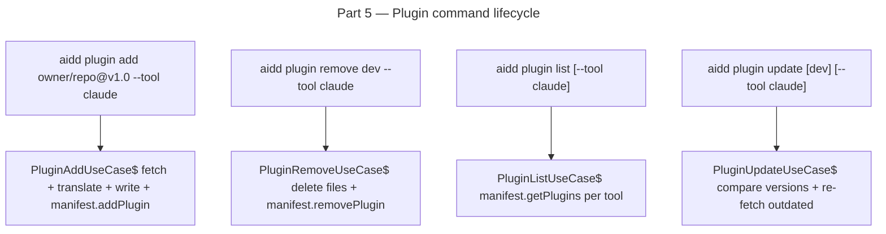

# Instruction: plugin architecture — Part 5: `aidd plugin` command lifecycle

## Feature

- **Summary**: Add `aidd plugin` command with 4 subcommands: `add`, `remove`, `list`, `update`. Each subcommand maps to one use-case. Register in `cli.ts`. All follow the thin-wrapper command pattern — one use-case per action, no orchestration in command files.
- **Stack**: `TypeScript 5.x`, `Node.js >= 24`, `vitest`, `commander`
- **Branch name**: `feat/260-plugin-architecture-part-5`
- **Parent Plan**: `2026_04_27-#260-plugin-architecture-master.md`
- **Sequence**: `5 of 8`
- Confidence: 9/10
- Time to implement: 1-2 sessions

## Existing files

- @src/domain/models/plugin.ts
- @src/domain/models/plugin-source.ts
- @src/domain/models/manifest.ts
- @src/domain/ports/plugin-fetcher.ts
- @src/domain/ports/plugin-manifest-reader.ts
- @src/domain/services/plugin-translator.ts
- @src/domain/models/plugin-catalog.ts
- @src/application/commands/install.ts
- @src/application/cli.ts
- @src/infrastructure/deps.ts

### New files to create

- src/application/commands/plugin.ts
- src/application/use-cases/plugin/plugin-add-use-case.ts
- src/application/use-cases/plugin/plugin-remove-use-case.ts
- src/application/use-cases/plugin/plugin-list-use-case.ts
- src/application/use-cases/plugin/plugin-update-use-case.ts
- tests/application/use-cases/plugin/plugin-add-use-case.integration.test.ts
- tests/application/use-cases/plugin/plugin-remove-use-case.integration.test.ts
- tests/application/use-cases/plugin/plugin-list-use-case.unit.test.ts
- tests/application/use-cases/plugin/plugin-update-use-case.integration.test.ts

## User Journey

## Implementation phases

### Phase 1: PluginAddUseCase

> Fetch + translate + write + manifest entry.

1. Create `src/application/use-cases/plugin/plugin-add-use-case.ts`:
   - Input: `{ source: PluginSource; toolIds: ToolId[] | "all"; projectRoot: string; interactive: boolean }`
   - Fetch via `pluginFetcher`; read via `pluginManifestReader`; translate per tool; write files; `manifest.addPlugin` per tool; save manifest
   - Throws `DuplicatePluginError` if plugin already installed for any target tool

### Phase 2: PluginRemoveUseCase

> Delete plugin files and manifest entry.

1. Create `src/application/use-cases/plugin/plugin-remove-use-case.ts`:
   - Input: `{ pluginName: string; toolIds: ToolId[] | "all"; projectRoot: string }`
   - For each tool: get tracked plugin files from `manifest.getPlugins(toolId)`, delete files, `manifest.removePlugin`; save manifest
   - Throws `PluginNotFoundError` if not installed for any requested tool

### Phase 3: PluginListUseCase

> Read manifest and return plugin list per tool.

1. Create `src/application/use-cases/plugin/plugin-list-use-case.ts`:
   - Input: `{ toolIds: ToolId[] | "all" }`
   - Returns `Map<ToolId, readonly Plugin[]>` from manifest
   - Pure read — no side effects

### Phase 4: PluginUpdateUseCase

> Re-fetch and re-translate plugins with newer versions.

1. Create `src/application/use-cases/plugin/plugin-update-use-case.ts`:
   - Input: `{ pluginNames?: string[]; toolIds: ToolId[] | "all"; projectRoot: string }`
   - For each installed plugin: fetch fresh distribution, compare version via `compareSemver`; if newer → delete old files, re-translate, write new files, `manifest.updatePlugin`
   - If versions equal → skip

### Phase 5: Plugin command

> Thin wrapper registering all 4 subcommands.

1. Create `src/application/commands/plugin.ts`:
   - `registerPluginCommand(program: Command): void`
   - `plugin add <source> [--tool <toolId>]` — parse source string → `parsePluginSource` → `PluginAddUseCase`
   - `plugin remove <name> [--tool <toolId>]` → `PluginRemoveUseCase`
   - `plugin list [--tool <toolId>]` → `PluginListUseCase` → format table output
   - `plugin update [<name>] [--tool <toolId>]` → `PluginUpdateUseCase`
   - All actions follow thin-wrapper pattern: create deps → call use-case → display result → catch via `errorHandler.handle`
2. Edit `src/application/cli.ts`:
   - Import and call `registerPluginCommand(program)`

### Phase 6: Wire deps.ts

> Inject use-cases into factory.

1. Edit `src/infrastructure/deps.ts`:
   - Instantiate and export `PluginAddUseCase`, `PluginRemoveUseCase`, `PluginListUseCase`, `PluginUpdateUseCase`

### Phase 7: Tests

1. `plugin-add-use-case.integration.test.ts` — add local fixture plugin → files written, manifest updated; re-add → throws `DuplicatePluginError`
2. `plugin-remove-use-case.integration.test.ts` — remove installed plugin → files deleted, manifest updated; remove missing → throws `PluginNotFoundError`
3. `plugin-list-use-case.unit.test.ts` — list from v3 manifest fixture → correct map returned
4. `plugin-update-use-case.integration.test.ts` — same version → no re-fetch; newer version → files updated

## Validation flow

1. `pnpm test` — all plugin command use-case tests pass
2. `biome check --write` + `tsc --noEmit` clean
3. Manual: `aidd plugin add ./tests/fixtures/plugins/claude-format/sample-plugin --tool claude` → verify plugin installed
4. `aidd plugin list --tool claude` → verify sample-plugin appears
5. `aidd plugin remove sample-plugin --tool claude` → verify files removed
