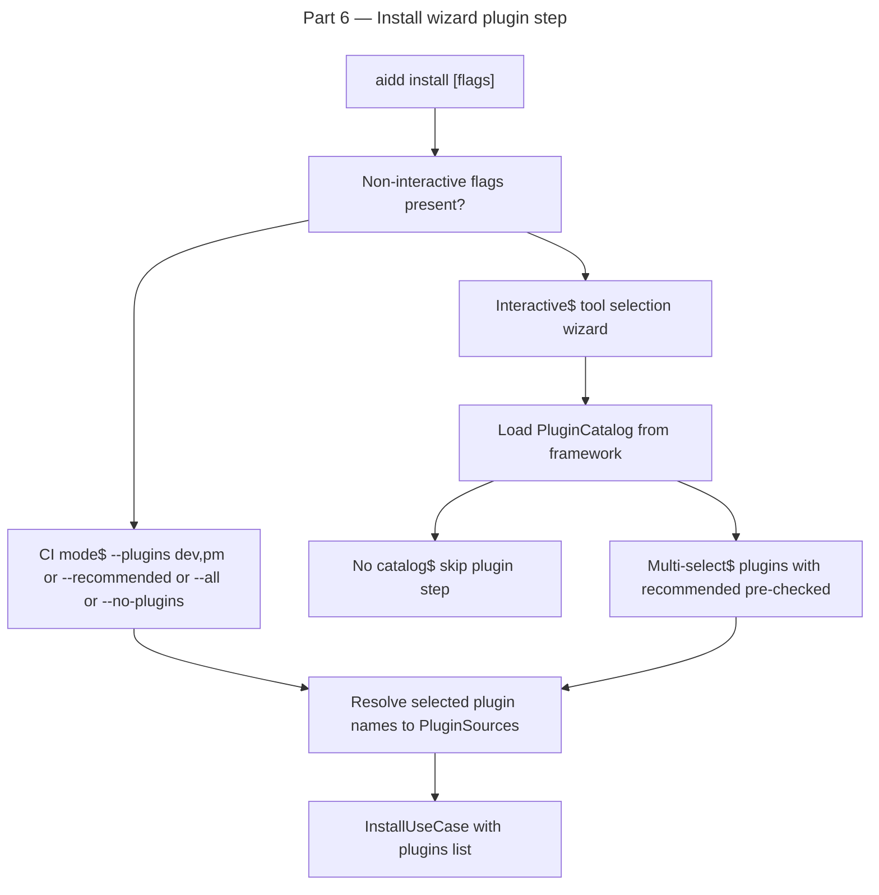

# Instruction: plugin architecture — Part 6: Install wizard plugin selection

## Feature

- **Summary**: Augment `aidd install` interactive wizard with a plugin selection step after tool selection. Load catalog from framework, present plugin list with recommended pre-checked. Add `--plugins <names>`, `--all`, `--recommended`, `--no-plugins` flags for CI/non-interactive use. Starter pack = recommended plugins from catalog.
- **Stack**: `TypeScript 5.x`, `Node.js >= 24`, `vitest`, `commander`
- **Branch name**: `feat/260-plugin-architecture-part-6`
- **Parent Plan**: `2026_04_27-#260-plugin-architecture-master.md`
- **Sequence**: `6 of 8`
- Confidence: 8/10
- Time to implement: 1-2 sessions

## Existing files

- @src/application/commands/install.ts
- @src/application/use-cases/install/install-use-case.ts
- @src/application/use-cases/setup/setup-use-case.ts
- @src/domain/models/plugin-catalog.ts
- @src/domain/ports/plugin-catalog-repository.ts
- @src/domain/ports/prompter.ts
- @src/infrastructure/deps.ts

### New files to create

- tests/application/use-cases/install/install-wizard-plugins.integration.test.ts

## User Journey

## Implementation phases

### Phase 1: Install command flags

> Non-interactive plugin selection flags.

1. Edit `src/application/commands/install.ts`:
   - Add `--plugins <names>` — comma-separated plugin names from catalog
   - Add `--all` — install all plugins from catalog
   - Add `--recommended` — install only catalog entries with `recommended: true`
   - Add `--no-plugins` — skip plugin step entirely (default for existing users if no catalog)
   - Flags are mutually exclusive: `--plugins` and `--all` and `--recommended` conflict → `output.error()` + `process.exit(1)`

### Phase 2: Plugin wizard step in InstallUseCase

> Interactive plugin selection using catalog.

1. Edit `src/application/use-cases/install/install-use-case.ts`:
   - After tool selection, if `interactive && catalog !== null`:
     - Use `Prompter` multi-select: show each `catalog.plugins` entry with `recommended` flag as pre-selection
     - Return selected `PluginCatalogEntry[]`
   - If `!interactive`: resolve from flags (`--plugins` → filter by name, `--all` → all, `--recommended` → filter recommended, `--no-plugins` → [])
   - If no catalog (null) → skip plugin step, use `plugins: []`
   - Convert selected entries to `PluginSource[]` and pass to existing `InstallPluginsUseCase`

### Phase 3: Starter pack definition

> Recommended set from catalog, no hardcoding in CLI.

- Starter pack is purely `catalog.plugins.filter(p => p.recommended)` — defined in framework's `marketplace.json`
- CLI has zero knowledge of specific plugin names — purely data-driven

### Phase 4: Tests

1. `tests/application/use-cases/install/install-wizard-plugins.integration.test.ts`:
   - `--recommended` flag → only recommended catalog plugins installed
   - `--all` flag → all catalog plugins installed
   - `--plugins dev,pm` → only dev and pm installed
   - `--no-plugins` → no plugins, tool files only
   - No catalog → wizard step skipped silently, no plugins installed
   - Interactive with mocked prompter selecting 2 plugins → 2 plugins installed

## Validation flow

1. `pnpm test` — wizard plugin tests green
2. `biome check --write` + `tsc --noEmit` clean
3. Manual: `aidd install --yes --recommended` with framework having marketplace.json → verify recommended plugins installed
4. Manual: `aidd install --yes --no-plugins` → verify no plugin files written, same behavior as pre-Part-6
5. Manual interactive: `aidd install` → wizard shows plugin list after tool selection → select one → verify installed
