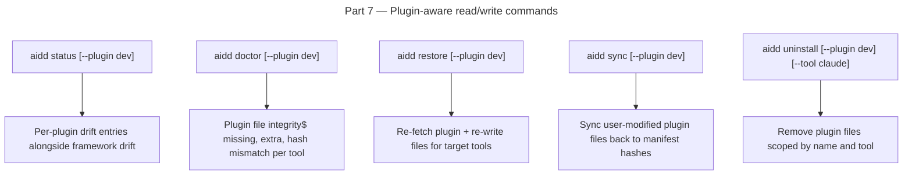

# Instruction: plugin architecture — Part 7: Read/Write commands plugin-aware

## Feature

- **Summary**: Extend `status`, `doctor`, `restore`, `sync`, and `uninstall` use-cases and commands to report and act at plugin scope. Each gains an optional `--plugin <name>` flag. Status/doctor report plugin drift per plugin per tool. Restore/sync/uninstall apply per-plugin when flag set, full scope otherwise.
- **Stack**: `TypeScript 5.x`, `Node.js >= 24`, `vitest`, `commander`
- **Branch name**: `feat/260-plugin-architecture-part-7`
- **Parent Plan**: `2026_04_27-#260-plugin-architecture-master.md`
- **Sequence**: `7 of 8`
- Confidence: 8/10
- Time to implement: 1-2 sessions

## Existing files

- @src/application/use-cases/status-use-case.ts
- @src/application/use-cases/doctor-use-case.ts
- @src/application/use-cases/restore/restore-use-case.ts
- @src/application/use-cases/sync/sync-use-case.ts
- @src/application/use-cases/uninstall-use-case.ts
- @src/application/commands/status.ts
- @src/application/commands/doctor.ts
- @src/application/commands/restore.ts
- @src/application/commands/sync.ts
- @src/application/commands/uninstall.ts
- @src/domain/models/manifest.ts
- @src/domain/models/plugin.ts

### New files to create

- tests/application/use-cases/status-plugin.unit.test.ts
- tests/application/use-cases/doctor-plugin.unit.test.ts
- tests/application/use-cases/restore-plugin.integration.test.ts

## User Journey

## Implementation phases

### Phase 1: Status — plugin drift reporting

> Surface per-plugin, per-tool drift alongside existing framework drift.

1. Edit `src/application/use-cases/status-use-case.ts`:
   - For each installed tool: iterate `manifest.getPlugins(toolId)`, check each plugin's tracked files against disk hashes
   - Add `pluginDrift: Array<{ toolId, pluginName, driftedFiles: string[] }>` to result type
   - `--plugin <name>` flag filters to one plugin only
2. Edit `src/application/commands/status.ts`: display plugin drift section in output

### Phase 2: Doctor — plugin integrity

> Report missing, extra, or hash-mismatched plugin files.

1. Edit `src/application/use-cases/doctor-use-case.ts`:
   - For each installed plugin per tool: verify all tracked files exist and hashes match; collect `PluginIntegrityIssue[]`
   - Add `pluginIssues: PluginIntegrityIssue[]` to doctor result type
   - `--plugin <name>` flag scopes check
2. Edit `src/application/commands/doctor.ts`: display plugin issues section

### Phase 3: Restore — per-plugin

> Re-fetch and re-write plugin files on demand.

1. Edit `src/application/use-cases/restore/restore-use-case.ts`:
   - If `pluginName` input provided: re-run fetch + translate + write for that plugin across selected tools
   - If no plugin name: existing restore behavior unchanged, then also restore all tracked plugins
2. Edit `src/application/commands/restore.ts`: add `--plugin <name>` flag

### Phase 4: Sync — per-plugin

> Detect user-modified plugin files and update manifest hashes.

1. Edit sync use-case:
   - If `pluginName` provided: re-hash plugin files and update `plugin.files` map in manifest via `manifest.updatePlugin`
   - If no plugin: existing sync behavior unchanged
2. Edit sync command: add `--plugin <name>` flag

### Phase 5: Uninstall — per-plugin

> Remove plugin files scoped by plugin name and optionally tool.

1. Edit `src/application/use-cases/uninstall-use-case.ts`:
   - If `pluginName` provided: `manifest.removePlugin(toolId, pluginName)` + delete tracked plugin files for each target tool
   - If no plugin: existing full-uninstall behavior unchanged
2. Edit uninstall command: add `--plugin <name> [--tool <toolId>]` flags

### Phase 6: Tests

1. `status-plugin.unit.test.ts` — v3 manifest with plugin drift → result contains pluginDrift entries; no plugin drift → empty array
2. `doctor-plugin.unit.test.ts` — missing plugin file → pluginIssues populated; all present → empty
3. `restore-plugin.integration.test.ts` — restore specific plugin → files re-written from fixture source

## Validation flow

1. `pnpm test` — all plugin-aware command tests green
2. `biome check --write` + `tsc --noEmit` clean
3. Manual: install plugin, modify a plugin file, run `aidd status` → drift reported with plugin scope
4. Manual: `aidd restore --plugin sample-plugin` → file restored to original content
5. Manual: `aidd uninstall --plugin sample-plugin --tool claude` → claude plugin files removed, cursor untouched
6. Existing commands (no --plugin flag) → identical behavior to pre-Part-7
