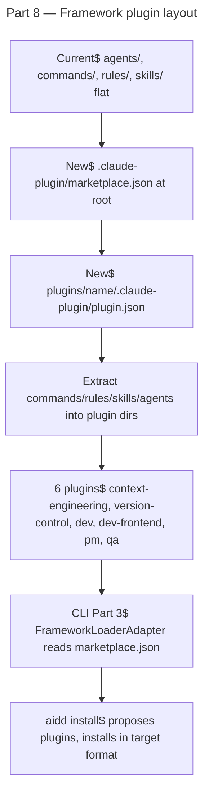

# Instruction: plugin architecture — Part 8: Framework repo restructure into plugin layout

## Feature

- **Summary**: Restructure `aidd-framework` repo from flat `agents/`, `commands/`, `rules/`, `skills/` layout into Claude Code marketplace format. Create `plugins/<name>/.claude-plugin/plugin.json` for each domain plugin. Add `.claude-plugin/marketplace.json` at repo root listing all plugins. Extract framework content into 6 plugins. CLI Parts 1–7 must be validated before this part.
- **Stack**: `TypeScript 5.x` (build scripts), `Node.js >= 24`
- **Branch name**: `feat/260-plugin-architecture-part-8` (on `aidd-framework` repo)
- **Parent Plan**: `2026_04_27-#260-plugin-architecture-master.md`
- **Sequence**: `8 of 8`
- Confidence: 7/10
- Time to implement: 2-3 sessions

## Existing files (aidd-framework repo)

- @../framework/agents/
- @../framework/commands/
- @../framework/rules/
- @../framework/skills/
- @../framework/version.txt

### New files to create

- ../framework/.claude-plugin/marketplace.json
- ../framework/plugins/context-engineering/.claude-plugin/plugin.json
- ../framework/plugins/version-control/.claude-plugin/plugin.json
- ../framework/plugins/dev/.claude-plugin/plugin.json
- ../framework/plugins/dev-frontend/.claude-plugin/plugin.json
- ../framework/plugins/pm/.claude-plugin/plugin.json
- ../framework/plugins/qa/.claude-plugin/plugin.json

## User Journey

## Plugin catalog

| Plugin | Content | Recommended |
|--------|---------|------------|
| `context-engineering` | CLAUDE.md templates, rules for context management | yes |
| `version-control` | git workflow commands, commit/PR rules | yes |
| `dev` | implementation commands, code review, test generation | yes |
| `dev-frontend` | frontend-specific commands, design system rules | no |
| `pm` | product management commands, user story generation | no |
| `qa` | QA commands, test strategies | no |

## Implementation phases

### Phase 1: marketplace.json

> Root catalog listing all 6 plugins with metadata.

1. Create `../framework/.claude-plugin/marketplace.json`:
   - Array of 6 entries: each with `name`, `source: { kind: "local", path: "./plugins/<name>" }`, `description`, `recommended`, `strict: true`
   - Recommended set: `context-engineering`, `version-control`, `dev`

### Phase 2: Plugin manifests

> Create `.claude-plugin/plugin.json` for each of the 6 plugins.

1. For each plugin directory `plugins/<name>/`:
   - Create `.claude-plugin/plugin.json` with `name`, `version` (matches `version.txt`), `description`, `author: { name: "AI-Driven Dev" }`
   - `strict: true`

### Phase 3: Content extraction

> Move current flat content into appropriate plugin directories.

1. Analyze current `commands/`, `agents/`, `rules/`, `skills/` content and assign each file to a plugin domain:
   - `02_context/`, `03_plan/` commands → `context-engineering`
   - `08_deploy/`, `09_refactor/` commit/VCS commands → `version-control`
   - `04_code/`, `05_review/`, `06_tests/` commands → `dev`
   - Frontend-specific commands → `dev-frontend`
   - `02_context/` PM commands → `pm`
   - `06_tests/` QA commands → `qa`
2. Move agents + skills similarly
3. Each plugin has: `skills/`, `commands/`, `agents/`, `rules/` dirs as applicable
4. Keep framework root `README.md`, `version.txt`, build scripts untouched

### Phase 4: Build script update

> Ensure dist/ packaging includes new plugin layout.

1. Update any `scripts/` that copy or publish framework content to include `plugins/` directory
2. Update `dist/` build if applicable
3. Verify `version.txt` is still read correctly by CLI

### Phase 5: Validate end-to-end with CLI

> Confirm CLI Parts 1–7 work against restructured framework.

1. Point CLI at local framework path: `aidd install --framework ./path/to/framework`
2. Verify `FrameworkLoaderAdapter` reads marketplace.json, returns 6-entry catalog
3. Run `aidd install --recommended` → context-engineering, version-control, dev plugins installed for each selected tool
4. Verify native plugin files at correct paths (e.g. `.claude/plugins/dev/.claude-plugin/plugin.json`)
5. Run `aidd plugin list` → 3 installed plugins visible in manifest

## Validation flow

1. `node scripts/build.js` (or equivalent) — dist/ includes plugins/ structure
2. Point CLI at framework, run `aidd install --yes --tools claude --recommended` → verify 3 recommended plugins installed in `.claude/plugins/`
3. `aidd status` → no drift immediately after install
4. `aidd plugin update` → no updates (just installed)
5. Modify one plugin file → `aidd status` → drift reported for that plugin
6. `aidd restore --plugin dev` → file restored

## Risks

- **MEDIUM**: File assignment ambiguity — some commands span multiple domains. Mitigate: assign to primary domain, document in plugin.json description.
- **LOW**: Users with existing flat installs will see `aidd update` offer plugin migration. Mitigate: backward-compat catalog entry pointing to old flat paths retained for one release cycle.
