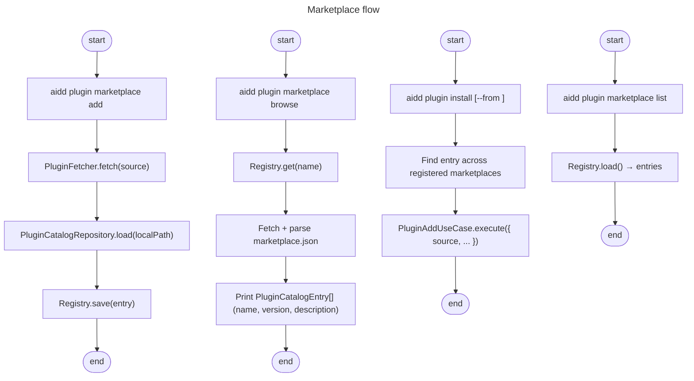

# Instruction: feat(#261): plugin marketplace flow — register, browse, install

## Feature

- **Summary**: Add marketplace lifecycle on top of single-source `plugin add` shipped in #260. Users register external marketplaces (`marketplace.json` repos), browse their catalog, and install plugins by name with marketplace-resolved sources. Framework remains a marketplace too — install wizard already consumes it. Builds on existing `PluginCatalog`, `PluginFetcherAdapter`, and `PluginAddUseCase`. Adds one new port (registry persistence), one new adapter, and 5 atomic use-cases. Each CLI command stays a thin wrapper calling exactly one use-case.
- **Stack**: `TypeScript 5.x`, `Node.js >= 20`, `vitest`, `commander`
- **Branch name**: `feat/261-plugin-marketplace-flow`
- **Parent Plan**: `none` (follow-up to #260)
- **Sequence**: `1 of 1`
- Confidence: 8/10
- Time to implement: 2-3 sessions

## What we have (reused as-is)

| Piece | Location | Role |
|---|---|---|
| `PluginCatalog` | `src/domain/models/plugin-catalog.ts` | Marketplace JSON shape |
| `parsePluginCatalog` | same | JSON → `PluginCatalog` |
| `PluginCatalogRepository` | `src/domain/ports/plugin-catalog-repository.ts` | Load `marketplace.json` from path |
| `PluginCatalogRepositoryAdapter` | `src/infrastructure/adapters/plugin-catalog-repository-adapter.ts` | FS implementation |
| `PluginFetcherAdapter` | `src/infrastructure/adapters/plugin-fetcher-adapter.ts` | Multi-host fetch (github/gitlab/url/ssh/local/npm) |
| `PluginSource` | `src/domain/models/plugin-source.ts` | Source discriminant |
| `PluginAddUseCase` | `src/application/use-cases/plugin/plugin-add-use-case.ts` | Single-plugin install |
| `Prompter` | `src/domain/ports/prompter.ts` | Multi-select for browse |

## What we want (new)

| Piece | Layer | Role |
|---|---|---|
| `PluginMarketplace` | `domain/models/` | Registry entry: `name`, `source`, `lastFetched`, `catalog?` |
| `PluginMarketplaceRegistry` | `domain/ports/` | Persist + read registered marketplaces |
| `PluginMarketplaceRegistryAdapter` | `infrastructure/adapters/` | `.aidd/plugin-marketplaces.json` I/O |
| `MarketplaceAddUseCase` | `application/use-cases/plugin/` | Fetch + validate + register |
| `MarketplaceListUseCase` | same | Read registry |
| `MarketplaceRemoveUseCase` | same | Delete entry |
| `MarketplaceRefreshUseCase` | same | Re-fetch catalog (single or all) |
| `MarketplaceBrowseUseCase` | same | Return catalog entries for one marketplace |
| `PluginInstallFromMarketplaceUseCase` | same | Resolve `name` → `PluginCatalogEntry.source` → call `PluginAddUseCase` |

## Existing files

- @src/application/commands/plugin.ts
- @src/application/use-cases/plugin/plugin-add-use-case.ts
- @src/domain/models/plugin-catalog.ts
- @src/domain/ports/plugin-catalog-repository.ts
- @src/infrastructure/adapters/plugin-catalog-repository-adapter.ts
- @src/infrastructure/adapters/plugin-fetcher-adapter.ts
- @src/infrastructure/deps.ts

### New files to create

**Domain**
- src/domain/models/plugin-marketplace.ts
- src/domain/ports/plugin-marketplace-registry.ts

**Application**
- src/application/use-cases/plugin/marketplace-add-use-case.ts
- src/application/use-cases/plugin/marketplace-list-use-case.ts
- src/application/use-cases/plugin/marketplace-remove-use-case.ts
- src/application/use-cases/plugin/marketplace-refresh-use-case.ts
- src/application/use-cases/plugin/marketplace-browse-use-case.ts
- src/application/use-cases/plugin/plugin-install-from-marketplace-use-case.ts

**Infrastructure**
- src/infrastructure/adapters/plugin-marketplace-registry-adapter.ts

**Tests**
- tests/domain/models/plugin-marketplace.unit.test.ts
- tests/application/use-cases/plugin/marketplace-add-use-case.integration.test.ts
- tests/application/use-cases/plugin/marketplace-browse-use-case.integration.test.ts
- tests/application/use-cases/plugin/plugin-install-from-marketplace-use-case.integration.test.ts
- tests/infrastructure/adapters/plugin-marketplace-registry-adapter.integration.test.ts

## Responsibility split — command vs code

### Command layer (`src/application/commands/plugin.ts`)

Pure wiring. One subcommand → one use-case. No branching on domain state, no helper functions.

```
aidd plugin marketplace add <url> [--name <slug>]      → MarketplaceAddUseCase
aidd plugin marketplace list                           → MarketplaceListUseCase
aidd plugin marketplace remove <name>                  → MarketplaceRemoveUseCase
aidd plugin marketplace refresh [name]                 → MarketplaceRefreshUseCase
aidd plugin marketplace browse <name>                  → MarketplaceBrowseUseCase
aidd plugin install <plugin-name> [--from <market>]    → PluginInstallFromMarketplaceUseCase
aidd plugin add <source>                               → PluginAddUseCase  (unchanged)
```

Each action handler:
1. Parse CLI flags + tool option
2. `createDeps(projectRoot, ...)`
3. Call exactly one `*UseCase.execute(...)`
4. `output.success()` / `output.print()` typed result
5. `errorHandler.handle(error)` in catch

No prompting in command except CLI input (none here — all args).

### Use-case layer

One responsibility per class. Throws typed errors. ≤ 20 lines per method. No tool-specific logic.

| Use-case | Throws |
|---|---|
| `MarketplaceAddUseCase` | `MarketplaceAlreadyRegisteredError`, `InvalidPluginManifestError` |
| `MarketplaceRemoveUseCase` | `MarketplaceNotFoundError` |
| `MarketplaceRefreshUseCase` | `MarketplaceNotFoundError`, `PluginFetchError` |
| `MarketplaceBrowseUseCase` | `MarketplaceNotFoundError` |
| `PluginInstallFromMarketplaceUseCase` | `PluginNotInMarketplaceError`, propagates `PluginAddUseCase` errors |

### Domain layer

`PluginMarketplace` value object: `{ name, source: PluginSource, addedAt: string, lastFetched?: string }`. Catalog NOT stored — re-read from cache on demand. Validate `name` against `PLUGIN_NAME_REGEX`.

### Infrastructure layer

`PluginMarketplaceRegistryAdapter` — JSON file at `.aidd/plugin-marketplaces.json`. Schema:

```json
{
  "version": 1,
  "marketplaces": [
    { "name": "anthropic", "source": {...}, "addedAt": "...", "lastFetched": "..." }
  ]
}
```

No catalog cached in registry — adapter calls `PluginFetcherAdapter` + `PluginCatalogRepository` to materialize.

## User Journey



## Acceptance Criteria

| # | Criterion |
|---|---|
| AC1 | `plugin marketplace add <url>` fetches marketplace.json, validates schema, persists registry entry |
| AC2 | Duplicate `add` (same name) throws `MarketplaceAlreadyRegisteredError` |
| AC3 | `plugin marketplace list` prints `name`, `source`, `lastFetched` for each entry |
| AC4 | `plugin marketplace remove <name>` deletes entry; missing name → `MarketplaceNotFoundError` |
| AC5 | `plugin marketplace refresh [name]` re-fetches one or all; updates `lastFetched` |
| AC6 | `plugin marketplace browse <name>` prints catalog entries (`name@version — description`) |
| AC7 | `plugin install <plugin-name>` resolves source from a single marketplace match; multi-match without `--from` → error listing candidates |
| AC8 | `plugin install <plugin-name> --from <market>` scopes resolution to one marketplace |
| AC9 | Registry file `.aidd/plugin-marketplaces.json` versioned; missing file → empty registry, never throws |
| AC10 | `plugin add <source>` (single source) unchanged — backward compatible |
| AC11 | Framework's `marketplace.json` consumed by install wizard — unchanged path, no regression |
| AC12 | Each new CLI subcommand: handler ≤ 15 lines, calls exactly one use-case |
| AC13 | Each new use-case: single `execute()`, methods ≤ 20 lines |

## Out of scope

- Search across marketplaces (`plugin search <query>`) — defer
- Plugin signing / trust model — defer
- Auto-refresh on stale registry — defer
- Updating registered marketplace URL in place — use remove + add
- GUI / interactive marketplace browser — `browse` is print-only

## Risks

| Risk | Mitigation |
|---|---|
| Name collision: marketplace name shadows plugin name | Separate namespaces; `install` resolves plugin in catalogs only |
| Catalog drift between `add` and `install` | `lastFetched` shown in list; user runs `refresh` |
| Registry file corruption | Schema-versioned, JSON parse error → typed `InvalidRegistryError`, suggest manual cleanup |
| `git-subdir` marketplaces (e.g. `awesome-claude-plugins/.claude-plugin/marketplace.json` at root) | Reuse existing `PluginFetcher` — already supports all source kinds |

## Test plan

- Unit: `PluginMarketplace` validation (name regex, source kind)
- Integration: each marketplace use-case round-trip on temp filesystem
- Integration: `plugin install <name>` resolves through registered marketplace, files land in `.claude/plugins/<name>/`
- E2E: full flow `add → list → browse → install → remove` against `tests/fixtures/framework/marketplace-sample/`
- Negative: duplicate add, unknown name, multi-match without `--from`, malformed marketplace.json

## Done when

- All AC pass with green test suite (`pnpm typecheck && pnpm lint && pnpm test`)
- No regression on existing #260 plugin commands
- `aidd_docs/memory/codebase_map.md` updated for new use-cases
- PR description lists each new file + use-case responsibility
