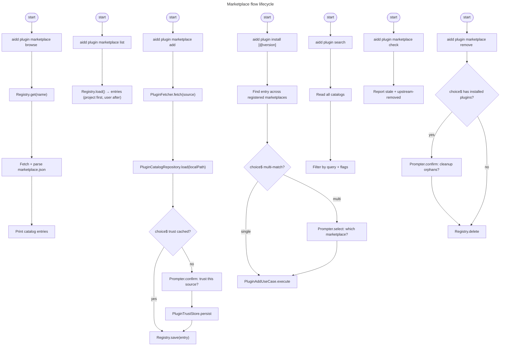

# Instruction: feat(#261): plugin marketplace flow — register, browse, search, install

## Feature

- **Summary**: Add marketplace lifecycle on top of #260 single-source `plugin add`. Users register external marketplaces using the universal Claude `marketplace.json` schema (adopted by Cursor, Copilot VS Code, and Codex per their official specs). Browse, search, version-pinned install, two-layer registry (project + user), trust prompt with cached decision, picker wizard integration, and stale/upstream detection. Framework auto-registered as a marketplace entry. Universal source format = no per-tool divergence on the marketplace side.
- **Stack**: TypeScript 5.x, Node.js >= 20, vitest, commander
- **Branch name**: `feat/261-plugin-marketplace-flow`
- **Parent Plan**: `none` (follow-up to #260)
- **Sequence**: `1 of 1`
- Confidence: 8/10
- Time to implement: 3-4 sessions

## Verified per-tool marketplace specs

| Tool | Marketplace location | Schema |
|---|---|---|
| Claude | `.claude-plugin/marketplace.json` | canonical |
| Cursor | `cursor/plugins` repo with `.cursor-plugin/marketplace.json` | same as Claude |
| Copilot VS Code | configurable via `chat.plugins.marketplaces` (defaults `copilot-plugins`, `awesome-copilot`) | Claude-style |
| Codex | multi-path read incl. `.claude-plugin/marketplace.json` (compat!) + `.agents/plugins/marketplace.json` | Claude-compat |

Conclusion: AIDD's existing `PluginCatalog` parser (Claude schema) covers all 4 ecosystems without extra work.

## What we have (reused as-is)

| Piece | Location | Role |
|---|---|---|
| `PluginCatalog` | `src/domain/models/plugin-catalog.ts` | Parsed `marketplace.json` shape |
| `parsePluginCatalog` | same | JSON → `PluginCatalog` |
| `PluginCatalogRepository` | `src/domain/ports/plugin-catalog-repository.ts` | Load `marketplace.json` from path |
| `PluginCatalogRepositoryAdapter` | `src/infrastructure/adapters/plugin-catalog-repository-adapter.ts` | FS implementation |
| `PluginFetcherAdapter` | `src/infrastructure/adapters/plugin-fetcher-adapter.ts` | Multi-host fetch (github/gitlab/url/ssh/local/npm) |
| `PluginSource` | `src/domain/models/plugin-source.ts` | Source discriminant |
| `PluginAddUseCase` | `src/application/use-cases/plugin/plugin-add-use-case.ts` | Single-plugin install |
| `Prompter` | `src/domain/ports/prompter.ts` | Multi-select for browse + picker wizard |

## What we want (new)

### Domain

| Piece | Location | Role |
|---|---|---|
| `PluginMarketplace` | `domain/models/plugin-marketplace.ts` | Value object: `name`, `source`, `addedAt`, `lastFetched?`, `scope: "project" \| "user"` |
| `PluginMarketplaceRegistry` | `domain/ports/plugin-marketplace-registry.ts` | Persist + read both registry layers |
| `PluginTrustStore` | `domain/ports/plugin-trust-store.ts` | Persist trust decisions per-repo |
| `MARKETPLACE_NAME_REGEX` | inline `plugin-marketplace.ts` | Validation (slug) |

### Application

| Use-case | File | Throws |
|---|---|---|
| `MarketplaceAddUseCase` | `marketplace-add-use-case.ts` | `MarketplaceAlreadyRegisteredError`, `InvalidPluginManifestError`, `TrustDeniedError` |
| `MarketplaceListUseCase` | `marketplace-list-use-case.ts` | — |
| `MarketplaceRemoveUseCase` | `marketplace-remove-use-case.ts` | `MarketplaceNotFoundError` |
| `MarketplaceRefreshUseCase` | `marketplace-refresh-use-case.ts` | accumulates errors, never throws on first failure |
| `MarketplaceBrowseUseCase` | `marketplace-browse-use-case.ts` | `MarketplaceNotFoundError`, `OfflineError` |
| `MarketplaceCheckUseCase` | `marketplace-check-use-case.ts` | — (read-only report) |
| `PluginInstallFromMarketplaceUseCase` | `plugin-install-from-marketplace-use-case.ts` | `PluginNotInMarketplaceError`, `VersionMismatchError`, `AmbiguousPluginMatchError` |
| `PluginSearchUseCase` | `plugin-search-use-case.ts` | — |

### Infrastructure

| Adapter | File | Persists |
|---|---|---|
| `PluginMarketplaceRegistryAdapter` | `plugin-marketplace-registry-adapter.ts` | `.aidd/plugin-marketplaces.json` (project) + `~/.config/aidd/plugin-marketplaces.json` (user) |
| `PluginTrustStoreAdapter` | `plugin-trust-store-adapter.ts` | `.aidd/cache/trusted-marketplaces.json` |

### Tests

- `tests/domain/models/plugin-marketplace.unit.test.ts`
- `tests/application/use-cases/plugin/marketplace-add-use-case.integration.test.ts`
- `tests/application/use-cases/plugin/marketplace-refresh-use-case.integration.test.ts`
- `tests/application/use-cases/plugin/marketplace-browse-use-case.integration.test.ts`
- `tests/application/use-cases/plugin/marketplace-check-use-case.integration.test.ts`
- `tests/application/use-cases/plugin/plugin-install-from-marketplace-use-case.integration.test.ts`
- `tests/application/use-cases/plugin/plugin-search-use-case.integration.test.ts`
- `tests/infrastructure/adapters/plugin-marketplace-registry-adapter.integration.test.ts`
- `tests/infrastructure/adapters/plugin-trust-store-adapter.integration.test.ts`
- `tests/e2e/plugin-marketplace.e2e.test.ts` — full flow: add → list → browse → search → install → check → remove

## CLI surface

```
aidd plugin marketplace add <url> [--name <slug>] [--token <value>] [--yes]
aidd plugin marketplace list
aidd plugin marketplace remove <name> [--yes]
aidd plugin marketplace refresh [name]
aidd plugin marketplace browse <name>
aidd plugin marketplace check
aidd plugin search <query> [--recommended] [--marketplace <name>]
aidd plugin install <name>[@<version>] [--from <market>] [--tool <toolId>] [--token <value>]
aidd plugin add <source>                   # unchanged
```

## Responsibility split

### Command layer (`src/application/commands/plugin.ts`)

Each subcommand: parse flags → `createDeps()` → call ONE use-case → display result → `errorHandler.handle(error)`. ≤ 15 lines per handler. No domain logic, no helper functions.

### Use-case layer

One responsibility per class. Single `execute()`. ≤ 20 lines per method. Throws typed errors. Uses `Prompter` only for domain-level interaction (trust prompt, conflict resolution, orphan cleanup), never for CLI input collection.

### Domain layer

`PluginMarketplace` value object — readonly fields, validate `name` against regex. `PluginMarketplaceRegistry` and `PluginTrustStore` ports define persistence contracts.

### Infrastructure layer

Two-layer registry adapter merges project + user files into a unified read view, but persists to one layer at a time (default project, `--user` flag for user scope on add).

## Decision log (from brainstorm)

| Topic | Decision |
|---|---|
| Registry scope | Project + User, project-first precedence |
| Default marketplaces | None shipped — only Framework auto-registered |
| Trust | Always prompt on add; cached per-repo forever; `--yes` for CI |
| Token | Reuse env vars; `--token <value>` auto-applied per source URL host (Option A) |
| Plugin name conflict | Interactive prompt (TTY); `--from` required (CI) |
| Marketplace name collision | Interactive prompt; overwrite triggers orphan cleanup prompt |
| Update path | Re-fetch latest from catalog |
| Verbose output | `plugin install` shows resolved marketplace + URL |
| Browse format | `name@version — description — <url>`, recommended flag |
| Refresh failure | Report-and-continue, exit non-zero with summary |
| Marketplace remove with installed plugins | Warn + prompt cleanup |
| Offline | Ask user to use cached catalog or fail |
| Version pinning | `name@version` validates against plugin's `plugin.json` semver |
| Catalog cache | `.aidd/cache/marketplaces/<name>/` |
| Staleness | 7 days default |
| Wizard integration | Picker step (marketplace → plugins multi-select) in `setup`, `install`, `plugin install` |
| Search | Cross-marketplace, `--recommended` + `--marketplace` filters |
| Search output | `name@version — description — marketplace: <name> (<url>) — recommended` |
| `marketplace check` | Read-only report: stale + upstream-removed plugins |

## User Journey



## Implementation steps (in order)

### Step 1 — Domain foundation (1 session)

1. Create `PluginMarketplace` value object with validation (name regex, source kind, `scope` enum).
2. Define `PluginMarketplaceRegistry` port + `PluginTrustStore` port.
3. Add typed errors to `domain/errors.ts`: `MarketplaceAlreadyRegisteredError`, `MarketplaceNotFoundError`, `TrustDeniedError`, `PluginNotInMarketplaceError`, `VersionMismatchError`, `AmbiguousPluginMatchError`, `OfflineError`.
4. Unit tests: `plugin-marketplace.unit.test.ts`.

### Step 2 — Infrastructure adapters (1 session)

1. `PluginMarketplaceRegistryAdapter` with two-layer load + scope-aware save. JSON schema versioned.
2. `PluginTrustStoreAdapter` at `.aidd/cache/trusted-marketplaces.json`.
3. Wire into `deps.ts` factory.
4. Integration tests for both adapters.

### Step 3 — Lifecycle use-cases (1 session)

1. `MarketplaceAddUseCase` (fetch → trust prompt → persist).
2. `MarketplaceListUseCase`.
3. `MarketplaceRemoveUseCase` (warn + cleanup prompt).
4. `MarketplaceRefreshUseCase` (report-and-continue).
5. `MarketplaceBrowseUseCase` (with offline cache fallback prompt).
6. `MarketplaceCheckUseCase` (read-only stale + upstream-removed report).
7. Integration tests for each.

### Step 4 — Resolution + install + search (1 session)

1. `PluginInstallFromMarketplaceUseCase` (resolve name → catalog entry → version match → call `PluginAddUseCase`). Conflict prompt or `--from`.
2. `PluginSearchUseCase` (aggregate all catalogs, filter, return matches).
3. Integration tests.
4. Wizard picker integration (extend existing `install-wizard-plugins-use-case.ts`).

### Step 5 — Command wiring + e2e (0.5 session)

1. Extend `application/commands/plugin.ts` with subcommands. Each handler ≤ 15 lines.
2. `tests/e2e/plugin-marketplace.e2e.test.ts` — full flow add → list → browse → search → install → check → remove.
3. Update `aidd_docs/memory/codebase_map.md`.
4. Run typecheck/lint/test/build green.

## Test plan

### Unit tests

- `PluginMarketplace` validation (name regex, source kind dispatch, scope enum)
- Trust store key derivation per source kind

### Integration tests

| Scenario | File |
|---|---|
| Two-layer registry: project shadows user | `plugin-marketplace-registry-adapter.integration.test.ts` |
| Trust store persists + caches per-repo | `plugin-trust-store-adapter.integration.test.ts` |
| Marketplace add: trust prompt, persist | `marketplace-add-use-case.integration.test.ts` |
| Marketplace add: duplicate → error | same |
| Marketplace add: trust denied → `TrustDeniedError` | same |
| Marketplace add: `--yes` skips prompt | same |
| Refresh: one fails, others succeed, exit non-zero | `marketplace-refresh-use-case.integration.test.ts` |
| Browse: offline → fallback or fail | `marketplace-browse-use-case.integration.test.ts` |
| Check: detects stale (>7d) + upstream-removed | `marketplace-check-use-case.integration.test.ts` |
| Install by name: resolves single match | `plugin-install-from-marketplace-use-case.integration.test.ts` |
| Install with multi-match (TTY) → prompt | same |
| Install with multi-match (CI) → error needs `--from` | same |
| Install with `@version` → semver match | same |
| Install with version mismatch → `VersionMismatchError` | same |
| Search across marketplaces: query matches description | `plugin-search-use-case.integration.test.ts` |
| Search filters: `--recommended`, `--marketplace` | same |

### E2E

- Full lifecycle on temp project: framework auto-register → add custom marketplace → list shows both → browse → search → install plugin@version → check reports clean → remove marketplace with cleanup prompt

### Negative

- Duplicate marketplace add → error
- Unknown marketplace remove → `MarketplaceNotFoundError`
- Search with empty query → empty result, no crash
- Malformed `marketplace.json` → `InvalidPluginManifestError`
- Trust denied → `TrustDeniedError` halts add

## Risks

| Risk | Mitigation |
|---|---|
| Two-layer registry conflict resolution | Project shadows user by name; documented + tested |
| Trust prompt cache poisoning | Per-repo identifier; cache file user-only chmod 600 |
| Offline marketplace breaks `plugin install` | Use cached catalog with explicit prompt or fail loud |
| Version pin clashes (catalog says 1.2.0, plugin.json says 1.2.1) | `VersionMismatchError` with both versions in message; user chooses pin or remove pin |
| `marketplace check` slow with many marketplaces | Parallel fetch, single progress line |
| Wizard picker grows complex with many marketplaces | Single picker step (marketplace), then plugin multi-select; same pattern as existing wizard |
| Auto-registered framework marketplace duplication risk | Reserve a fixed name (`framework`) and prevent user override on add |

## Out of scope (defer)

- Auto-refresh on stale (manual + `marketplace check` only)
- Plugin signing / cryptographic trust
- Updating marketplace URL in place (use `remove` + `add`)
- GUI marketplace browser
- Default suggested marketplaces shipped (future: framework-config doc)
- Search across plugin file content (search only `name`, `description`, `marketplace name`)

## Acceptance criteria

| # | Criterion |
|---|---|
| AC1 | `marketplace add <url>` fetches, validates, prompts trust, persists project entry |
| AC2 | Trust cached per-repo in `.aidd/cache/trusted-marketplaces.json`; never re-asks |
| AC3 | `--yes` bypasses trust prompt + all interactive resolution |
| AC4 | `marketplace add` overwrite triggers orphan-plugin cleanup prompt |
| AC5 | Project registry shadows user on same name |
| AC6 | `marketplace list` shows project entries first, user after, with scope label |
| AC7 | `marketplace refresh` reports per-marketplace status, exits non-zero on any failure, continues all |
| AC8 | `marketplace browse` output: `name@version — description — <url>`, recommended flag |
| AC9 | `marketplace check` read-only report: stale (>7d) + upstream-removed plugins |
| AC10 | `marketplace remove` warns + prompts cleanup if installed plugins reference it |
| AC11 | `plugin install <name>` resolves from registered marketplaces; multi-match → prompt or `--from` |
| AC12 | `plugin install <name>@<version>` validates against plugin's `plugin.json` semver |
| AC13 | `plugin install` verbose output shows resolved marketplace + URL |
| AC14 | `plugin search <query>` cross-marketplace, supports `--recommended` + `--marketplace` filters |
| AC15 | Wizard (`setup`, `install`) shows picker: marketplace → plugins multi-select |
| AC16 | `--token <value>` auto-applies based on detected host of source URL |
| AC17 | Catalog cache in `.aidd/cache/marketplaces/<name>/`; offline asks user or fails |
| AC18 | Framework auto-registered as marketplace entry, uniform with user-added |
| AC19 | `plugin add <source>` (single-source) unchanged — backward compat |
| AC20 | All new CLI handlers ≤ 15 lines, exactly one use-case call |
| AC21 | All new use-case methods ≤ 20 lines |
| AC22 | All ports follow port-design rule (interface-only, ≤ 5 methods, async) |
| AC23 | E2E test: full lifecycle add → list → browse → search → install → check → remove green |

## Done when

- All AC pass with `pnpm typecheck && pnpm lint && pnpm test && pnpm build` green
- No regression on existing #260 plugin commands
- `aidd_docs/memory/codebase_map.md` updated for new use-cases + adapters
- PR description lists each new file + use-case responsibility
- Smoke test against `cursor/plugins`, `awesome-claude-plugins`, and a registered marketplace from a `gitlab.com` source verifies multi-host fetch + trust prompt
