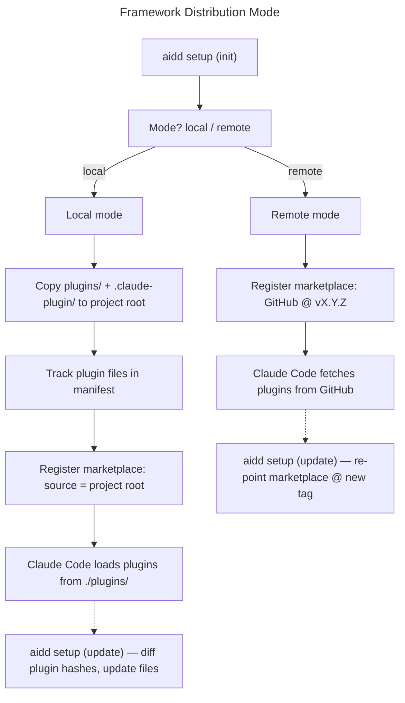

# Master Plan: Framework Distribution Mode

## Overview

- **Goal**: Add local/remote distribution modes — local copies plugins to project root (tracked by manifest), remote uses GitHub marketplace @ release tag
- **Risk Score**: 11/15
- **Branch**: `feat/framework-distribution-mode`

## Child Plans

| #   | Plan                          | File                                          | Status | Validated |
| --- | ----------------------------- | --------------------------------------------- | ------ | --------- |
| 1   | Domain & Manifest             | `./2026_04_30-framework-distribution-mode-part-1.md` | done | [x]       |
| 2   | Plugin copy flow (local mode) | `./2026_04_30-framework-distribution-mode-part-2.md` | done | [x]       |
| 3   | Setup mode integration        | `./2026_04_30-framework-distribution-mode-part-3.md` | done | [x]       |
| 4   | Update flow + Build & CI      | `./2026_04_30-framework-distribution-mode-part-4.md` | done | [x]       |

## User Journey

## Validation Protocol

1. Complete Part 1, run typecheck + unit tests
2. [x] Checkpoint 1: manifest model correct, migration tested
3. Complete Part 2, run integration tests
4. [x] Checkpoint 2: plugins copied and tracked correctly in local mode
5. Complete Part 3, test `aidd setup --mode local` and `--mode remote` end-to-end
6. [x] Checkpoint 3: marketplace registered correctly for both modes
7. Complete Part 4, run `build-dist.sh` locally, validate tarball contents
8. [ ] Final: full flow from fresh project to Claude Code with plugins loaded (manual validation pending)

## Key Design Decisions

- **Default mode**: local
- **Portability**: in local mode, marketplace source stored as `"."` (relative) — works on any machine
- **Manifest**: bump to v4, add `mode` field + `plugins` section
- **Plugin files location**: project root `./plugins/` and `./.claude-plugin/`
- **Switch mode**: `aidd setup --switch-mode` re-registers marketplace + optionally copies/removes plugins

## Estimations

- **Confidence**: 8/10
- **Risk**: marketplace relative path support in Claude Code unverified — test early in Part 3
- **Duration**: ~3-4 days
