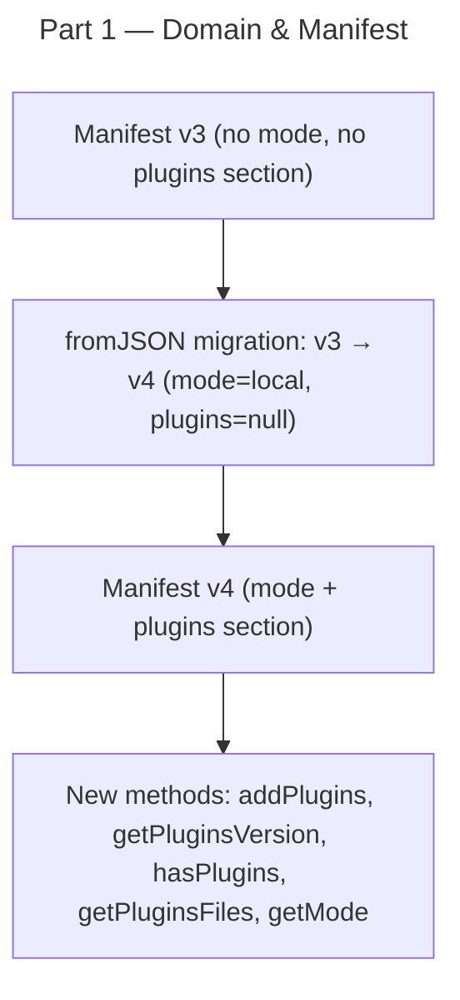

# Instruction: Framework Distribution Mode — Part 1: Domain & Manifest

## Feature

- **Summary**: Add `DistributionMode` type and extend manifest with `mode` field and `plugins` section to support tracking plugin files in local mode
- **Stack**: `TypeScript 5`, `Node.js 20`
- **Branch name**: `feat/framework-distribution-mode`
- **Parent Plan**: `./2026_04_30-framework-distribution-mode-master.md`
- **Sequence**: `1 of 4`
- Confidence: 9/10
- Time to implement: 2-3h

## Existing files

- @src/domain/models/manifest.ts

### New file to create

- none

## User Journey

## Implementation phases

### Phase 1 — DistributionMode type

> Add the mode discriminant type to the manifest model

1. Add `export type DistributionMode = "local" | "remote"` near top of `manifest.ts` (above `ManifestData`)
2. Add `mode: DistributionMode` to `ManifestData` interface (required after migration)

### Phase 2 — Plugins section

> Mirror the existing `scripts` section pattern for plugin file tracking

1. Add `PluginsSectionData = { version: string; files: TrackedFileData[] }` interface (mirror of `ScriptsEntryData`)
2. Add `plugins: PluginsSectionData | null` to `ManifestData`
3. Add private `_plugins: { version: string; files: TrackedFile[] } | null = null` field to `Manifest` class
4. Add `addPlugins(version: string, files: InstallationFile[]): void` — mirrors `addScripts`
5. Add `getPluginsVersion(): string | undefined`
6. Add `hasPlugins(): boolean`
7. Add `getPluginsFiles(): ReadonlyArray<{ relativePath: string; hash: FileHash }>`

### Phase 3 — Mode accessor

> Persist and expose mode on the manifest

1. Add private `_mode: DistributionMode` field to `Manifest` class
2. Add `getMode(): DistributionMode` method
3. Add `setMode(mode: DistributionMode): void` method (returns void, mutates `_mode`)

### Phase 4 — Migration v3 → v4

> Bump manifest version and handle missing fields from older persisted manifests

1. Bump current manifest version constant to `4`
2. In `fromJSON`: add v3 → v4 migration — set `mode: "local"`, `plugins: null` when loading v3 data
3. Ensure existing v3 manifests load without error (backward compat)
4. Update `toJSON()` to serialize `mode` and `plugins` fields

## Validation flow

1. Run `pnpm typecheck` — zero errors
2. Run `pnpm test` — existing manifest unit tests pass
3. Manually verify: create a v3 manifest JSON, call `Manifest.fromJSON()`, confirm `getMode()` returns `"local"` and `hasPlugins()` returns `false`
4. Manually verify: call `addPlugins("1.0.0", [...])`, call `toJSON()`, confirm `plugins` section present in output
