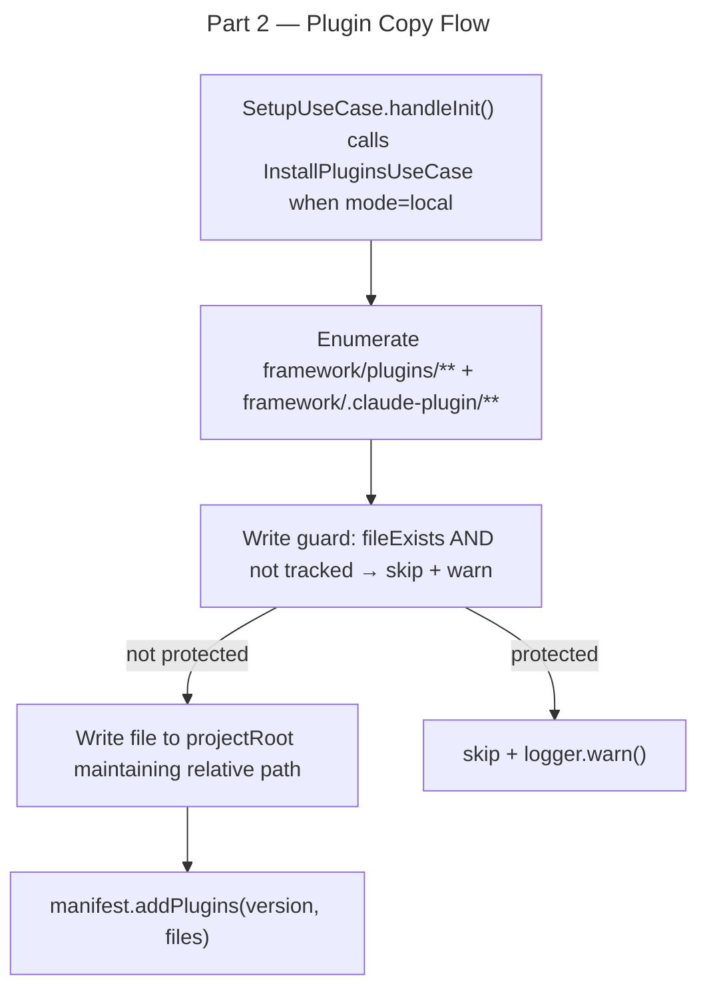

# Instruction: Framework Distribution Mode — Part 2: Plugin Copy Flow

## Feature

- **Summary**: Create `InstallPluginsUseCase` that copies `plugins/` and `.claude-plugin/` from the framework to the project root, tracking files in the manifest `plugins` section with write-guard
- **Stack**: `TypeScript 5`, `Node.js 20`
- **Branch name**: `feat/framework-distribution-mode`
- **Parent Plan**: `./2026_04_30-framework-distribution-mode-master.md`
- **Sequence**: `2 of 4`
- Confidence: 8/10
- Time to implement: 3-4h

## Existing files

- @src/application/use-cases/setup-use-case.ts
- @src/domain/ports/file-system.ts
- @src/domain/ports/manifest-repository.ts
- @src/domain/ports/logger.ts
- @src/infrastructure/deps.ts

### New file to create

- `src/application/use-cases/install-plugins-use-case.ts`

## User Journey

## Implementation phases

### Phase 1 — InstallPluginsUseCase

> Create the use-case that copies plugin files from framework to project root

1. Create `src/application/use-cases/install-plugins-use-case.ts`
2. `InstallPluginsOptions`: `{ frameworkPath: string; projectRoot: string; version: string; force?: boolean }`
3. `InstallPluginsResult`: `{ files: InstallationFile[]; skippedCount: number; warnings: string[] }`
4. Class `InstallPluginsUseCase` — constructor: `FileSystem, ManifestRepository, Logger`
5. `execute()`: enumerate all files under `frameworkPath/plugins/` and `frameworkPath/.claude-plugin/` using `fs.listFilesRecursive` (or equivalent)
6. For each file: read content, compute hash, apply write-guard (`fs.fileExists(dest) && !manifest.isFileTracked(rel)` → skip + warn)
7. Write each non-guarded file to `join(projectRoot, relativePath)` creating parent dirs as needed
8. Collect results as `InstallationFile[]`
9. Call `manifest.addPlugins(version, files)` on the loaded manifest
10. Save manifest via `manifestRepo.save(manifest)`
11. Return `InstallPluginsResult`

### Phase 2 — Wire into SetupUseCase

> Call InstallPluginsUseCase from handleInit in local mode

1. Add `InstallPluginsUseCase` to `SetupUseCase` constructor injection (after existing deps)
2. In `handleInit()`: after `runInstall()`, if `mode === "local"` call `installPluginsUseCase.execute({ frameworkPath: resolved.path, projectRoot, version: resolved.version })`
3. Add `mode: DistributionMode` to `SetupOptions` interface
4. Persist mode in manifest: `manifest.setMode(options.mode ?? "local")` during init flow

### Phase 3 — Wire into deps.ts

> Register InstallPluginsUseCase in the dependency graph

1. Instantiate `InstallPluginsUseCase` in `createDeps()` using existing `fs`, `manifestRepo`, `logger`
2. Expose as `deps.installPluginsUseCase`

## Validation flow

1. Run `pnpm typecheck` — zero errors
2. Run `pnpm test` — existing tests pass
3. Integration test: run `aidd setup --path ../../framework --mode local` in a temp dir
4. Verify `./plugins/aidd-context/`, `./plugins/aidd-dev/`, `./plugins/aidd-vcs/`, `./plugins/aidd-pm/` created at project root
5. Verify `./.claude-plugin/marketplace.json` created at project root
6. Verify `.aidd/manifest.json` contains `plugins` section with correct file hashes
7. Run again (idempotent): existing files not overwritten, manifest unchanged
