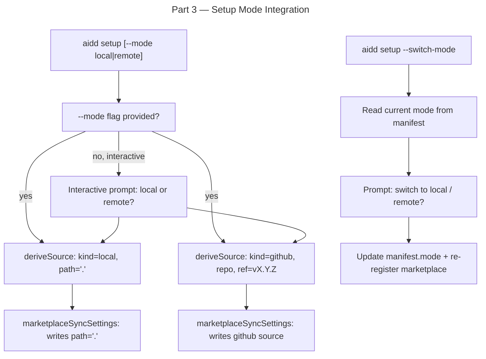

# Instruction: Framework Distribution Mode — Part 3: Setup Mode Integration

## Feature

- **Summary**: Add `--mode local|remote` flag to `aidd setup`, interactive prompt at init, update marketplace registration to use relative path for local mode and GitHub @ tag for remote mode, add `--switch-mode` capability
- **Stack**: `TypeScript 5`, `Node.js 20`
- **Branch name**: `feat/framework-distribution-mode`
- **Parent Plan**: `./2026_04_30-framework-distribution-mode-master.md`
- **Sequence**: `3 of 4`
- Confidence: 7/10 — portability of relative `"."` path in Claude Code unverified, test early
- Time to implement: 3-4h

## Existing files

- @src/application/commands/setup.ts
- @src/application/use-cases/marketplace/marketplace-register-framework-use-case.ts
- @src/application/use-cases/marketplace/marketplace-sync-settings-use-case.ts
- @src/application/use-cases/setup-use-case.ts

### New file to create

- none

## User Journey

## Implementation phases

### Phase 1 — CLI flag

> Add --mode flag to setup command

1. Add `.option("--mode <mode>", "Distribution mode: local (default) or remote")` to setup command
2. Add `mode?: string` to `cmdOptions` type
3. Validate: if provided, must be `"local"` or `"remote"` — otherwise `output.error()` + `process.exit(1)`
4. Add `.option("--switch-mode", "Switch distribution mode on existing project")` flag
5. Pass `mode` as `DistributionMode` to `SetupUseCase` options

### Phase 2 — Interactive prompt for mode at init

> Prompt user when no --mode flag and interactive

1. In `SetupUseCase.handleInit()`: if `mode` not provided and `interactive`, prompt via `prompter.select("Distribution mode?", ["local", "remote"])` — default `"local"`
2. If not interactive and no mode provided: default to `"local"`
3. Store resolved mode in manifest via `manifest.setMode(resolvedMode)`

### Phase 3 — Marketplace source by mode

> Update deriveSource to use mode-aware logic

1. Add `mode: DistributionMode` and `projectRoot: string` to `MarketplaceRegisterFrameworkOptions`
2. Update `deriveSource(pathHint, mode, projectRoot)`:
   - `mode === "local"` + pathHint (dev) → `{ kind: "local", path: resolve(pathHint) }`
   - `mode === "local"` + no pathHint → `{ kind: "local", path: "." }` (relative, portable)
   - `mode === "remote"` → `{ kind: "github", repo, ref: "v{version}" }` (existing logic)
3. Pass `mode` and `projectRoot` from `setup.ts` and `install.ts` when calling `marketplaceRegisterFrameworkUseCase.execute()`

### Phase 4 — Switch mode

> Allow changing mode on an existing project

1. In `SetupUseCase`, detect `--switch-mode` flag via new `switchMode?: boolean` in `SetupOptions`
2. Add `handleSwitchMode(options)` method:
   - Load manifest, read current mode
   - Prompt user for new mode (if interactive) or use `options.mode`
   - If switching to local: call `InstallPluginsUseCase`
   - If switching from local: optionally offer to remove `./plugins/` and `./.claude-plugin/` (prompt)
   - Update `manifest.setMode(newMode)`, save manifest
   - Re-run `MarketplaceRegisterFrameworkUseCase` with new mode (force re-register by removing old entry first)
3. Add `"mode-switched"` variant to `SetupResult`

### Phase 5 — Portability test

> Verify relative path "." works in Claude Code before shipping

1. In a test project, manually set `extraKnownMarketplaces` with `{ source: "directory", path: "." }` in `.claude/settings.json`
2. Verify Claude Code resolves plugins correctly from `./plugins/`
3. If relative path NOT supported: fall back to post-processing in `build-dist.sh` (strip marketplace path, require `aidd setup` on first use) — document decision

## Validation flow

1. Run `pnpm typecheck` — zero errors
2. Run `pnpm test` — existing tests pass
3. Test `aidd setup --path ../../framework --mode local` → marketplace registered with `path: "."`
4. Test `aidd setup --path ../../framework --mode remote` → marketplace registered with github source
5. Test `aidd setup --switch-mode` on existing local project → switches to remote
6. **Critical**: verify Claude Code loads plugins from `./plugins/` when marketplace path is `"."`
