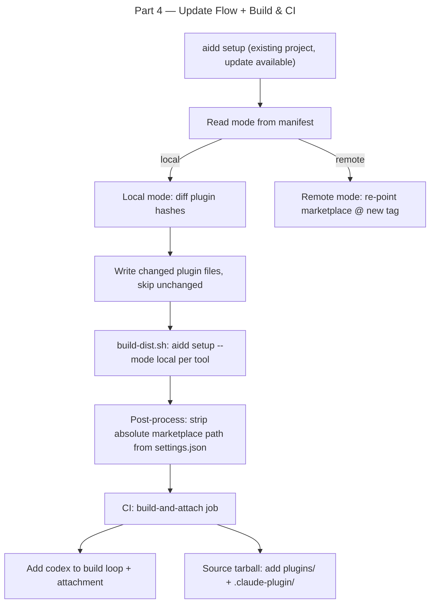

# Instruction: Framework Distribution Mode — Part 4: Update Flow + Build & CI

## Feature

- **Summary**: Extend update flow to diff and update plugin files in local mode; update `build-dist.sh` to use `--mode local` and generate portable dist; update `ci.yml` to add `codex` and include `plugins/` + `.claude-plugin/` in source tarball
- **Stack**: `TypeScript 5`, `Node.js 20`, `bash`, `GitHub Actions`
- **Branch name**: `feat/framework-distribution-mode`
- **Parent Plan**: `./2026_04_30-framework-distribution-mode-master.md`
- **Sequence**: `4 of 4`
- Confidence: 8/10
- Time to implement: 3-4h

## Existing files

- @src/application/use-cases/setup-use-case.ts
- @framework/scripts/build-dist.sh
- @framework/.github/workflows/ci.yml

### New file to create

- none

## User Journey



## Implementation phases

### Phase 1 — Update flow for local mode

> Detect and apply plugin file changes when mode=local

1. In `SetupUseCase.handleUpdate()`: read `manifest.getMode()`
2. If mode = `"local"`: call `InstallPluginsUseCase` with `force: false` after updating framework files
3. `InstallPluginsUseCase` in update context: compare file hashes against `manifest.getPluginsFiles()` — only write changed files
4. Add plugin update counts to the `"updated"` result variant: `pluginsUpdated: number`, `pluginsDeleted: number`
5. In `setup.ts` display: append plugin counts to the update success message if > 0
6. Handle deleted plugins: files tracked in manifest `plugins` section but no longer in framework → delete from project + remove from manifest

### Phase 2 — build-dist.sh

> Update build script to use local mode and generate portable dist

1. Replace `aidd setup --path "$FRAMEWORK_ROOT" --docs-dir aidd_docs` with `aidd setup --path "$FRAMEWORK_ROOT" --docs-dir aidd_docs --mode local`
2. After `aidd install`, post-process `.claude/settings.json` in each dist dir:
   - Remove `extraKnownMarketplaces` entry that contains the CI absolute path
   - Keep `enabledPlugins` intact
   - Use `node -e` or `jq` inline script
3. Reason: users need `aidd setup` once on their machine to register marketplace with their absolute path. Plugins are pre-installed in the tarball.
4. Add comment block explaining the post-process step

### Phase 3 — ci.yml updates

> Add codex and update tarball contents

1. Add `codex` to the build loop in `build-dist.sh` call (already there) — verify it runs
2. In `ci.yml` "Build per-tool tarballs" step: add `aidd-codex-${VERSION}.tar.gz`
3. In `ci.yml` "Attach tarballs to release" step: add `/tmp/aidd-codex-${VERSION}.tar.gz` to `gh release upload`
4. In `ci.yml` "Build source tarball" step: add `plugins/` and `.claude-plugin/` to the `tar czf` command:
   ```bash
   tar czf "/tmp/aidd-framework-${VERSION}.tar.gz" \
     agents/ \
     commands/ \
     config/ \
     rules/ \
     skills/ \
     plugins/ \
     .claude-plugin/ \
     aidd_docs/ \
     version.txt
   ```

## Validation flow

1. Run `pnpm typecheck` — zero errors
2. Run `pnpm test` — all tests pass
3. Run `bash scripts/build-dist.sh` locally (with `aidd` CLI installed)
4. Verify `dist/claude/plugins/` exists with all 4 plugin dirs
5. Verify `dist/claude/.claude-plugin/marketplace.json` exists
6. Verify `dist/claude/.claude/settings.json` does NOT contain the local absolute CI path in `extraKnownMarketplaces`
7. Copy `dist/claude/` to a temp project, run `aidd setup` once → verify marketplace registered + plugins available in Claude Code
8. Check CI YAML is valid: `act` dry-run or push to branch + observe CI
