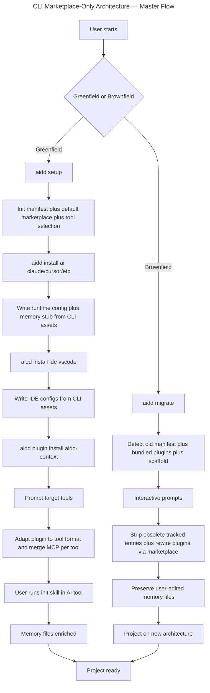

# Instruction: CLI Marketplace-Only Architecture Refactor (Master)

## Feature

- **Summary**: Refactor CLI + framework so framework becomes pure plugin marketplace and CLI ships tool runtime configs as built-in assets. Strict separation between framework distribution and tool installation. Plugin install always from marketplace, MCP plugin-owned with per-tool translation.
- **Stack**: `Node.js >=24, TypeScript ESM, commander, @inquirer/prompts, tsup, vitest, biome, lefthook`
- **Branch name**: `feat/marketplace-only-architecture`
- **Parent Plan**: `none`
- **Sequence**: `master`
- Confidence: 9/10 (post-verification + decisions locked)
- Time to implement: 6–8 days (Phase 1 expanded to 3 sub-phases)

## Existing files

- @src/application/commands/install.ts
- @src/application/commands/setup.ts
- @src/application/commands/plugin.ts
- @src/application/commands/marketplace.ts
- @src/application/use-cases/install/install-use-case.ts
- @src/application/use-cases/install/install-memory-bank-use-case.ts
- @src/application/use-cases/install/install-plugins-use-case.ts
- @src/application/use-cases/resolve-framework-use-case.ts
- @src/application/use-cases/init-use-case.ts
- @src/application/use-cases/setup-use-case.ts
- @src/application/use-cases/catalog-use-case.ts
- @src/infrastructure/adapters/framework-resolver-adapter.ts
- @src/infrastructure/adapters/framework-loader-adapter.ts
- @src/infrastructure/adapters/marketplace-registry-adapter.ts
- @src/infrastructure/adapters/plugin-fetcher-adapter.ts
- @src/infrastructure/adapters/plugin-distribution-reader-adapter.ts
- @src/infrastructure/tar/
- @src/domain/models/manifest.ts
- @src/domain/tools/ai/{claude,cursor,copilot,opencode,codex}.ts
- @src/domain/capabilities/mcp-capability.ts
- @../framework/config/
- @../framework/rules/
- @../framework/aidd_docs/
- @../framework/scripts/build-dist.sh
- @../framework/.claude-plugin/marketplace.json

## New files to create

- src/assets/configs/{claude,cursor,copilot,opencode,codex}/ (tool runtime configs)
- src/assets/configs/vscode/ (IDE configs)
- src/assets/memory-stubs/{CLAUDE,AGENTS,copilot-instructions}.md
- src/assets/marketplaces/default.json (default marketplace pointer)
- src/assets/index.ts (asset loader inlined by tsup)
- src/domain/ports/marketplace-resolver.ts
- src/infrastructure/adapters/marketplace-resolver-adapter.ts
- src/application/use-cases/install/install-runtime-config-use-case.ts
- src/application/use-cases/install/install-memory-stub-use-case.ts
- src/application/use-cases/migrate-use-case.ts
- src/application/commands/migrate.ts

## User Journey



## Implementation phases

### ✅ Phase 0 — CLI assets bundling

> Foundation: bundle tool runtime configs + memory stubs in CLI binary.

See: `2026_05_01-cli-marketplace-architecture-part-0.md`

### ✅ Phase 1 — Marketplace-only core

> New MarketplaceResolver. Default marketplace pre-registered. Plugin install prompts target tools. MCP plugin-owned, translated per tool. Strip framework loading.

See: `2026_05_01-cli-marketplace-architecture-part-1.md`

### ✅ Phase 2 — Install command split (`install ai|ide <tool>`)

> Split install into `ai <tool>` (runtime config + memory stub) and `ide <tool>` (IDE configs). Add `uninstall ide`. Remove old framework-fetch flow.

See: `2026_05_01-cli-marketplace-architecture-part-2.md`

### ✅ Phase 3 — Migration command

> Interactive `aidd migrate`. Strip obsolete tracked entries. Rewire plugins via marketplace. Preserve user files.

See: `2026_05_01-cli-marketplace-architecture-part-3.md`

### ✅ Phase 4 — Framework cleanup + tests + docs

> Delete framework/config/, framework/rules/, framework/aidd_docs/. Simplify build-dist. Realign tests, update README/ARCHITECTURE/CHANGELOG.

See: `2026_05_01-cli-marketplace-architecture-part-4.md`

## Validation flow

1. Greenfield project: `aidd setup` then `aidd install ai claude` then `aidd install ide vscode` then `aidd plugin install aidd-context` — verify all files written, manifest tracks every entry, no rules scaffold created, no framework docs copied
2. Brownfield project (existing manifest with bundled plugins + framework docs): `aidd migrate` — verify obsolete entries removed, plugins re-registered via marketplace, user-edited memory files untouched
3. MCP per-tool translation: install plugin with `.mcp.json` to claude+cursor+codex+opencode — verify `.mcp.json` (claude), `.cursor/mcp.json` (cursor), `.codex/config.toml` `[mcp_servers]` section (codex), `opencode.json` `mcp` key (opencode)
4. Plugin install prompt: `aidd plugin install aidd-dev` — verify interactive prompt with checkbox for target tools, non-interactive `--tool claude,cursor` works
5. CLI binary: `npx @ai-driven-dev/cli@next setup` — verify bundled assets shipped (no missing config errors)
6. Manifest backward compat: load v1/v2/v3/v4 manifest files via fixture tests — verify migration chain still works
7. E2E: full greenfield + brownfield journeys via `tests/e2e/`

## Confidence assessment

✅ **Reasons for high confidence (8/10):**
- Manifest migration chain (v1→v2→v3→v4) already in place — no new schema bump
- Plugin format conversion pattern already clean (`domain/tools/ai/*.ts` + capability classes)
- Codex MCP→TOML conversion ALREADY implemented (`mergeCodexConfigToml()` + `domain/formats/toml.ts`)
- Install/uninstall commands ALREADY have `ai|ide <tool>` subcommand structure (commander `[category] [tool...]` args) — Phase 2 = data source swap only
- Marketplace registry already supports project + user scope storage
- 5 phases independently shippable

❌ **Risks discovered post-verification (drops confidence from 9 to 8):**
- **`framework/config/` content does NOT exist at production path** — only in `tests/fixtures/framework/config/`. Phase 0 must source from fixtures + write Cursor/Codex templates from scratch
- **tsup config has NO raw/text loaders** — Phase 0 must add explicit esbuild loader config for `.json/.md/.toml`
- **FrameworkResolver/Loader has 8 dependent use-cases** (setup, init, install, update, restore, adopt, adopt-tools, check-update) — cannot delete in single sweep, Phase 1 split into 3 sub-phases
- **Rules scaffold NOT created by CLI** (it's static framework repo structure) — drop from migration logic
- **`framework/aidd_docs/CATALOG.md` and `framework/scripts/build-dist.sh` (which depends on `aidd setup` + `aidd install ai/ide`)** — explicit cleanup needed in Phase 4
- Migration command edge cases for projects with custom modifications to tracked files
- OpenCode flat-mode plugin adaptation may surface edge cases at scale
- Default marketplace URL must be locked before Phase 1 ships

**Confidence raised to 9/10 — all blockers resolved:**
- ✅ Asset source: test fixtures + greenfield Cursor/Codex/Claude templates
- ✅ FrameworkResolver phase-out: parallel (1a) → migrate 8 callers (1b) → delete (1c)
- ✅ Default marketplace URL: `https://github.com/ai-driven-dev/aidd-framework.git` (git clone, anonymous)
- ✅ tsup esbuild loader POC: PASSED (Phase −1 spike completed 2026-05-01)
- ✅ Docs dir hardcoded to `aidd_docs` (no user customization)

## Phase −1 — Spike COMPLETED ✓

> POC executed 2026-05-01. tsup v8.5.1 + esbuild text-loader VERIFIED.

**Result:**
- `.md` → text loader → string at runtime (works)
- `.json` → native import → parsed object (CLI merges as JSON — better than string)
- `.toml` → text loader → string + parse via existing `domain/formats/toml.ts`
- Bundle overhead: ~10-20KB total for full asset set (negligible)

**Pattern confirmed:**
```ts
// tsup.config.ts
esbuildOptions(options) {
  options.loader = {
    ...options.loader,
    ".md": "text",
    ".toml": "text",
  };
}
```

**Phase 0 unblocked. No fallback to FS-runtime read needed.**

## Locked decisions (no further debate)

| # | Topic | Lock |
|---|---|---|
| 1 | Default marketplace URL | **Git clone** — `https://github.com/ai-driven-dev/aidd-framework.git`. Anonymous read. Reuses existing PluginFetcher. Auth only when user adds private marketplace |
| 2 | Memory stub content | **Existing AGENTS.md template format** — frontmatter + behavior guidelines + empty `<aidd_project_memory>` block with `{{DOCS}}` placeholder + ls fallback (matches `framework/plugins/aidd-context/skills/01-project-init/assets/AGENTS.md`) |
| 3 | `aidd migrate` atomicity | **Combined a+b+c** — backup `.aidd/manifest.backup.json` before mutation + `--dry-run` flag + accept partial on failure with documented recovery |
| 4 | E2E plugin source | **Mock HTTP server** — vitest mocks simulating real marketplace responses |
| 5 | `aidd setup` scope | **Full bootstrap + interactive** — manifest + default marketplace + interactive tool selection + auto-call `install ai <tool>` + memory stubs for each selected tool |
| 6 | `aidd_docs/` creation | **Skill creates it** — CLI doesn't pre-create empty dir; aidd-context init skill creates on first write |
| 7 | Multi-marketplace conflicts | Non-issue (single source of truth per plugin name) |
| 8 | MCP credentials | **User manually updates** `.mcp.json`/`opencode.json`/`.codex/config.toml` after plugin install — no CLI prompt |
| 9 | Command idempotency | **All commands idempotent** — re-run = no-op or update-only, never error on already-applied state |
| 10 | Docs directory | **Hardcoded to `aidd_docs`** — no user customization, no `--docs-dir` flag, no manifest `docsDir` field choice. Skill writes to hardcoded path. CLI memory stubs use literal `aidd_docs` not `{{DOCS}}` placeholder |
| 11 | Placeholders + self-contained plugins | **Plugin content fully tool-agnostic AND fully self-contained.** Intra-plugin refs = relative (`@./...`/`@../...`). **Cross-plugin refs = ELIMINATED via inlining (Option A)** — shared templates/conventions copied into each plugin that uses them. Project rules refs (`{{TOOLS}}/rules/`) = REMOVED (skills use runtime discovery, generic text). Project docs refs = hardcoded `aidd_docs/...` literal (project convention). CLI does NO path substitution — only extension transforms. Marketplace truly standalone — each plugin = autonomous unit |

## Sequencing

```text
Phase −1 (spike + lock decisions, 2h) ──► Phase 0 (assets) ──► Phase 1 (marketplace core, 3 sub-phases) ──► Phase 2 (install swap) ──► Phase 3 (migrate) ──► Phase 4 (cleanup)
                                                                                                                   └─► Phase 4 (framework cleanup) parallelizable after Phase 0
```

Each phase = 1 PR, releasable to beta. Public release after Phase 3.

## Verified facts (post-deep-analysis)

| Claim | Truth | Notes |
|---|---|---|
| `framework/config/` files exist | FALSE | Only in `tests/fixtures/framework/config/` |
| `framework` is standalone Git repo | TRUE | Remote: `git@github.com:ai-driven-dev/aidd-framework.git` |
| Install/uninstall commands have `ai|ide` subcommands | TRUE | Already implemented today |
| Codex MCP→TOML conversion | TRUE | `mergeCodexConfigToml()` in codex.ts; `domain/formats/toml.ts` |
| CLI creates rules scaffold | FALSE | Zero grep matches; framework has static dirs only |
| FrameworkResolver/Loader dependents | 8 use cases | setup, init, install, update, restore, adopt, adopt-tools, check-update |
| tsup raw/text loaders configured | FALSE | Must add explicit esbuild `loader` config |
| `tests/infrastructure/tar/` exists | FALSE | Only `src/infrastructure/tar/` (1.1K + .gitkeep) |
| Manifest tracks `docs`, `scripts`, top-level `plugins` | TRUE | All three nullable fields exist |
| Catalog use case path | `shared/catalog-use-case.ts` | Not at root |
| `framework/aidd_docs/` content | memory/, tasks/, CATALOG.md, CONTRIBUTING.md, README.md | More than expected |
| Plugin install marketplace use case | `plugin-install-from-marketplace-use-case.ts` | Different prefix than expected |
