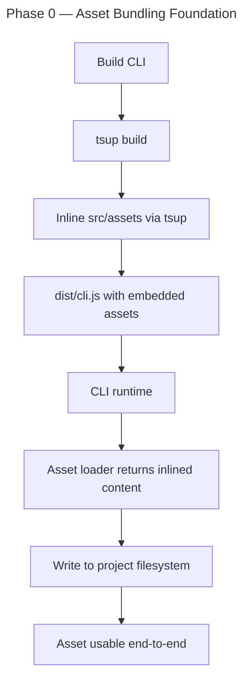

# Instruction: CLI Assets Bundling Foundation

## Feature

- **Summary**: Bundle tool runtime configs (claude/cursor/copilot/opencode/codex/vscode) and memory file stubs (CLAUDE.md/AGENTS.md/copilot-instructions.md) as built-in CLI assets via tsup inline. Move framework/config/ content into CLI repo. Foundation for marketplace-only architecture.
- **Stack**: `Node.js >=24, TypeScript ESM, tsup, vitest`
- **Branch name**: `feat/cli-assets-bundling`
- **Parent Plan**: `2026_05_01-cli-marketplace-architecture-master.md`
- **Sequence**: `1 of 5`
- Confidence: 9/10
- Time to implement: 4–6h

## Existing files

- @tsup.config.ts (NO raw/text loaders today — must add)
- @package.json (`files: ["dist", "README.md"]` — no assets entry needed if inline)
- @tests/fixtures/framework/config/copilot/settings.json (REAL source — production framework path doesn't exist)
- @tests/fixtures/framework/config/vscode/settings.json
- @tests/fixtures/framework/config/vscode/keybindings.json
- @tests/fixtures/framework/config/vscode/extensions.json
- @tests/fixtures/framework/config/.opencode/opencode.json
- @tests/fixtures/framework/config/codex/hooks.json (only Codex template that exists)

> NOTE: `framework/config/.claude/`, `framework/config/cursor/`, `framework/config/codex/config.toml` DO NOT EXIST in production framework. Must write greenfield templates for these.

### New files to create

- src/assets/configs/claude/settings.json
- src/assets/configs/cursor/settings.json
- src/assets/configs/copilot/settings.json
- src/assets/configs/opencode/opencode.json
- src/assets/configs/codex/config.toml
- src/assets/configs/vscode/{settings,keybindings,extensions}.json
- src/assets/memory-stubs/CLAUDE.md
- src/assets/memory-stubs/AGENTS.md
- src/assets/memory-stubs/copilot-instructions.md
- src/assets/marketplaces/default.json
- src/assets/index.ts
- tests/infrastructure/assets/asset-loader.unit.test.ts

## User Journey



## Implementation phases

### Phase 1 — Asset directory structure

> Create canonical asset layout in `src/assets/`. Sources from test fixtures (production framework/config doesn't exist).

1. Create `src/assets/configs/{claude,cursor,copilot,opencode,codex,vscode}/` directories
2. Write `src/assets/configs/claude/settings.json` from scratch (Claude permissions/hooks defaults — no source exists)
3. Copy `tests/fixtures/framework/config/copilot/settings.json` → `src/assets/configs/copilot/settings.json`
4. Copy `tests/fixtures/framework/config/vscode/{settings,keybindings,extensions}.json` → `src/assets/configs/vscode/`
5. Copy `tests/fixtures/framework/config/.opencode/opencode.json` → `src/assets/configs/opencode/opencode.json`
6. Write `src/assets/configs/cursor/settings.json` + `src/assets/configs/codex/config.toml` from scratch (no source)
7. Add memory stubs in `src/assets/memory-stubs/` following EXACT format of `framework/plugins/aidd-context/skills/01-project-init/assets/AGENTS.md`:
   - Frontmatter (`name: agents`, `description: AI agent configuration and guidelines`)
   - Behavior guidelines section
   - Answering guidelines section
   - `<aidd_project_memory>` block (empty — skill fills later)
   - **Docs path hardcoded as `aidd_docs`** (no `{{DOCS}}` placeholder per locked decision #10)
   - ls fallback logic preserved for graceful degradation
   - Variants: `CLAUDE.md` (claude), `AGENTS.md` (cursor/opencode/codex shared), `.github/copilot-instructions.md` (copilot)
8. Add `src/assets/marketplaces/default.json` with content:
   ```json
   {
     "name": "aidd-framework",
     "source": "https://github.com/ai-driven-dev/aidd-framework.git",
     "type": "git"
   }
   ```

### Phase 2 — Asset loader module

> Inline assets via tsup esbuild loaders. Spike VERIFIED 2026-05-01.

1. Update `tsup.config.ts` — add esbuild loader config (verified working):
   ```ts
   esbuildOptions(options) {
     options.loader = {
       ...options.loader,
       ".md": "text",
       ".toml": "text",
     };
   }
   ```
   Note: `.json` keeps NATIVE import (returns parsed object — better for merge logic)
2. Create `src/assets/index.ts` exporting typed loader API:
   - `loadConfigAsset(toolId: ToolId, fileName: string)` — returns object for JSON, string for TOML
   - `loadMemoryStub(toolId: ToolId): { fileName: string; content: string }` — returns string for MD
   - `loadDefaultMarketplace(): { name: string; source: string; type: "git" }`
3. Use direct ESM imports:
   - `import claudeSettings from "./configs/claude/settings.json"` → object
   - `import claudeMemoryStub from "./memory-stubs/CLAUDE.md"` → string
   - `import codexConfig from "./configs/codex/config.toml"` → string (parse via TOML formatter when needed)
4. Verify dist bundle size acceptable (POC showed ~10-20KB overhead for full asset set)
5. Keep `package.json#files` as `["dist", "README.md"]` — assets fully inlined, no FS fallback

### Phase 3 — Tests

> Verify loader API contracts.

1. Unit test `loadConfigAsset` — returns expected content per tool
2. Unit test `loadMemoryStub` — returns correct fileName mapping (CLAUDE/AGENTS/copilot-instructions)
3. Unit test `loadDefaultMarketplace` — returns valid URL structure
4. Build CLI, exec `node dist/cli.js --version`, verify no runtime asset-load errors

## Validation flow

1. Run `pnpm build` — verify dist/cli.js compiles, size acceptable
2. Run `node dist/cli.js --version` — no asset-load errors
3. Inspect dist/cli.js — confirm asset content embedded (grep for known config string)
4. Run `pnpm test src/assets` — all loader tests pass
5. Verify framework/config/ files match src/assets/configs/ files (diff check before deletion in Phase 4)

## Confidence assessment

✅ tsup esbuild loader pattern documented and supported (text loader well-known)
✅ Asset sizes small, no runtime FS dependency
✅ Test fixtures provide source for copilot/vscode/opencode templates
❌ Cursor + Codex + Claude config templates need greenfield writing (not in framework today)
❌ tsup loader config must be POC-validated before full asset structure to avoid wasted effort

**Confidence: 8/10** (down from 9/10 due to source-from-fixtures complications + tsup loader unverified)
