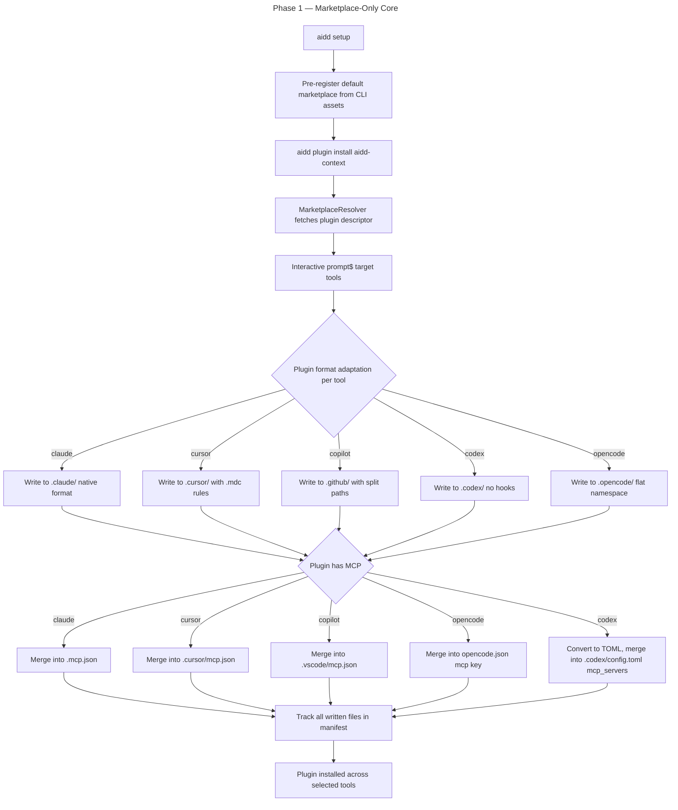

# Instruction: Marketplace-Only Core

## Feature

- **Summary**: Replace framework loader with marketplace resolver. Pre-register default marketplace on `aidd setup`. Plugin install always from marketplace, prompts target tools (Option B). MCP plugin-owned, translated per tool format (JSON for claude/cursor/copilot/opencode, TOML for codex). Memory bank generation reduced to stub-only. Aggressive removal of framework-fetch/loader/catalog/scaffold code.
- **Stack**: `Node.js >=24, TypeScript ESM, commander, @inquirer/prompts, vitest`
- **Branch name**: `feat/marketplace-only-core`
- **Parent Plan**: `2026_05_01-cli-marketplace-architecture-master.md`
- **Sequence**: `2 of 5`
- Confidence: 7/10 (lower than first estimate — 8 use cases depend on FrameworkResolver/Loader)
- Time to implement: 2.5–3 days (was 1.5–2 — expanded due to multi-step phase-out)

## Existing files

- @src/application/use-cases/resolve-framework-use-case.ts
- @src/application/use-cases/init-use-case.ts
- @src/application/use-cases/setup-use-case.ts
- @src/application/use-cases/install/install-memory-bank-use-case.ts
- @src/application/use-cases/install/install-plugins-use-case.ts
- @src/application/use-cases/catalog-use-case.ts
- @src/application/use-cases/shared/post-install-pipeline-use-case.ts
- @src/infrastructure/adapters/framework-resolver-adapter.ts
- @src/infrastructure/adapters/framework-loader-adapter.ts
- @src/infrastructure/adapters/marketplace-registry-adapter.ts
- @src/infrastructure/tar/
- @src/domain/ports/framework-resolver.ts
- @src/domain/capabilities/mcp-capability.ts
- @src/domain/tools/ai/codex.ts
- @src/infrastructure/deps.ts
- @src/cli.ts

### New files to create

- src/domain/ports/marketplace-resolver.ts
- src/infrastructure/adapters/marketplace-resolver-adapter.ts
- src/application/use-cases/install/install-memory-stub-use-case.ts
- src/application/use-cases/resolve-marketplace-use-case.ts

### Files to delete (FINAL state — phased deletion in sub-phase 1c)

- src/application/use-cases/resolve-framework-use-case.ts
- src/application/use-cases/install/install-memory-bank-use-case.ts
- src/application/use-cases/shared/catalog-use-case.ts (CORRECTED PATH — was claimed at root)
- src/infrastructure/adapters/framework-resolver-adapter.ts
- src/infrastructure/adapters/framework-loader-adapter.ts
- src/infrastructure/tar/ (entire directory — only contains `tar-extractor.ts` 1.1K + .gitkeep)
- src/domain/ports/framework-resolver.ts
- src/domain/ports/framework-loader.ts

### Use cases that MUST be migrated off FrameworkResolver/Loader before deletion

8 dependent use cases (verified via grep):
- `setup-use-case.ts`
- `init-use-case.ts` (uses `loader.loadFromDirectory()` for docs files)
- `install/install-use-case.ts`
- `update/update-use-case.ts`
- `adopt/adopt-use-case.ts`
- `adopt/adopt-tools-use-case.ts`
- `restore/restore-use-case.ts`
- `check-update-use-case.ts`

## User Journey

## Implementation phases

### Phase 1 — MarketplaceResolver port + adapter

> Create marketplace resolver replacing framework resolver.

1. Create `src/domain/ports/marketplace-resolver.ts` — interface with `resolve(source: MarketplaceSource): Promise<MarketplaceDescriptor>` (URL or local path)
2. Create `src/infrastructure/adapters/marketplace-resolver-adapter.ts` — implements port; fetches `marketplace.json` via HTTP (remote) or fs (local); reuses HTTP client + auth
3. Create `src/application/use-cases/resolve-marketplace-use-case.ts` — orchestrates: load registered marketplace, fetch descriptor, return plugin index
4. Wire in `src/infrastructure/deps.ts`
5. Integration test with mock HTTP server

### Phase 2 — Default marketplace pre-registration + Setup full bootstrap

> Auto-register default marketplace + interactive tool selection + auto-install runtime configs (locked decision #5).

1. Modify `src/application/use-cases/setup-use-case.ts`:
   - After manifest creation, call `marketplaceRegistry.save(projectRoot, defaultMarketplace, scope: "project")`
   - Read default marketplace from `loadDefaultMarketplace()` (Phase 0 asset) — `https://github.com/ai-driven-dev/framework.git`
   - Interactive prompt: which tools to install? (claude/cursor/copilot/opencode/codex) + IDE (vscode)
   - For each selected tool: call `InstallRuntimeConfigUseCase` (auto-install runtime configs + memory stubs)
   - Idempotent: re-running `aidd setup` = no-op for already-installed tools, prompts for additions only
2. Add CLI flags to override: `--marketplace-url <url>` or `--marketplace-path <path>`, `--tool <list>` (skip prompt)
3. Update `src/application/commands/setup.ts` to wire new flags
4. Integration test for greenfield setup with default marketplace + selected tools

### Phase 3 — Memory stub use case + docsDir hardcoding

> Replace memory bank generation with stub-only logic. Hardcode docs path. Per existing rule, do NOT add `skipMemoryScript` flag — use InitUseCase exception pattern.

1. Create `src/application/use-cases/install/install-memory-stub-use-case.ts`:
   - Reads memory stub from `loadMemoryStub(toolId)` (Phase 0 asset — AGENTS.md template format)
   - **No placeholder substitution** — stub already has hardcoded `aidd_docs` path (locked decision #10)
   - Writes `CLAUDE.md` / `AGENTS.md` / `.github/copilot-instructions.md` only if absent (per write guard rule)
   - Tracks in manifest with hash
   - Idempotent: if file exists tracked → skip; if exists untracked → warn + skip (preserve user-owned)
2. **Remove `docsDir` customization across CLI** (locked decision #10):
   - Remove `--docs-dir` flag from all commands
   - Replace `Manifest.DEFAULT_DOCS_DIR` reads with hardcoded constant `aidd_docs` everywhere
   - Keep `manifest.docsDir` field as constant `"aidd_docs"` for backward compat (or remove entirely if no consumers — verify via grep)
   - Remove `Manifest.validateDocsDir()` validation (no input to validate)
   - Update `init-use-case.ts` and `setup-use-case.ts` to drop docsDir prompts/flags
2. Wire in `deps.ts`
3. Called by new `InstallRuntimeConfigUseCase` (Phase 1 of part-2)
4. Unit + integration tests covering: write fresh, skip-if-exists, hash-mismatch handling

### Phase 4 — Plugin install: target-tool prompt + MCP per-tool translation

> Prompt user for target tools per plugin install. Ensure MCP translation works for all 5 tools (especially Codex TOML).

1. Modify `src/application/use-cases/plugin/install-from-marketplace-use-case.ts`:
   - After fetch, query manifest for declared tools
   - Prompt: "Install <plugin> to which tools? [checkbox]"
   - Accept `--tool claude,cursor` flag for non-interactive
2. Verify `src/domain/capabilities/mcp-capability.ts` handles all 5 destinations:
   - claude → `.mcp.json`
   - cursor → `.cursor/mcp.json`
   - copilot → `.vscode/mcp.json`
   - opencode → `opencode.json` mcp key (JSON merge)
   - codex → `.codex/config.toml` `[mcp_servers]` section (TOML conversion via existing format module or new TOML formatter)
3. If TOML conversion missing for codex MCP: add to `src/domain/formats/toml.ts`
4. Integration test: install plugin with `.mcp.json` to all 5 tools, verify each MCP destination written correctly

### Phase 5 — FrameworkResolver/Loader phase-out (SPLIT into 3 sub-phases)

> Cannot delete in single sweep — 8 use cases depend. Coexist parallel, migrate, delete last.

#### Sub-phase 5a — Coexist parallel (MarketplaceResolver alongside)

1. Keep FrameworkResolver/Loader untouched
2. MarketplaceResolver (Phase 1 part 1) added independently
3. New use cases (`InstallRuntimeConfigUseCase`, `InstallMemoryStubUseCase`, `ResolveMarketplaceUseCase`) use only MarketplaceResolver
4. Verify both code paths work in parallel via tests

#### Sub-phase 5b — Migrate 8 dependent use cases

Migrate one-by-one, each in own commit. **For each: also strip `.replaceAll("{{DOCS}}/", ...)` lines (placeholder dead per locked decision #10).**

1. `init-use-case.ts` — remove `loader.loadFromDirectory()` for docs files; init no longer copies framework docs; strip `{{DOCS}}` placeholder call (line 198); update test
2. `install/install-use-case.ts` — replace plugin install path using framework loader with marketplace path; delegate to `InstallRuntimeConfigUseCase` for runtime configs
3. `setup-use-case.ts` — remove FrameworkResolver dep; setup orchestrates `InstallRuntimeConfigUseCase` + `InstallMemoryStubUseCase`; remove docsDir customization
4. `update/update-use-case.ts` — replace framework version bump with marketplace plugin update; strip `{{DOCS}}` placeholder call (line 1121)
5. `restore/restore-use-case.ts` — restore tracked files from manifest only (no framework re-fetch); strip `{{DOCS}}` placeholder call (line 425)
6. `adopt/adopt-use-case.ts` + `adopt/adopt-tools-use-case.ts` — adopt = manifest-only operation now (no framework load); `adopt-docs-use-case.ts` likely deletable entirely (no docs install); strip `{{DOCS}}` placeholder call (adopt-docs line 81)
7. `check-update-use-case.ts` — replace with CLI version check + marketplace catalog freshness check
8. Each migration: commit + test green

#### Sub-phase 5c — Final deletion sweep

1. Delete `src/application/use-cases/resolve-framework-use-case.ts`
2. Delete `src/application/use-cases/install/install-memory-bank-use-case.ts`
3. Delete `src/application/use-cases/shared/catalog-use-case.ts`
4. Delete `src/application/use-cases/adopt/adopt-docs-use-case.ts` (likely deletable — no docs install)
5. Delete `src/infrastructure/adapters/framework-resolver-adapter.ts`
6. Delete `src/infrastructure/adapters/framework-loader-adapter.ts`
7. Delete `src/infrastructure/tar/` (entire directory)
8. Delete `src/domain/ports/framework-resolver.ts` + `framework-loader.ts`
9. **DELETE `src/domain/formats/placeholders.ts` entirely** (locked decision #11) — no more placeholders at all
10. **DELETE `src/domain/models/framework.ts`** if it only contained placeholder constants (verify via knip)
11. **Simplify capability classes** in `src/domain/capabilities/`:
    - DROP `baseRewriteContent`/`baseReverseRewriteContent` calls entirely
    - Plugin content tool-agnostic (no path substitution at all)
    - Keep file extension transforms (`.md` → `.mdc` for Cursor rules, `.agent.md` for Copilot agents) — these stay
    - Lossless round-trip trivial (no content transform = identity)
12. **Update per-tool definitions** in `src/domain/tools/ai/{claude,cursor,copilot,opencode,codex}.ts`:
    - Drop `baseRewriteContent`/`baseReverseRewriteContent` imports
    - Drop content-rewrite logic — plugin content unchanged on install
    - Keep extension/format transforms (Cursor `.mdc`, Copilot `.agent.md`, etc.)
11. Remove `CatalogUseCase` calls from any remaining sites (post-install-pipeline-use-case.ts already exempts InitUseCase per existing rule)
12. Update `deps.ts` to remove deleted dependencies
13. Run `knip` to detect any remaining dead exports — delete

> Note: Rules scaffold logic NOT in CLI (verified) — nothing to remove from `init-use-case.ts` for that.
> Note: Per `0-post-install-pipeline.md` rule, do NOT add `skipMemoryScript` flag to pipeline. Use existing InitUseCase exception pattern instead.

## Validation flow

1. Greenfield: `aidd setup` writes manifest + registers default marketplace; no rules scaffold, no framework docs
2. `aidd plugin install aidd-context` prompts for target tools, installs to selected, writes `.mcp.json` etc. correctly per tool
3. Codex MCP: install plugin with MCP to codex — verify `.codex/config.toml` has `[mcp_servers.servername]` TOML section
4. Memory stub: `aidd install ai claude` (Phase 2 dependency, mock for now) writes minimal `CLAUDE.md` if absent, skips if user-edited
5. `pnpm typecheck` + `pnpm test` + `pnpm knip` all pass — no orphaned code

## Confidence assessment

✅ Marketplace registry + plugin install pipeline already exist; refactor is reorganization not greenfield
✅ Memory stub logic trivial (single file write, manifest check)
✅ Per-tool format adapters already exist in `domain/tools/ai/*.ts`
✅ Codex MCP→TOML conversion ALREADY implemented (`mergeCodexConfigToml()` in codex.ts + `domain/formats/toml.ts`) — no new work needed
✅ Coexistence pattern (5a → 5b → 5c) reduces risk vs single sweep
❌ 8 use cases depend on FrameworkResolver/Loader — sub-phase 5b is the bulk of the work; each migration risks breaking others
❌ `init-use-case.ts` migration is most invasive (removes docs-files install entirely); breaks behavior contract
❌ Removal sweep still risks orphaned imports; rely on TS compiler + knip

**Confidence: 7/10** (was 9/10 — dropped due to 8-use-case dep chain not visible in initial verification)
