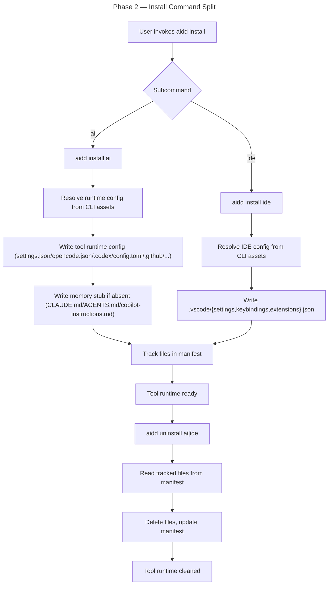

# Instruction: Install Command Split (`install ai|ide <tool>`)

## Feature

- **Summary**: REVISED SCOPE — `install ai|ide <tool>` and `uninstall ai|ide <tool>` already exist as commander subcommands today. This phase swaps their data source (FrameworkLoader → CLI assets). Adds memory stub installation. No commander surface refactor needed.
- **Stack**: `Node.js >=24, TypeScript ESM, commander, vitest`
- **Branch name**: `feat/install-command-split`
- **Parent Plan**: `2026_05_01-cli-marketplace-architecture-master.md`
- **Sequence**: `3 of 5`
- Confidence: 9/10
- Time to implement: 3–5h (reduced from 6–8h — commander structure already in place)

## Existing files

- @src/application/commands/install.ts
- @src/application/commands/uninstall.ts
- @src/application/use-cases/install/install-use-case.ts
- @src/application/use-cases/install/install-config-use-case.ts
- @src/application/use-cases/uninstall-use-case.ts
- @src/cli.ts

### New files to create

- src/application/use-cases/install/install-runtime-config-use-case.ts
- src/application/use-cases/install/install-ide-config-use-case.ts
- src/application/use-cases/uninstall-ide-use-case.ts

## User Journey

## Implementation phases

### Phase 1 — Runtime config use case

> Single use case for `install ai <tool>`.

1. Create `src/application/use-cases/install/install-runtime-config-use-case.ts`:
   - Input: `{ toolId: AiToolId, projectRoot: string }`
   - Reads runtime config asset via `loadConfigAsset(toolId, fileName)`
   - Writes to per-tool destination (uses existing `domain/tools/ai/{tool}.ts` for paths)
   - Calls `InstallMemoryStubUseCase` for memory stub
   - Calls `PostInstallPipelineUseCase` (manifest save only, no memory generation)
2. Use existing capability classes for path resolution
3. Throws on unknown tool, on write conflict (untracked existing file)

### Phase 2 — IDE config use case

> Single use case for `install ide <tool>`.

1. Create `src/application/use-cases/install/install-ide-config-use-case.ts`:
   - Input: `{ toolId: IdeToolId, projectRoot: string }`
   - Reads IDE configs (settings/keybindings/extensions) via `loadConfigAsset(toolId, fileName)`
   - Writes to per-tool destination (use existing `domain/tools/ide/vscode.ts`)
   - Calls `PostInstallPipelineUseCase` (manifest save only)
2. Throws on unknown IDE tool

### Phase 3 — Uninstall IDE use case

> Mirror for `uninstall ide`.

1. Create `src/application/use-cases/uninstall-ide-use-case.ts`:
   - Input: `{ toolId: IdeToolId, projectRoot: string }`
   - Reads tracked files from manifest for tool
   - Deletes files (with merge file unmerge support)
   - Updates manifest
2. Reuse logic patterns from existing `UninstallUseCase`

### Phase 4 — Command rewiring

> Commander subcommands already exist (verified). Swap use case calls only.

1. Update `src/application/commands/install.ts` action handler:
   - When `category === "ai"` → call `InstallRuntimeConfigUseCase` (was: `InstallUseCase`)
   - When `category === "ide"` → call `InstallIdeConfigUseCase` (was: `InstallUseCase`)
   - Remove framework resolution flag handling (no longer needed)
2. Update `src/application/commands/uninstall.ts` action handler:
   - `uninstall ai <tool>` keeps existing logic
   - `uninstall ide <tool>` → call `UninstallIdeUseCase`
3. Wire new deps in `deps.ts` (new use cases from Phases 1-3)
4. `cli.ts` registration unchanged (commands already registered)

### Phase 5 — Remove old install code

> Delete obsolete install orchestration. Coordinate with Part 1 sub-phase 5c.

1. Delete `src/application/use-cases/install/install-use-case.ts` (top-level orchestrator) — only after Part 1 sub-phase 5b migrated callers
2. Delete sub-use-cases that orchestrated bundled plugin install (keep `install-plugins-use-case.ts` for marketplace flow used in Part 1)
3. Delete `src/application/use-cases/install/install-config-use-case.ts` (122 lines) — logic absorbed by new runtime/ide config use cases
4. Update `deps.ts` to drop deleted refs
5. `knip` sweep

## Validation flow

1. `aidd install ai claude` writes `.claude/settings.json` + `CLAUDE.md` stub, manifest updated
2. `aidd install ai cursor` writes `.cursor/settings.json` + `AGENTS.md` stub
3. `aidd install ide vscode` writes `.vscode/{settings,keybindings,extensions}.json`
4. `aidd uninstall ai claude` removes `.claude/settings.json` (CLAUDE.md preserved if user-edited via manifest hash check)
5. `aidd uninstall ide vscode` removes `.vscode/*` files
6. Old `aidd install` (no args) returns error or shows help — verify no framework fetch triggered
7. E2E test full bootstrap flow

## Confidence assessment

✅ Use cases small, single-responsibility; existing capability classes do heavy lifting
✅ Uninstall logic mirrors existing UninstallUseCase
✅ Asset loader (Phase 0) provides clean read API
❌ Removing old `InstallUseCase` may surface coupling to other code (status/doctor); fix on encounter
