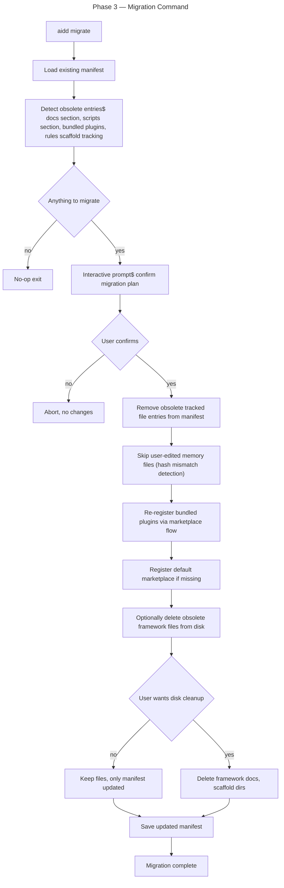

# Instruction: Migration Command (`aidd migrate`)

## Feature

- **Summary**: Interactive `aidd migrate` command for brownfield projects. Detects old manifest with bundled framework files, rules scaffold, framework docs, bundled plugins. Strips obsolete tracked entries. Re-registers plugins via marketplace flow. Preserves user-edited memory files. No new manifest schema bump (uses existing v3→v4 chain; handles cleanup via tracked-entry filtering).
- **Stack**: `Node.js >=24, TypeScript ESM, commander, @inquirer/prompts, vitest`
- **Branch name**: `feat/migrate-command`
- **Parent Plan**: `2026_05_01-cli-marketplace-architecture-master.md`
- **Sequence**: `4 of 5`
- Confidence: 9/10 (raised — rules-scaffold logic dropped, simpler detection)
- Time to implement: 5–7h (slightly reduced)

## Existing files

- @src/domain/models/manifest.ts
- @src/infrastructure/adapters/manifest-repository-adapter.ts
- @src/application/commands/setup.ts
- @src/application/use-cases/setup-use-case.ts
- @src/domain/ports/prompter.ts

### New files to create

- src/application/commands/migrate.ts
- src/application/use-cases/migrate-use-case.ts
- tests/application/use-cases/migrate-use-case.integration.test.ts
- tests/e2e/migrate.e2e.test.ts

## User Journey

## Implementation phases

### Phase 1 — Detection logic

> Identify what needs migration in current manifest + filesystem.

1. In `migrate-use-case.ts`, implement `detect()` returning `MigrationPlan`:
   - `obsoleteDocsSection: boolean` (manifest.docs ≠ null — VERIFIED tracked)
   - `obsoleteScriptsSection: boolean` (manifest.scripts ≠ null)
   - `obsoletePluginsSection: boolean` (top-level manifest.plugins ≠ null)
   - `bundledPluginsToRewire: PluginEntry[]` (plugins from per-tool entries to re-register via marketplace)
   - `frameworkDocsFiles: string[]` (tracked docs files originating from framework — read from `manifest.docs.files`)
   - `userEditedMemoryFiles: string[]` (memory files where current hash ≠ tracked hash → user-edited, preserve)
2. Pure function: input = `Manifest` + filesystem state, output = plan
3. Unit-test detection with fixture manifests

> NOTE: Removed `rulesScaffoldDirs` from plan — verified that CLI never created rules scaffold (it's static framework repo structure, not user-installed). Nothing to detect/strip.

### Phase 2 — Migration execution (atomicity per locked decision #3)

> Apply plan with backup + dry-run + accept-partial strategy combined.

1. Implement `MigrateUseCase.execute({ projectRoot, interactive: boolean, dryRun: boolean })`:
   - Call `detect()`
   - If empty plan → return early (no-op message — idempotent)
   - Display plan summary via `Logger`
   - **If `dryRun === true` → exit after display, no writes**
   - Prompt for confirmation (interactive)
   - **Backup**: copy `.aidd/manifest.json` → `.aidd/manifest.backup.json` (timestamped suffix optional)
   - Strip obsolete entries from manifest (set `docs`/`scripts`/top-level `plugins` sections to null, remove tracked file refs)
   - Preserve user-edited memory file entries (no removal from manifest, hash mismatch detection)
   - For each `bundledPluginsToRewire`: call existing marketplace plugin install logic (**best-effort, log failures, continue** — accept partial)
   - If default marketplace not registered: call setup logic to register
   - Prompt for disk cleanup (delete obsolete files vs leave on disk)
   - Save manifest
   - On success: print recovery hint ("Backup at `.aidd/manifest.backup.json` — delete when satisfied")
2. Throws on manifest write error; partial migration on plugin re-fetch failure (log + continue)
3. Document recovery flow in CHANGELOG: `cp .aidd/manifest.backup.json .aidd/manifest.json` to restore

### Phase 3 — Command wiring

> Add `aidd migrate` to CLI surface.

1. Create `src/application/commands/migrate.ts` (thin wrapper per architecture rules)
2. Register in `src/cli.ts`
3. Wire deps in `deps.ts` (manifest repo, prompter, marketplace registry, plugin install use case)
4. Support `--dry-run` flag (detect + display plan, no writes)
5. Support `--non-interactive` flag (apply plan without prompts, fails on conflicts)

### Phase 4 — Tests

> Cover detection + execution paths.

1. Unit tests for `detect()` with fixture manifests covering: clean v4 (no-op), v3 with bundled plugins, v2 with old tools layout
2. Integration test with real filesystem: pre-seed old manifest + framework files, run `MigrateUseCase`, verify final state
3. E2E test `aidd migrate --dry-run` and `aidd migrate` on a fixture project

## Validation flow

1. Pre-seed test project with old manifest (v3 schema, bundled plugins, framework docs tracked) + filesystem state
2. Run `aidd migrate --dry-run` — displays plan, no changes
3. Run `aidd migrate` — confirms, executes, verifies:
   - Manifest `docs` and `scripts` sections set to null
   - Bundled plugin entries removed; same plugins re-installed via marketplace adapter
   - User-edited `CLAUDE.md` preserved on disk and in manifest
   - Default marketplace registered if previously absent
4. Run `aidd migrate` again on already-migrated project — no-op message, exits 0
5. Test edge case: marketplace fetch fails during rewire — log warning, continue migration, leave plugin entry as legacy with notice

## Confidence assessment

✅ Manifest read/write APIs already exist; migration = pure data transformation
✅ Existing migrations chain (v1→v2→v3→v4) demonstrates the pattern
✅ Plugin marketplace install logic (Phase 1) reusable
❌ Edge cases for partially-migrated projects need careful detection logic
❌ User-edited file detection relies on hash comparison — robust but requires fs access
